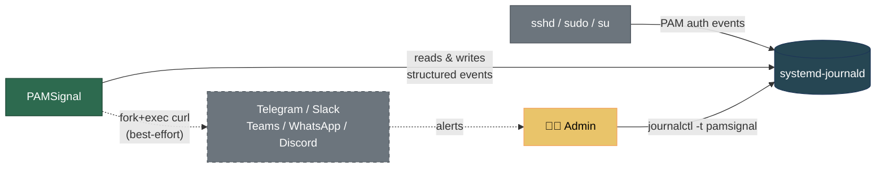

# PAMSignal


PAMSignal is a lightweight, real-time login monitor for Linux servers. It watches the systemd journal for PAM authentication events and writes structured events back to the journal when someone logs in, logs out, or tries to brute-force their way in. Optionally sends alerts to Telegram, Slack, Teams, WhatsApp, or Discord.

**Don't use a sledgehammer to crack a nut.** If you manage 1-10 Linux servers and just want to know when someone touches your box — without deploying Wazuh, EDR, or reading 200 pages of documentation — this is for you.



## Install

### Debian / Ubuntu

```bash
curl -fsSL https://anhtuank7c.github.io/pamsignal/key.asc \
  | sudo gpg --dearmor -o /usr/share/keyrings/pamsignal.gpg
echo "deb [signed-by=/usr/share/keyrings/pamsignal.gpg] https://anhtuank7c.github.io/pamsignal stable main" \
  | sudo tee /etc/apt/sources.list.d/pamsignal.list
sudo apt update
sudo apt install pamsignal
```

### Fedora

```bash
sudo dnf config-manager addrepo \
  --from-repofile=https://anhtuank7c.github.io/pamsignal/rpm/fedora/pamsignal.repo
sudo dnf install pamsignal
```

### RHEL 9 / AlmaLinux 9 / Rocky Linux 9

```bash
sudo dnf config-manager --add-repo \
  https://anhtuank7c.github.io/pamsignal/rpm/el9/pamsignal.repo
sudo dnf install pamsignal
```

The signing key fingerprint is `2D2C 828F A6F4 D019 E446  8FBB B106 2235 2862 2F69` — the public key is checked into the repo at [`docs/signing-key.asc`](./docs/signing-key.asc) and served at the install URLs above. Verify it matches before adding the repository.

After install, edit `/etc/pamsignal/pamsignal.conf` (it's `0640 root:pamsignal`, so use `sudo`), drop in your alert credentials, then `sudo systemctl reload pamsignal`.

## Build from source

```bash
# Install dependencies
sudo apt install libsystemd-dev pkg-config build-essential meson ninja-build libcmocka-dev

# Build
meson setup build && meson compile -C build
meson test -C build

# Create service user
sudo useradd -r -s /usr/sbin/nologin pamsignal
sudo usermod -aG systemd-journal pamsignal

# Run
sudo -u pamsignal ./build/pamsignal --foreground
```

Monitor events in another terminal:

```bash
journalctl -t pamsignal -f
```

See [Deployment](./docs/deployment.md) for production setup with systemd.

## Features

- Real-time monitoring of PAM events (sshd, sudo, su, login)
- Structured journal events with custom `PAMSIGNAL_*` fields
- Brute-force detection (configurable threshold and time window)
- Best-effort alerts to Telegram, Slack, Teams, WhatsApp, Discord, and custom webhooks
- Alert failures cannot break the core monitoring (fork+exec isolation)
- INI-style config with live reload via SIGHUP
- Runs as unprivileged user with 15+ systemd security directives
- Build hardened: stack protector, FORTIFY_SOURCE, PIE, full RELRO
- Single binary. Single config file. Single dependency: `libsystemd`

## Documentation

| Doc | What's in it |
|-----|-------------|
| [Architecture](./docs/architecture.md) | C4 diagrams, alert isolation model, structured journal fields, design decisions |
| [Configuration](./docs/configuration.md) | Config file reference, alert channels, CLI flags, reload |
| [Alerts](./docs/alerts.md) | Channel setup guides, message formats, webhook payload reference |
| [Development](./docs/development.md) | Build, test environment, e2e testing |
| [Deployment](./docs/deployment.md) | systemd service, production setup, security hardening |
| [Changelog](./CHANGELOG.md) | What's done, what's next, task tracking |

## On using AI

This project is built with AI assistance ([Claude Code](https://claude.ai/claude-code)). I want to be straightforward about what that means.

I'm not a senior C programmer. I don't have years of Linux systems experience. AI doesn't just write boilerplate for me — it teaches me, catches mistakes I wouldn't know to look for, and helps me make decisions I couldn't make alone yet. The [OWASP ASVS 5.0 security review](.claude/skills/owasp-review/SKILL.md) that hardened this project? That was an AI-assisted audit using a custom skill I built for exactly this purpose.

I don't claim full control over every detail. What I do is: read what AI produces, ask questions when I don't understand, test it on real systems, and take responsibility for shipping it. The `.claude/` directory is committed to this repo — you can see exactly how AI is used in this project. I hide nothing.

This is how I believe software will increasingly be built: humans and AI collaborating openly. If that bothers you, this project probably isn't for you. If you're curious about the workflow, everything is here to inspect.

## Status

See [CHANGELOG.md](./CHANGELOG.md) for the full task tracking.

**Done:** Core observer, structured journal output, config with SIGHUP reload, alert dispatch (Telegram, Slack, Teams, WhatsApp, Discord, webhook), security hardening, documentation.

**Next up:**
- End-to-end test with real alert channels
- Per-IP alert cooldown (current cooldown is global)
- Curl availability check at startup

**Ideas (no promises):** GeoIP/ASN lookup, event forwarding, package distribution, IPv6 context, message templates.

## Learning notes

Technical notes I wrote while building this:

- [Project initialization and structure](./docs/notes/project-initialization.md)
- [Meson build system guide](./docs/notes/meson-build-system.md)
- [Systemd journal subscription](./docs/notes/systemd-journal.md)
