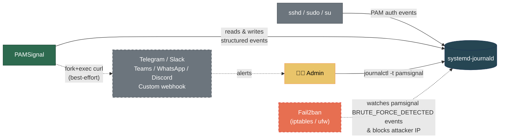

# PAMSignal 🚨


PAMSignal is a lightweight, zero-dependency login monitor for Linux servers. It watches the systemd journal for PAM authentication events and sends real-time alerts to your favorite messaging platforms. 

If you manage a handful of servers and want to know instantly when someone logs in or tries to brute-force your machine—without deploying Wazuh, EDR, or reading 200 pages of documentation—this is for you.

## ✨ Why PAMSignal?

- **Real-time Alerts**: Native integration for Telegram, Slack, Teams, WhatsApp, Discord, and Custom Webhooks.
- **Brute-Force Protection**: Natively tracks failed attempts and seamlessly integrates with [Fail2ban](./examples/fail2ban/README.md) to block attackers.
- **Ultra Lightweight**: A single C binary with a single config file. The only dependency is `libsystemd`.
- **Fault-Tolerant**: Alert dispatching is isolated via `fork+exec`. Network timeouts or API failures will never crash the core monitoring process.

## 🏗️ Architecture



## 🚀 Quick Start

### 1. Install

<details>
<summary><strong>Debian / Ubuntu</strong></summary>

```bash
curl -fsSL https://anhtuank7c.github.io/pamsignal/key.asc | sudo gpg --dearmor -o /usr/share/keyrings/pamsignal.gpg
echo "deb [signed-by=/usr/share/keyrings/pamsignal.gpg] https://anhtuank7c.github.io/pamsignal stable main" | sudo tee /etc/apt/sources.list.d/pamsignal.list
sudo apt update && sudo apt install pamsignal
```
</details>

<details>
<summary><strong>Fedora / CentOS / RHEL</strong></summary>

**Fedora / CentOS**
```bash
sudo dnf config-manager addrepo --from-repofile=https://anhtuank7c.github.io/pamsignal/rpm/fedora/pamsignal.repo
sudo dnf install pamsignal
```

**RHEL 9 / AlmaLinux 9 / Rocky Linux 9**
```bash
sudo dnf config-manager --add-repo https://anhtuank7c.github.io/pamsignal/rpm/el9/pamsignal.repo
sudo dnf install pamsignal
```
</details>

*Signing key fingerprint: `2D2C 828F A6F4 D019 E446  8FBB B106 2235 2862 2F69`*

### 2. Configure Alerts

Edit the configuration file (`/etc/pamsignal/pamsignal.conf`) and drop in your platform credentials. For example, to enable Telegram:

```ini
telegram_bot_token = <your_bot_token>
telegram_chat_id = <your_chat_id>
```
*See [Alert Setup Guides](./docs/alerts.md) for Slack, Teams, WhatsApp, and Discord.*

### 3. Custom Webhook Integrations (Optional)

Need to send alerts to a provider we don't support natively? Or want to build your own auto-banning logic? 
PAMSignal sends structured ECS JSON to any custom webhook. 

👉 **[Check out the Node.js Custom Webhook Example](./examples/nodejs-webhook/README.md)** to see how easy it is to build your own receiver!

### 4. Reload & Monitor

Apply your configuration and watch the live events:

```bash
sudo systemctl reload pamsignal
journalctl -t pamsignal -f
```

## 🛡️ Hardening with Fail2ban (Optional Advanced Protection)

PAMSignal calculates brute-force thresholds for you. You can take this a step further by automatically blocking attackers' IPs using Fail2ban. Since PAMSignal does the heavy lifting, the Fail2ban setup is incredibly simple.

👉 **[Read the Fail2ban Integration Guide](./examples/fail2ban/README.md)**

## 📚 Documentation

- 🏛️ **[Architecture](./docs/architecture.md)** — C4 diagrams, isolation models, and design decisions
- ⚙️ **[Configuration](./docs/configuration.md)** — Config reference, CLI flags, and tuning
- 🔔 **[Alerts](./docs/alerts.md)** — Webhook payloads and channel setup
- 🔒 **[Deployment](./docs/deployment.md)** — Security hardening and systemd setup
- 🎯 **[Threat Model](./docs/threat-model.md)** — What pamsignal defends against, what it deliberately does not, and the design rationale behind the split
- 🛠️ **[Development](./docs/development.md)** — Building from source and testing
- 🔐 **[Security Policy](./SECURITY.md)** — Responsible-disclosure channel and supported versions
- 📝 **[Changelog](./CHANGELOG.md)** — Status, task tracking, and updates

---

## 🤖 Built with AI Collaboration

This project is built with AI assistance ([Claude Code](https://claude.ai/claude-code)). I am open about this workflow: AI catches edge cases, guides architectural decisions, and even performed the [OWASP ASVS 5.0 security review](.claude/skills/owasp-review/SKILL.md) that hardened this project. The `.claude/` directory is committed to this repo so you can inspect exactly how AI is utilized here. Humans test on real systems and take responsibility for shipping.
