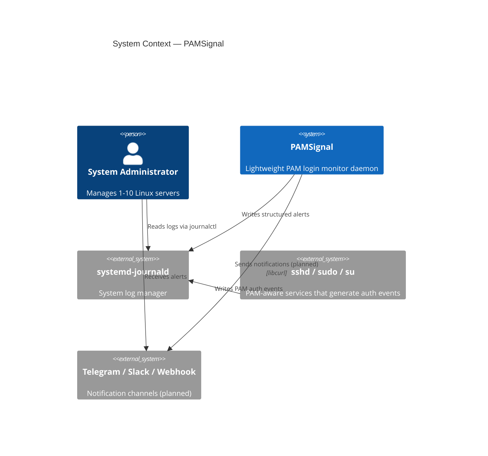
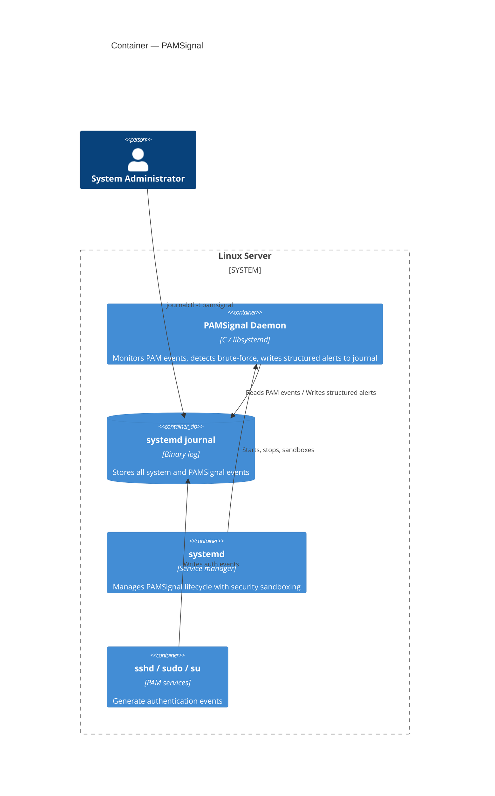
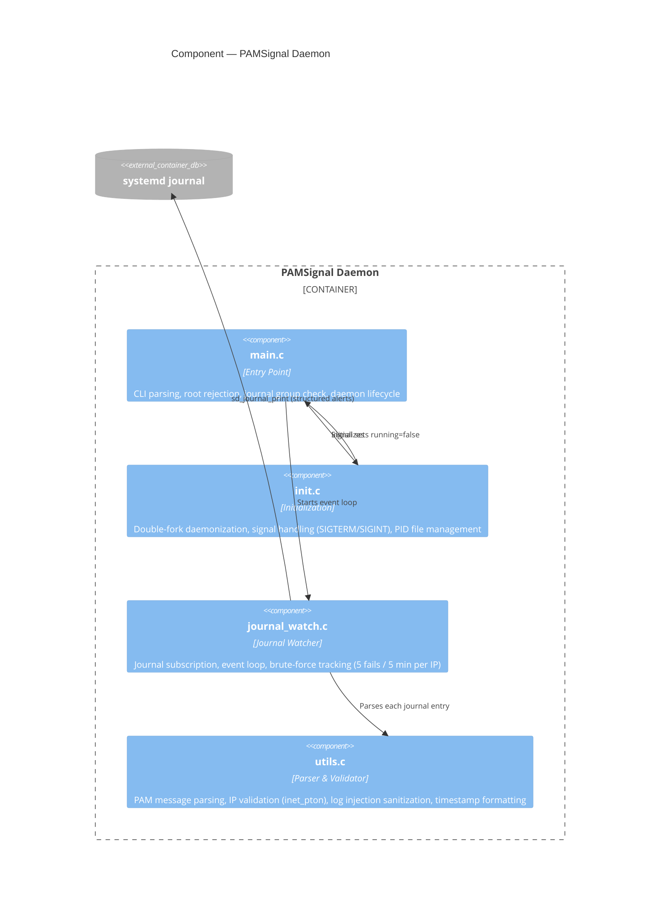

# PAMSignal


## What is PAMSignal?

PAMSignal is a lightweight, real-time login monitor for Linux servers. It watches the systemd journal for PAM authentication events and alerts you when someone logs in, logs out, or tries to brute-force their way in.

**Don't use a sledgehammer to crack a nut.** If you manage 1-10 Linux servers and just want to know when someone touches your box — without deploying Wazuh, EDR, or reading 200 pages of documentation — this is for you.

## How it works

PAMSignal subscribes to the systemd journal and filters for PAM-related messages from sshd, sudo, su, and login. It parses each message to extract the username, source IP, port, service, and authentication method, then writes structured events back to the journal. It tracks failed login attempts per IP and alerts when a brute-force pattern is detected (5 failures within 5 minutes).

It runs as a dedicated unprivileged user (not root), uses no external runtime, and has a single dependency: `libsystemd`.

## Architecture (C4 Model)

### Level 1: System Context

How PAMSignal fits into a Linux server environment.



### Level 2: Container

PAMSignal is a single-process daemon. No database, no web server, no backend.



### Level 3: Component

The internal structure of the PAMSignal daemon.



## Why I built this

- I manage a number of Linux servers with limited resources and needed a monitoring tool that didn't exist the way I wanted.
- I wanted to learn C, Linux internals, and security by building something real.
- I wanted to create an open-source project Made in Vietnam.

## On using AI

This project is built with AI assistance ([Claude Code](https://claude.ai/claude-code)). I want to be straightforward about what that means.

I'm not a senior C programmer. I don't have years of Linux systems experience. AI doesn't just write boilerplate for me — it teaches me, catches mistakes I wouldn't know to look for, and helps me make decisions I couldn't make alone yet. The [OWASP ASVS 5.0 security review](.claude/skills/owasp-review/SKILL.md) that hardened this project? That was an AI-assisted audit using a custom skill I built for exactly this purpose.

I don't claim full control over every detail. What I do is: read what AI produces, ask questions when I don't understand, test it on real systems, and take responsibility for shipping it. The `.claude/` directory is committed to this repo — you can see exactly how AI is used in this project. I hide nothing.

This is how I believe software will increasingly be built: humans and AI collaborating openly. If that bothers you, this project probably isn't for you. If you're curious about the workflow, everything is here to inspect.

## What it does today

- Real-time monitoring of PAM events via systemd journal
- Detects session open/close, login success, and login failure
- Tracks failed login attempts per IP with brute-force detection
- Extracts username, source IP, port, service, auth method, and timestamp
- Runs as unprivileged daemon with systemd sandboxing
- Build hardened: stack protector, FORTIFY_SOURCE, PIE, full RELRO
- Runtime hardened: 15+ systemd security directives

## What's next

The core observer works. The next step is making it actually useful for day-to-day monitoring:

- **Alerts:** Telegram, Slack, and custom webhook notifications via `libcurl`
- **Configuration:** Config file (likely YAML or JSON) so you can set alert credentials and thresholds without recompiling
- **Rate limiting:** Throttle alerts during sustained attacks so your phone doesn't explode
- **Config reload:** SIGHUP to reload config without restarting the daemon

## Ideas (no promises)

Things I'm thinking about, but only if real users ask for them:

- GeoIP/ASN lookup for source IPs
- Forwarding events to external logging systems
- Package distribution (.deb, .rpm)
- IPv6 network context from `/proc/net/tcp6`

## Development Guide

### Prerequisites

```bash
sudo apt install libsystemd-dev pkg-config build-essential meson ninja-build
```

### Build

```bash
# First time: configure the build directory
meson setup build

# Compile
meson compile -C build
```

### Clean

```bash
# Remove all build artifacts and reconfigure
rm -rf build
meson setup build
```

### Setup test environment

PAMSignal runs as a dedicated unprivileged user with journal read access (not root).

```bash
# Create a system user for pamsignal (no login shell, no home directory)
sudo useradd -r -s /usr/sbin/nologin pamsignal

# Grant permission to read the systemd journal
sudo usermod -aG systemd-journal pamsignal
```

You also need SSH available locally to generate real login events:

```bash
sudo apt install openssh-server
sudo systemctl enable --now ssh
```

### Run (manual)

```bash
# Foreground mode (Ctrl+C to stop)
sudo -u pamsignal ./build/pamsignal --foreground

# Or as a background daemon
sudo -u pamsignal ./build/pamsignal
```

### Run (systemd service)

```bash
# Install binary and service file
sudo meson install -C build

# Reload systemd and start the service
sudo systemctl daemon-reload
sudo systemctl enable --now pamsignal

# Check status
sudo systemctl status pamsignal

# View logs
journalctl -u pamsignal -f
```

### Stop

```bash
# If running as systemd service
sudo systemctl stop pamsignal

# If running manually as background daemon
sudo kill $(pgrep pamsignal)
```

### End-to-end testing

Start pamsignal and open a second terminal to watch its output:

```bash
journalctl -t pamsignal -f
```

Then in a third terminal, trigger events:

```bash
# 1. Successful SSH login (expect: LOGIN_SUCCESS + SESSION_OPEN)
ssh localhost
# type 'exit' (expect: SESSION_CLOSE)

# 2. Failed SSH login (expect: LOGIN_FAILED)
ssh nonexistent@localhost

# 3. Brute-force detection (expect: BRUTE_FORCE_DETECTED after 5 failures)
for i in $(seq 1 5); do ssh nonexistent@localhost; done

# 4. Sudo session (expect: SESSION_OPEN for sudo)
sudo ls

# 5. Graceful shutdown (expect: "shutting down" in journal)
sudo systemctl stop pamsignal
# or Ctrl+C if running in foreground
```

## Learning notes

Technical notes I wrote while building this:

- [Project initialization and structure](./docs/phase-1-initialize.md)
- [Meson build system guide](./docs/phase-1-meson_guide.md)
- [Systemd journal subscription](./docs/phase-1-systemd-jounald.md)
