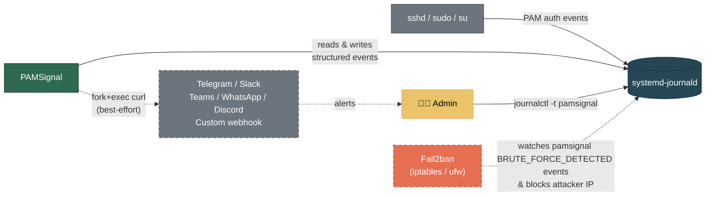

<p align="center">
  
</p>

# PAMSignal 🚨

> 🌐 **English** · [Tiếng Việt](docs/vi/README.md)

[](https://github.com/anhtuank7c/pamsignal/actions/workflows/ci.yml)


PAMSignal is a lightweight, zero-dependency login monitor for Linux servers. It watches the systemd journal for PAM authentication events and sends real-time alerts to your favorite messaging platforms. 

If you manage a handful of servers and want to know instantly when someone logs in or tries to brute-force your machine—without deploying Wazuh, EDR, or reading 200 pages of documentation—this is for you.

Think of it as a **smoke detector for your servers' front door**: it doesn't lock the door (hardening SSH is still your job — [here's how](./docs/ssh-hardening.md)), but it tells you the instant someone opens it or starts trying to force it.

## 👥 Is PAMSignal for you?

- **Solo devs & self-hosters** — get a phone buzz the moment anyone logs into your VPS, or a bot starts hammering it. Two-minute setup, no platform to babysit.
- **Small teams & startups** — one `#security-alerts` channel and one fleet dashboard for everyone on call.
- **Hosting providers & MSPs** — offer per-customer login alerting as a near-zero-cost value-add for the servers you manage → [hosting-provider playbook](./docs/use-cases.md#small-hosting-provider--msp).

Full playbooks for each in **[Use Cases & Integrations](./docs/use-cases.md)**.

## 👀 What you'll actually see

Seconds after an event, a line like this lands in your Telegram, Slack, Teams, Discord, or WhatsApp:

```text
[NOTICE] auth.login_success user=admin src=192.168.1.100:52341 host=web-01 service=sshd auth=publickey
[WARN]   auth.login_failure user=root  src=203.0.113.50:39182 host=web-01 service=sshd auth=password
[ALERT]  auth.brute_force_detected     src=203.0.113.50 attempts=12 window=300s user=root host=web-01
```

Prefer one screen for the whole fleet instead of per-host pings? PAMSignal also feeds a ready-made **[Grafana dashboard](./docs/grafana-getting-started.md)** (preview [below](#-fleet-view-in-grafana)).

## ✨ Why PAMSignal?

- **Real-time Alerts**: Native integration for Telegram, Slack, Teams, WhatsApp, Discord, and Custom Webhooks.
- **Brute-Force Protection**: Natively tracks failed attempts and seamlessly integrates with [Fail2ban](./examples/fail2ban/README.md) to block attackers.
- **Ultra Lightweight**: A single C binary with a single config file. The only dependency is `libsystemd`.
- **Fault-Tolerant**: Alert dispatching is isolated via `fork+exec`. Network timeouts or API failures will never crash the core monitoring process.
- **Fits your stack**: Speaks [ECS JSON](./docs/alerts.md#custom-webhook-ecs-json) to any SIEM or webhook and ships a [Grafana fleet dashboard](./docs/grafana-getting-started.md) — it feeds the tools you already run instead of being one more console.

## 🧱 Where PAMSignal fits

PAMSignal is the **detection** layer of a four-layer defence-in-depth stack. It does that one job well and leaves the others to the right tool — it never modifies `sshd` or blocks anything itself.

| Layer | Job | Your tool |
|---|---|---|
| Prevention | make the door hard to open | SSH key-only auth → **[Secure SSH guide](./docs/ssh-hardening.md)** |
| Integrity | detect tampering with the system | AIDE / `debsums` / `rpm -V` |
| **Detection / Alerting** | **tell you what's happening, now** | **PAMSignal** |
| Forensics | reconstruct events after the fact | `auditd` + journald retention |

The natural companion is **response**: [Fail2ban](./examples/fail2ban/README.md) acts on PAMSignal's brute-force signal to block attacker IPs at the firewall. Exactly what PAMSignal can and can't observe is spelled out in the **[Threat Model](./docs/threat-model.md)**.

## 🏗️ Architecture


```mermaid
graph LR
    sshd["sshd / sudo / su"]
    journald[("systemd-journald")]
    pamsignal["PAMSignal"]
    admin["🧑‍💻 Admin"]
    platforms["Telegram / Slack<br/>Teams / WhatsApp / Discord<br/>Custom webhook"]
    fail2ban["Fail2ban<br/>(iptables / ufw)"]

    sshd -- "PAM auth events" --> journald
    pamsignal -- "reads & writes<br/>structured events" --> journald
    admin -- "journalctl -t pamsignal" --> journald
    pamsignal -. "fork+exec curl<br/>(best-effort)" .-> platforms
    platforms -. "alerts" .-> admin
    fail2ban -. "watches pamsignal BRUTE_FORCE_DETECTED events<br/>& blocks attacker IP" .-> journald

    style pamsignal fill:#2d6a4f,stroke:#1b4332,color:#fff
    style journald fill:#264653,stroke:#1d3557,color:#fff
    style sshd fill:#6c757d,stroke:#495057,color:#fff
    style platforms fill:#6c757d,stroke:#495057,color:#fff,stroke-dasharray: 5 5
    style fail2ban fill:#e76f51,stroke:#d62828,color:#fff,stroke-dasharray: 5 5
    style admin fill:#e9c46a,stroke:#f4a261,color:#000
```

## 🚀 Quick Start

### 1. Install

<details>
<summary><strong>Debian / Ubuntu</strong></summary>

```bash
sudo install -d -m 0755 /etc/apt/keyrings
curl -fsSL https://anhtuank7c.github.io/pamsignal/key.asc | sudo gpg --dearmor -o /etc/apt/keyrings/pamsignal.gpg
echo "deb [signed-by=/etc/apt/keyrings/pamsignal.gpg] https://anhtuank7c.github.io/pamsignal stable main" | sudo tee /etc/apt/sources.list.d/pamsignal.list
sudo apt update && sudo apt install pamsignal
```
</details>

<details>
<summary><strong>Fedora / CentOS / RHEL</strong></summary>

**Fedora / CentOS**
```bash
sudo dnf config-manager addrepo --from-repofile=https://anhtuank7c.github.io/pamsignal/rpm/fedora/pamsignal.repo
sudo dnf install pamsignal
```

**RHEL 9 / AlmaLinux 9 / Rocky Linux 9**
```bash
sudo dnf config-manager --add-repo https://anhtuank7c.github.io/pamsignal/rpm/el9/pamsignal.repo
sudo dnf install pamsignal
```
</details>

<details>
<summary><strong>Ubuntu 20.04 LTS (Focal, ESM-only)</strong></summary>

20.04 is ESM-only since April 2025 and there's no gh-pages apt pocket for it — but a Focal-targeted `.deb` is built and tested in CI on every release, then attached as a GitHub release asset. Download and install directly:

```bash
VERSION=0.5.0   # bump per release — see https://github.com/anhtuank7c/pamsignal/releases
curl -fL -o pamsignal_focal.deb \
  "https://github.com/anhtuank7c/pamsignal/releases/download/v${VERSION}/pamsignal_${VERSION}-1_focal_amd64.deb"

# Optional: verify the detached signature (signing key fingerprint below)
curl -fL -o pamsignal_focal.deb.asc \
  "https://github.com/anhtuank7c/pamsignal/releases/download/v${VERSION}/pamsignal_${VERSION}-1_focal_amd64.deb.asc"
gpg --verify pamsignal_focal.deb.asc pamsignal_focal.deb

# Install — apt resolves libsystemd0 and other transitive deps from your host's apt sources
sudo apt install ./pamsignal_focal.deb
```

To upgrade later, re-run the same recipe with the new `VERSION`. For a fleet, wrap it in a small Ansible / cron / shell script.

> 🕒 **Lifecycle reminder.** Focal exits ESM in April 2030. Plan a migration to 22.04 LTS (Standard Support until April 2027) or 24.04 LTS in the next ~12 months. See [docs/distros.md](./docs/distros.md) for the full support matrix.
</details>

*Signing key fingerprint: `2D2C 828F A6F4 D019 E446  8FBB B106 2235 2862 2F69`*

### 2. Configure Alerts

Edit the configuration file (`/etc/pamsignal/pamsignal.conf`) and drop in your platform credentials. For example, to enable Telegram:

```ini
telegram_bot_token = <your_bot_token>
telegram_chat_id = <your_chat_id>
```
*See [Alert Setup Guides](./docs/alerts.md) for Slack, Teams, WhatsApp, and Discord.*

**Two tuning keys worth knowing on day one** — one controls *how often* you get pinged, the other controls *what* you get pinged about:

```ini
# Minimum seconds between brute-force alerts for the same IP.
# Default 60. Set to 0 to fire on EVERY threshold crossing —
# useful for low-traffic hosts where you don't want any signal collapsed.
alert_cooldown_sec = 60

# Which event categories trigger chat alerts. Default is "all" (every category),
# which is noisy in production. Narrow to just what you care about —
# most operators only want successful logins and brute-force pings.
enable_notification_type = login_success,brute_force
```
*All six event-type tokens (`login_success`, `login_failed`, `session_open`, `session_close`, `brute_force`, `all`) are documented in [Configuration → Notification-type filter](./docs/configuration.md#notification-type-filter). `journalctl -t pamsignal` keeps the full forensic trail regardless of what you filter out of chat.*

### 3. Custom Webhook Integrations (Optional)

Need to send alerts to a provider we don't support natively? Or want to build your own auto-banning logic? 
PAMSignal sends structured ECS JSON to any custom webhook. 

👉 **[Check out the Node.js Custom Webhook Example](./examples/nodejs-webhook/README.md)** to see how easy it is to build your own receiver!

### 4. Reload & Monitor

Apply your configuration and watch the live events:

```bash
sudo systemctl reload pamsignal
journalctl -t pamsignal -f
```

## 🛡️ Hardening with Fail2ban (Optional Advanced Protection)

PAMSignal calculates brute-force thresholds for you. You can take this a step further by automatically blocking attackers' IPs using Fail2ban. Since PAMSignal does the heavy lifting, the Fail2ban setup is incredibly simple.

👉 **[Read the Fail2ban Integration Guide](./examples/fail2ban/README.md)**

*First time securing SSH itself? Pair this with **[Secure SSH & Manage a Fleet](./docs/ssh-hardening.md)** — PAMSignal watches the door; that guide makes the door strong, and shows you how to drive many servers from one place.*

## 📊 Fleet view in Grafana

Per-host `journalctl` and real-time chat alerts cover one host. For fleet-wide auth visibility — one queryable view across every server — there's a Loki/Alloy/Grafana integration that ships with PAMSignal: ECS-schema events flow into Loki via Alloy, and a single dashboard answers "what's happening with auth across my fleet right now?" at a glance.


Local try-it stack (no Linux fleet required):

```bash
cd examples/grafana && docker compose up -d
# → http://localhost:3000 (anonymous Admin, dashboard preloaded)
```

👉 **New to Grafana?** Start with **[Grafana from Zero](./docs/grafana-getting-started.md)** — what Grafana/Loki/Alloy even are, setup both ways (cloud or self-host), and how to read every panel.

👉 **[Read the Grafana Integration Guide](./examples/grafana/README.md)** — the production reference: full deploy + Alloy install + 4 alert rules

## 📚 Documentation

**Guides — start here**

- 🧭 **[Use Cases & Integrations](./docs/use-cases.md)** — who it's for (solo · team · hosting provider) and how to plug PAMSignal into your existing stack
- 🔐 **[Secure SSH & Manage a Fleet](./docs/ssh-hardening.md)** — harden the door PAMSignal watches, and drive 1–50 servers from one `~/.ssh/config`
- 📊 **[Grafana from Zero](./docs/grafana-getting-started.md)** — stand up a fleet-wide dashboard and learn to read every panel, even if you've never used Grafana

**Reference**

- 🏛️ **[Architecture](./docs/architecture.md)** — C4 diagrams, isolation models, and design decisions
- ⚙️ **[Configuration](./docs/configuration.md)** — Config reference, CLI flags, and tuning
- 🔔 **[Alerts](./docs/alerts.md)** — Webhook payloads and channel setup
- 🔒 **[Deployment](./docs/deployment.md)** — Security hardening and systemd setup
- 🎯 **[Threat Model](./docs/threat-model.md)** — What pamsignal defends against, what it deliberately does not, and the design rationale behind the split
- 📐 **[Grafana Integration — Design](./docs/grafana-integration.md)** — Schema, label cardinality, and panel rationale (the deep dive behind the guide above)
- 🐧 **[Supported Distributions](./docs/distros.md)** — Three-tier matrix (CI-tested / expected to work / unsupported) with reasoning per row
- 🛠️ **[Development](./docs/development.md)** — Building from source and testing
- 🔐 **[Security Policy](./SECURITY.md)** — Responsible-disclosure channel and supported versions
- 📝 **[Changelog](./CHANGELOG.md)** — Status, task tracking, and updates

---

## 🙏 Acknowledgments

This project would look very different — or wouldn't exist at all — without two friends:

<table>
<tr>
<td width="100" align="center" valign="top">
<a href="https://github.com/hongquan"></a><br/>
<sub><b><a href="https://github.com/hongquan">Nguyen Hong&nbsp;Quan</a></b></sub><br/>
<sub>@hongquan</sub>
</td>
<td valign="top">

Gave the kind of honest, no-punches-pulled feedback on Linux standards and operator expectations that reshaped PAMSignal's roadmap and architecture. The single biggest design decision in this codebase — subscribing to <code>systemd-journald</code> for PAM events instead of tailing <code>/var/log/auth.log</code> — came directly from his pushback. His strong emphasis on Linux <a href="https://refspecs.linuxfoundation.org/FHS_3.0/fhs/index.html">FHS</a> compliance also threads through every file-path choice in the project: the binary under <code>/usr/bin</code>, config under <code>/etc/pamsignal/</code>, runtime state under <code>/run/pamsignal/</code>, the systemd vendor unit under <code>/usr/lib/systemd/system/</code>, and the apt repository keyring at <code>/etc/apt/keyrings/pamsignal.gpg</code> (<a href="https://github.com/anhtuank7c/pamsignal/issues/14">#14</a>). The result is a daemon that fits the modern Linux stack instead of working around it. 🙇

</td>
</tr>
<tr>
<td width="100" align="center" valign="top">
<a href="https://github.com/lehiep1994"></a><br/>
<sub><b><a href="https://github.com/lehiep1994">Samuel&nbsp;Le</a></b></sub><br/>
<sub>@lehiep1994</sub>
</td>
<td valign="top">

Kept me reading and kept me building. He sent me books on Linux internals at exactly the moments I needed them, and the steady encouragement to *not* abandon this project — through every "is this even worth shipping?" stretch — is a real part of why PAMSignal made it to a release. 🙇

</td>
</tr>
</table>

---

## 🤖 Built with AI Collaboration

This project is built with AI assistance ([Claude Code](https://claude.ai/claude-code)). I am open about this workflow: AI catches edge cases, guides architectural decisions, and even performed the [OWASP ASVS 5.0 security review](.claude/skills/owasp-review/SKILL.md) that hardened this project. The `.claude/` directory is committed to this repo so you can inspect exactly how AI is utilized here. Humans test on real systems and take responsibility for shipping.
