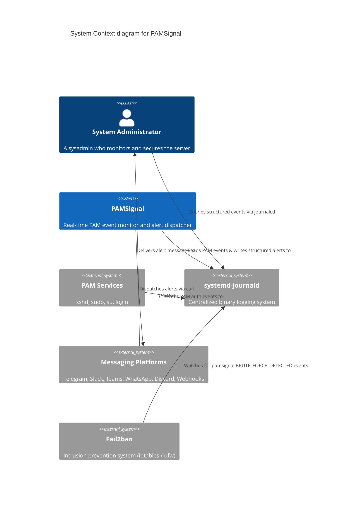
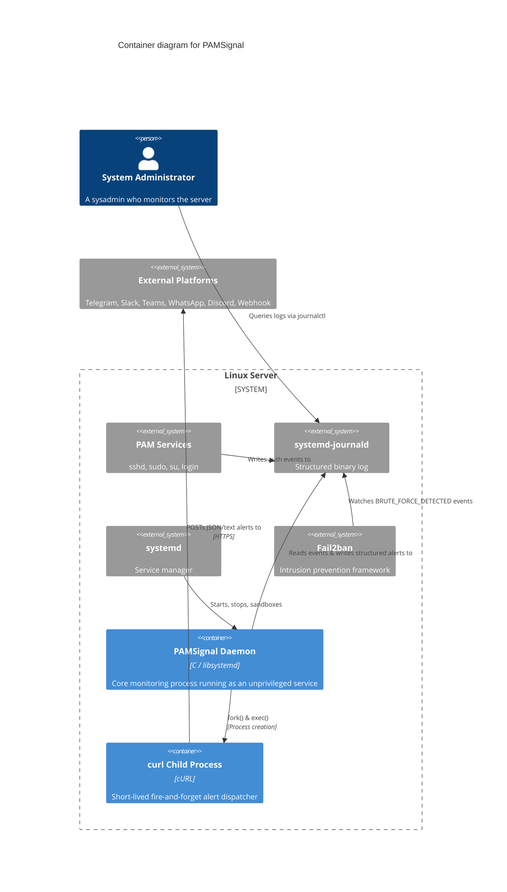
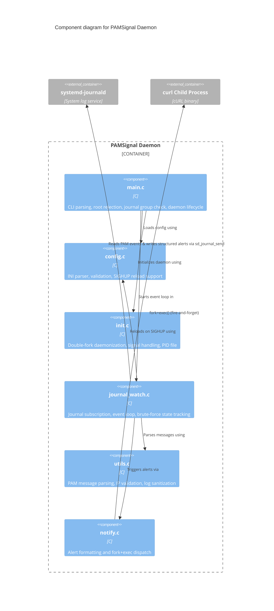
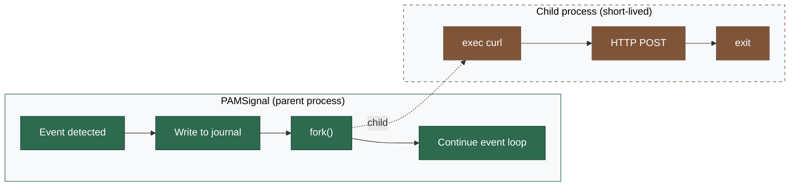

# Architecture

PAMSignal is designed around one core principle: **do one thing well with minimal moving parts.**

It subscribes to the systemd journal, filters for PAM-related messages from sshd, sudo, su, and login, parses each message to extract structured data (username, source IP, port, service, auth method), and writes structured events back to the journal with custom fields. It tracks failed login attempts per IP and detects brute-force patterns. Optionally, it sends best-effort alerts to messaging platforms without risking the core monitoring.

Single binary. Single config file. Single dependency (`libsystemd`). No database, no web server, no separate relay process.

## C4 Model

Following the [C4 model](https://c4model.com/) conventions, we map out the architecture from a high-level system context down to internal components.

### Level 1: System Context

The System Context diagram provides a high-level overview of how users interact with internal and external systems to get value. It shows PAMSignal within the larger Linux server environment.



### Level 2: Container

The Container diagram zooms into the system boundary to show the separately runnable/deployable containers. PAMSignal is a single-process daemon. Alerts are sent by short-lived child processes (`curl`) that cannot affect the parent monitoring daemon.



### Level 3: Component

The Component diagram zooms into the PAMSignal daemon container to show its internal C components, mapping to the actual source files in the project.



## Data flow

```
SSH login attempt
    → sshd writes to journald
        → pamsignal reads via sd_journal_wait/next
            → utils.c parses message, extracts fields
                → journal_watch.c writes structured event via sd_journal_send
                    → journald stores event with custom fields
                        → admin reads with: journalctl -t pamsignal
                → notify.c fork() → child exec("curl", ...) → Telegram/Slack/etc.
                    → parent continues immediately (fire-and-forget)
                    → child exits on its own (success or failure)
```

## Alert isolation model

Alerts are **best-effort and cannot break the core monitoring**. Here's how:



**Why this is safe:**

1. The parent **always writes to the journal first** — the core record is persisted before any alert attempt
2. `fork()` creates a copy-on-write child — cheap on Linux, no shared state
3. The parent **does not wait** for the child — it continues the event loop immediately
4. If the child crashes, segfaults, or hangs — the parent is completely unaffected
5. If Telegram/Slack/Discord is down — the child times out and exits, pamsignal keeps monitoring
6. `SIGCHLD` is ignored (`SA_NOCLDWAIT`) so zombie processes are automatically reaped
7. The child `exec`s `curl` — no HTTP library linked into the parent process at all

## Structured journal fields

PAMSignal writes events using `sd_journal_send()` with [Elastic Common Schema (ECS)] aligned field names so existing SIEM tooling can ingest the journal directly via the standard ECS field names rather than a vendor-specific dictionary. (Through the v0.2.x series PAMSignal also emitted a parallel `PAMSIGNAL_*` field set; those legacy fields were retired in v0.3.0 — update any `journalctl PAMSIGNAL_EVENT=…` queries to the ECS forms below.)

For login / session events:

| Field | Example | Description |
|-------|---------|-------------|
| `EVENT_ACTION` | `login_failure` | One of `session_opened`, `session_closed`, `login_success`, `login_failure`, `brute_force_detected` |
| `EVENT_CATEGORY` | `authentication` | Comma-separated list; sessions add `session`, brute-force adds `intrusion_detection` |
| `EVENT_KIND` | `event` | `event` for observations, `alert` for brute-force |
| `EVENT_OUTCOME` | `failure` | `success`, `failure`, or `unknown` |
| `EVENT_SEVERITY` | `5` | 3=info, 4=notice, 5=warning, 8=alert |
| `EVENT_MODULE` | `pamsignal` | Always `pamsignal` |
| `USER_NAME` | `root` | For sshd this is the account being attacked; for sudo/su this is the local actor (`ruser`) |
| `SOURCE_IP` | `203.0.113.45` | Remote IP (validated). Empty / absent for pure-local sudo/su brute-force |
| `SOURCE_PORT` | `22` | Remote port (login events only) |
| `SERVICE_NAME` | `sshd` | PAM service: `sshd`, `sudo`, `su`, `login`, `other` |
| `HOST_HOSTNAME` | `web-01` | Server hostname |
| `PROCESS_PID` | `12345` | The sshd / sudo / su PID associated with the event |

For brute-force events the same `EVENT_*` set applies plus, for the local-actor variant only, `USER_TARGET_NAME` (e.g. `root`) — the user the actor was trying to elevate to.

Query examples:

```bash
# All pamsignal events
journalctl -t pamsignal

# Only failed logins
journalctl -t pamsignal EVENT_ACTION=login_failure

# Only brute-force alerts (both IP-keyed and local-actor-keyed)
journalctl -t pamsignal EVENT_ACTION=brute_force_detected

# Events from a specific IP
journalctl -t pamsignal SOURCE_IP=203.0.113.45

# JSON output (for scripting)
journalctl -t pamsignal -o json
```

[Elastic Common Schema (ECS)]: https://www.elastic.co/guide/en/ecs/current/index.html

## Design decisions

**Why systemd journal as the primary output?**
The journal is already there. It provides structured fields, access control, persistence, and rotation. Administrators can query with `journalctl` filters. Scripts can consume JSON output. No custom log format to maintain.

**Why fork+exec curl for alerts (not libcurl, not a separate relay)?**
Three concerns balanced:
- **Usability:** One binary, one config file. No Python, no pip, no second service to manage.
- **Isolation:** Child process crash cannot affect the parent. No HTTP library in the parent's address space.
- **Simplicity:** `curl` is pre-installed on every Linux server. No new dependency to compile or link.

A separate relay (journal subscriber in Python) is the architecturally purest approach but doubles the operational complexity. Fork+exec achieves the same fault isolation with zero user-facing complexity.

**Why non-root?**
The daemon only needs to read the journal. Running as root would widen the attack surface for zero benefit. The `systemd-journal` group grants read access.

**Why a static fail table (not a hash map)?**
The table is bounded at `max_tracked_ips` entries (default 256). A flat array with linear scan is simpler, has no allocator overhead, and is fast enough for this scale. If you're tracking 100,000 IPs, you need a different tool.

**Why INI config (not YAML/JSON)?**
Zero dependencies. The config has ~10 keys — YAML/JSON parsing libraries add complexity for no benefit. Sysadmins can edit it with `vi` in 10 seconds.

**Why no network code in the parent process?**
Every network dependency (libcurl, sockets, TLS) is an attack surface. A security monitoring tool should minimize its own attack surface. The parent reads from the journal, writes to the journal, and forks children for alerts. The children exec `curl` and exit. The parent never makes a network call.
