# Grafana from Zero — See Your Whole Fleet on One Screen

> 🌐 **English** · [Tiếng Việt](vi/grafana-getting-started.md)

Chat alerts tell you *right now*. `journalctl -t pamsignal` tells you *what happened on this one host*. **Grafana** is the third view: every server's login activity on one screen, with trends over time and a searchable history you can keep for months.

This guide assumes **you have never touched Grafana, Loki, or Alloy**. It explains what each piece is, walks you from nothing to a working dashboard two different ways (managed cloud and self-hosted), and — most importantly — teaches you how to *read* the dashboard once you have it.

> This is the friendly on-ramp. The terse, production-focused reference lives in [`examples/grafana/README.md`](../examples/grafana/README.md), and the full design rationale (schema, label cardinality, panel choices) is in [`docs/grafana-integration.md`](./grafana-integration.md). This page links to both at the right moments.

---

## Do you even need this?

Be honest with yourself first:

- **1–2 servers, chat alerts feel like enough?** You probably don't need Grafana yet. Telegram/Slack + `journalctl` covers you. Bookmark this page for when you grow.
- **3+ servers, or you want trends, or you need an audit trail you can keep?** This is exactly what Grafana is for. Flipping between `journalctl` sessions on ten hosts doesn't scale; one dashboard does.
- **You run servers for other people (a hosting provider / MSP)?** Grafana is how you turn PAMSignal into a per-customer, value-add service — see [Use Cases](./use-cases.md#small-hosting-provider--msp).

PAMSignal needs **no changes** to feed Grafana. It already writes structured, ECS-aligned fields to the journal; this whole pipeline just ships those somewhere you can query them.

---

## The cast, in plain words

Three new programs join PAMSignal. Here's the warehouse analogy:

| Piece | What it is | The analogy |
|---|---|---|
| **PAMSignal** | Already running on each host; writes structured auth events to the journal | The **factory** producing goods |
| **Grafana Alloy** | A small agent on each host that reads the journal and ships PAMSignal's events out | The **courier** picking up from each factory |
| **Loki** | A database built for logs; stores everything and answers queries | The **central warehouse** |
| **Grafana** | The web UI with dashboards and alerts, querying Loki | The **storefront window** you actually look at |

```mermaid
graph LR
    pamsignal["PAMSignal<br/>(per host)"]
    journald[("systemd-journald<br/>(per host)")]
    alloy["Grafana Alloy<br/>(per host)"]
    loki[("Loki")]
    grafana["Grafana"]
    operator["🧑‍💻 You"]

    pamsignal -- "sd_journal_send<br/>(ECS fields)" --> journald
    journald -- "SYSLOG_IDENTIFIER=pamsignal" --> alloy
    alloy -- "Loki push API<br/>(4 labels)" --> loki
    loki -- "LogQL queries" --> grafana
    grafana -- "fleet dashboard<br/>+ alerts" --> operator

    style pamsignal fill:#2d6a4f,stroke:#1b4332,color:#fff
    style journald fill:#264653,stroke:#1d3557,color:#fff
    style alloy fill:#457b9d,stroke:#1d3557,color:#fff
    style loki fill:#e9c46a,stroke:#f4a261,color:#000
    style grafana fill:#e76f51,stroke:#d62828,color:#fff
    style operator fill:#6c757d,stroke:#495057,color:#fff
```



You only ever install **Alloy** on your servers. Loki and Grafana run *somewhere central* — either Grafana's cloud (Path A) or a box you own (Path B).

---

## Try it in 60 seconds first (no fleet, no commitment)

Before standing anything up for real, *see the dashboard* with fake data. You need only Docker:

```bash
cd examples/grafana
docker compose up -d
```

Open **http://localhost:3000** — no login, the dashboard is under the **PAMSignal** folder, and synthetic events stream in immediately (including periodic brute-force bursts). Play with it, read the [Reading your dashboard](#reading-your-dashboard) section against live-looking data, then tear it down:

```bash
docker compose down -v
```

This is the same dashboard you'll deploy for real — it just has a synthetic event generator instead of your actual fleet. Details: [`examples/grafana/README.md`](../examples/grafana/README.md).

---

## Path A — Grafana Cloud (managed, zero ops)

The fastest way to a real fleet dashboard. Grafana runs Loki and Grafana for you; you only install Alloy on your hosts. The **free tier includes Loki** and is plenty for a small fleet.

### A1. Create a free stack

1. Sign up at [grafana.com](https://grafana.com/auth/sign-up/create-user) and create a stack (you get a URL like `https://yourname.grafana.net`).
2. In the Cloud portal, open your **Loki** details. Note three things:
   - the **push URL** (looks like `https://logs-prod-xxx.grafana.net/loki/api/v1/push`),
   - your **user / instance ID** (a number),
   - a **token** you generate under *Access Policies* (give it the `logs:write` scope).

Keep those three handy — Alloy needs them.

### A2. Install Alloy on each host

```bash
# Debian / Ubuntu
curl -fsSL https://apt.grafana.com/gpg.key | sudo gpg --dearmor -o /etc/apt/keyrings/grafana.gpg
echo "deb [signed-by=/etc/apt/keyrings/grafana.gpg] https://apt.grafana.com stable main" \
  | sudo tee /etc/apt/sources.list.d/grafana.list
sudo apt-get update && sudo apt-get install -y alloy

# RHEL / Fedora / AlmaLinux / Rocky — see
# https://grafana.com/docs/alloy/latest/set-up/install/linux/
```

Alloy must be allowed to read the journal:

```bash
sudo usermod -aG systemd-journal alloy
```

### A3. Point Alloy at Cloud Loki

Start from the bundled [`examples/grafana/alloy.river`](../examples/grafana/alloy.river) (it already scrapes `SYSLOG_IDENTIFIER=pamsignal` and promotes the right four labels). Copy it in and edit the `loki.write` block to use your Cloud endpoint with basic auth:

```bash
sudo cp examples/grafana/alloy.river /etc/alloy/config.alloy
sudo $EDITOR /etc/alloy/config.alloy
```

```river
loki.write "default" {
  endpoint {
    url = "https://logs-prod-xxx.grafana.net/loki/api/v1/push"
    basic_auth {
      username = "123456"                 // your Cloud user / instance ID
      password = "glc_eyJ..."             // the token you generated
    }
  }
}
```

> In production, don't paste the token inline — use an environment variable or a file and reference it (`sys.env("LOKI_TOKEN")`). See Alloy's config docs.

```bash
sudo systemctl restart alloy
sudo journalctl -u alloy -f          # watch for successful pushes
```

### A4. Import the dashboard

In your Cloud Grafana: **Dashboards → New → Import**, upload [`examples/grafana/dashboards/pamsignal-v1.grafana-com.json`](../examples/grafana/dashboards/) (the version with a `${DS_LOKI}` placeholder), and pick your Loki datasource when prompted. Skip to [Reading your dashboard](#reading-your-dashboard).

---

## Path B — Self-host (you run Loki + Grafana)

Choose this if you'd rather keep all data on infrastructure you control. You'll run Loki and Grafana on one central box, and Alloy on every PAMSignal host pushes to it.

### B1. Stand up Loki + Grafana centrally

On your central/monitoring host, a minimal but real `docker-compose.yml`:

```yaml
services:
  loki:
    image: grafana/loki:3.2.0          # check for the current stable tag
    command: -config.file=/etc/loki/local-config.yaml
    ports: ["3100:3100"]
    volumes:
      - loki-data:/loki
    restart: unless-stopped

  grafana:
    image: grafana/grafana:11.3.0
    ports: ["3000:3000"]
    environment:
      - GF_SECURITY_ADMIN_PASSWORD=change-me-now   # set a real password
    volumes:
      - grafana-data:/var/lib/grafana
    restart: unless-stopped

volumes:
  loki-data:
  grafana-data:
```

```bash
docker compose up -d
```

The Loki image ships a working default config, so this comes up immediately. For real retention (the default keeps very little), adapt the bundled [`examples/grafana/config/loki-config.yml`](../examples/grafana/) — it sets a 7-day retention you can raise for audit/compliance. Mount it and change the `command:` to point at it.

> **Security, non-negotiable for self-host:** never expose Grafana to the internet with anonymous access or the default password. Put it behind your VPN/bastion or a reverse proxy with TLS and real login. The bundled try-it stack uses anonymous admin *only* because it's local and disposable.

### B2. Add Loki as a datasource

In Grafana (**http://your-host:3000**, log in as `admin`): **Connections → Data sources → Add data source → Loki**, URL `http://loki:3100` (same compose network) or `http://your-host:3100`. Save & test.

### B3. Install Alloy on each PAMSignal host

Exactly as in [A2](#a2-install-alloy-on-each-host) (the install + `systemd-journal` group are identical), then drop in `alloy.river` and set the `loki.write` endpoint to **your** Loki — no basic-auth needed if it's on a private network:

```bash
sudo cp examples/grafana/alloy.river /etc/alloy/config.alloy
sudo $EDITOR /etc/alloy/config.alloy   # set url = "http://your-loki-host:3100/loki/api/v1/push"
sudo systemctl restart alloy
```

### B4. Import the dashboard + provision (optional)

Import via UI exactly as in [A4](#a4-import-the-dashboard), **or** provision it from files (recommended for self-host so it survives restarts) — the bundled [`examples/grafana/README.md`](../examples/grafana/README.md#4-import-the-dashboard) has the copy-the-JSON-and-provisioning recipe and a one-command `verify.sh` health check.

---

## Connect PAMSignal — confirming data actually flows

Whichever path you chose, the link between PAMSignal and the pipeline is **Alloy reading the journal**. Three things have to be true:

1. PAMSignal is emitting events — `journalctl -t pamsignal -n 5` shows lines.
2. The `alloy` user is in the `systemd-journal` group (the `usermod` step above).
3. Alloy is pushing — `journalctl -u alloy -f` shows no auth/connection errors.

Then prove it end-to-end in Grafana: open **Explore**, pick the Loki datasource, and run:

```logql
{app="pamsignal"}
```

If lines appear, the pipeline works. If not, the troubleshooting table in [`examples/grafana/README.md`](../examples/grafana/README.md#troubleshooting) walks through every failure (most common: the `systemd-journal` group, or a label-name mismatch).

Under the hood, Alloy promotes exactly **four** low-cardinality fields to Loki labels — `app`, `host`, `service`, `event_action` — and leaves everything else (source IP, username, port, PID…) in the JSON body to be parsed at query time. That keeps Loki fast even across thousands of hosts; the *why* is in the [label cardinality plan](./grafana-integration.md#label-cardinality-plan).

---

## Reading your dashboard

This is the part that actually matters. A dashboard you can't interpret is just blinking lights. The bundled dashboard has three rows, top to bottom: a **glance** (is anything on fire?), **trends** (is it getting worse?), and **drill-downs** (who, exactly?).

For each panel below: **what it shows · what's normal · what's alarming · what to do.**


### Row 1 — Fleet pulse (the 5-second glance)

Five big single numbers, color-coded. This row answers "do I need to look closer?"

**① Hosts reporting (last 1h)**
- *Shows:* how many distinct hosts sent any event in the last hour — your fleet's heartbeat.
- *Normal:* equals your fleet size.
- *Alarming:* **lower than your fleet size.** A missing host means PAMSignal stopped, Alloy stopped, or the box is down.
- *Do:* on the silent host, `systemctl status pamsignal alloy`. Alert rule #4 catches this automatically.

**② Successful logins (range)**
- *Shows:* total successful logins across the fleet in the selected time range.
- *Normal:* a steady, recognisable rate — your team plus automation.
- *Alarming:* spikes outside working hours, or a sudden jump you can't explain.
- *Do:* filter the [drill-down tables](#row-3--drill-downs-who-exactly) by time to see *who* and *where*.

**③ Failed logins (range)**
- *Shows:* total failed logins.
- *Normal:* **non-zero is expected** on any internet-facing host — scanners constantly try. A low, flat background rate is healthy.
- *Alarming:* a sharp climb, or failures on hosts that shouldn't be exposed at all.
- *Do:* check the **top source IPs** and **top attacked usernames** tables below.

**④ Brute-force alerts (range)** — red when > 0
- *Shows:* how many times PAMSignal's brute-force threshold was crossed.
- *Normal:* **0.** PAMSignal only emits this after counting past your `fail_threshold`, so it isn't noise.
- *Alarming:* **anything above 0.** This is the one number on the board you treat as real every time.
- *Do:* see **Recent brute-force alerts**; if you run [Fail2ban](../examples/fail2ban/README.md), the offending IPs are likely already banned.

**⑤ Privilege escalations (sudo/su, range)**
- *Shows:* successful `sudo`/`su` sessions opening across the fleet.
- *Normal:* matches your admin activity and known automation.
- *Alarming:* escalations by accounts that shouldn't escalate, or on hosts nobody should be administering right now.
- *Do:* pivot to the live log stream filtered to `service="sudo"`.

### Row 2 — Trends (is it getting worse?)

Three time-series. A single number tells you *now*; a trend tells you *direction*.

**⑥ Login attempts/min — stacked by outcome (success vs failure)**
- *Read it:* the ratio matters more than the height. A wall of red (failures) with little green (success) is a campaign hammering you and getting nowhere — usually fine, but watch it. Red turning green is the dangerous transition: someone started succeeding.
- *Do:* if green appears from an unfamiliar IP during a red surge, treat it as a possible breach — jump to the source-IP table and the live stream.

**⑦ Brute-force detections/min — stacked by service**
- *Read it:* which service is under pressure — `sshd` (remote) vs `sudo`/`su` (local-actor). Remote spikes are the internet; local spikes mean someone *already on a host* is hammering elevation.
- *Do:* local-actor brute force is the more serious signal — investigate that host's active sessions.

**⑧ Events/min per host — stacked area, top 10 hosts**
- *Read it:* spot the outlier. One host suddenly dominating the chart is either under attack or misconfigured (noisy service flooding events).
- *Do:* use the `$host` variable to isolate it.

### Row 3 — Drill-downs (who, exactly?)

Tables and a live log feed. This is where you go from "something's up" to "this IP, this user, this host."

**⑨ Top 10 source IPs by failed-login count**
- *Use:* your block-list shortlist. Persistent offenders here are good `ignoreip`/ban candidates; a *trusted* IP showing lots of failures usually means a broken script or expired credential, not an attack.

**⑩ Top 10 attacked usernames**
- *Use:* sanity check. `root`, `admin`, `test`, `oracle`, `ubuntu` dominating is textbook bot behaviour — expected. A *real, valid* username you use appearing here means someone knows your accounts; that's more targeted.

**⑪ Recent brute-force alerts**
- *Use:* the incident table — time, IP-or-actor, attempts, window, service, host. This is your first stop when panel ④ lights up.

**⑫ Recent successful root logins over SSH**
- *Use:* the highest-signal panel on the board. If you followed [SSH hardening](./ssh-hardening.md) and set `PermitRootLogin no`, **this table should be empty.** Any row here means a direct root SSH login your hardening was supposed to prevent — investigate immediately.

**⑬ Live log stream**
- *Use:* the raw PAMSignal feed, filtered by whatever the dashboard variables are set to. Your "tail -f for the whole fleet."

### Filtering: the dashboard variables

At the top of the dashboard, three dropdowns (default "All") scope every panel at once:

- **`$host`** — one server, or a subset (great for per-customer views — see [Use Cases](./use-cases.md#small-hosting-provider--msp)).
- **`$service`** — `sshd`, `sudo`, `su`, `login`, `other`.
- **`$action`** — `login_success`, `login_failure`, `brute_force_detected`, …

Default time range is **last 6h**; quick-pick 1h / 6h / 24h / 7d / 30d. Just brought the stack up? Shorten to **last 5m** or panels look empty.

### Two worked readings

**A healthy Friday-afternoon glance:** *Hosts reporting* = fleet size (green). *Successful logins* matches your team. *Failed logins* shows the usual low background hum. *Brute-force alerts* = **0**. *Privilege escalations* matches known admin work. Trends are flat. Nothing to do — close the tab.

**A host under attack:** *Failed logins* climbing fast, *brute-force alerts* > 0 (red), panel ⑦ spiking on `sshd`. You open **Recent brute-force alerts**, see one IP at 40+ attempts, confirm it's already in your Fail2ban ban list, and glance at **⑫** to confirm no root login slipped through. Three panels, one minute, full picture.

---

## Alerts — getting paged from Grafana

The integration ships four Grafana-native alert rules ([`examples/grafana/alerts.yaml`](../examples/grafana/)):

| # | Fires on | Severity | Why it's trustworthy |
|---|---|---|---|
| 1 | Any `brute_force_detected` | critical | PAMSignal already validated the threshold |
| 2 | Successful **root** login over SSH | high | The canonical "you should care" event |
| 3 | ≥10 failed logins from one IP in 5 min | high | Safety net if you tuned `fail_threshold` very high |
| 4 | A host stopped reporting for >10 min | medium | Heartbeat — daemon dead or host offline |

After importing, attach each rule to a **contact point** (Slack, Telegram, PagerDuty, email…). Step-by-step: [`examples/grafana/README.md`](../examples/grafana/README.md#5-wire-alerts).

**How is this different from PAMSignal's own chat alerts?** PAMSignal alerts are *per-host, real-time* — the fastest possible ping. Grafana alerts are *fleet-aggregate and stateful* — they can say "10 failures from one IP across the whole fleet" or "host X went silent," which no single host can know about itself. Run both: PAMSignal for immediacy, Grafana for the cross-host and heartbeat cases.

---

## What you gain

- **One screen for N servers.** Stop SSH-ing into ten boxes to run `journalctl`.
- **Trends, not just snapshots.** "Failures doubled this week" is invisible in chat and obvious on a graph.
- **A real audit trail.** Loki retention (days → months → years) gives you searchable history for incident response and compliance — far beyond what a host's journal keeps.
- **Cross-host correlation.** The same attacker IP hitting five servers is one obvious row in Grafana and five disconnected pings in chat.
- **A heartbeat.** You find out a host went dark from panel ① / rule #4, not from a customer.

---

## Costs & cautions

- **Cardinality.** Never promote `source_ip` or `user_name` to Loki labels — they're unbounded and will blow up the index and your bill. The dashboard parses them at query time with `| json`; keep it that way. ([Why.](./grafana-integration.md#label-cardinality-plan))
- **Retention = storage.** Longer retention costs disk (self-host) or money (Cloud). Pick a window that matches your audit needs, not "forever by default."
- **Cloud free-tier limits.** Generous for a small fleet; watch your ingest/retention if the fleet grows. Self-host when the economics flip.
- **`session_closed` noise.** Heavy `sudo`/`su` use generates lots of close events; there's a commented-out drop stage in `alloy.river` if you want to shed them at the agent.

---

## Further reading

- 🛠️ **[`examples/grafana/README.md`](../examples/grafana/README.md)** — production deploy, `alloy.river`, `verify.sh`, full troubleshooting
- 📐 **[Grafana Integration — Design](./grafana-integration.md)** — schema, label-cardinality plan, LogQL patterns, panel rationale
- 🔐 **[Secure SSH & Manage a Fleet](./ssh-hardening.md)** — harden the doors this dashboard watches (and why panel ⑫ should stay empty)
- 🧩 **[Use Cases](./use-cases.md)** — multi-tenant Grafana for hosting providers, and plugging PAMSignal into an existing SIEM
- 🔔 **[Alerts](./alerts.md)** — PAMSignal's own chat/webhook formats (ECS) that flow into this pipeline
