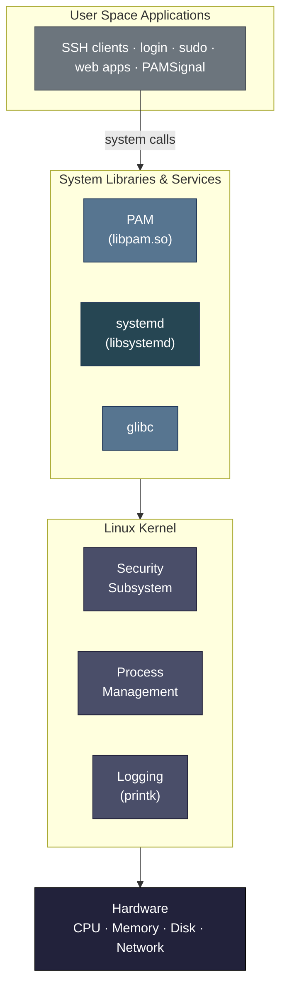
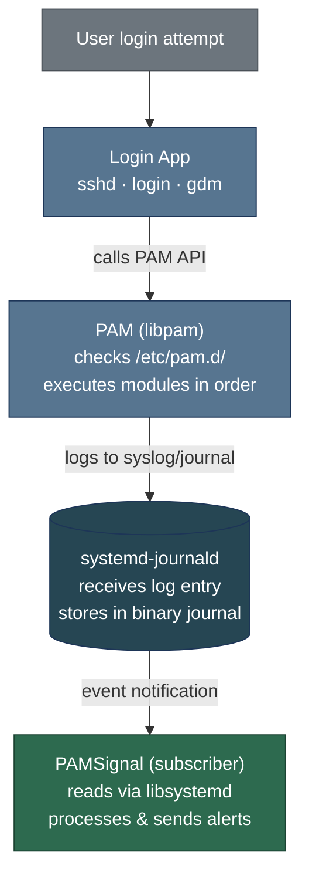
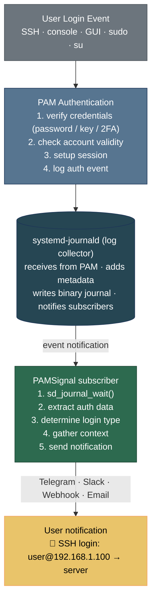
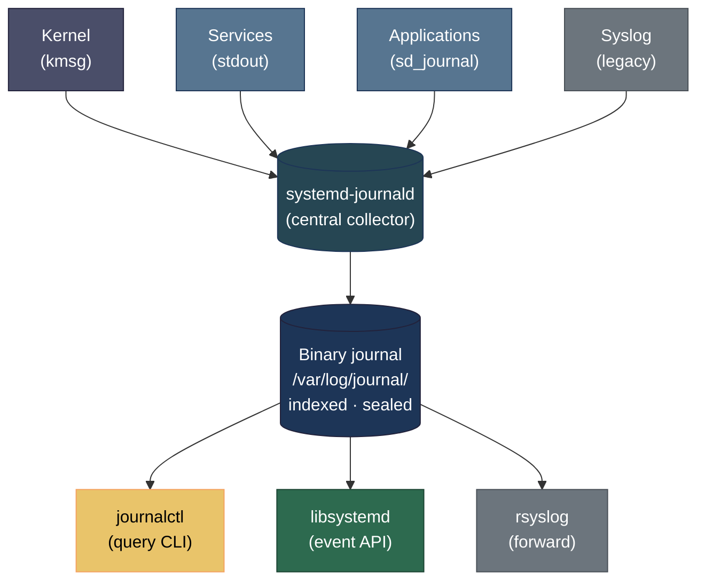

# Journal Subscriber

- **Status**: Completed
- **Start Date**: 27/12/2025
- **Completion Date**: 17/02/2026
- **Update Date**: 20/02/2026

## 1. Objectives

- **Event-driven**: Replace traditional log file scanning with event subscription from `libsystemd`, enabling PAMSignal to react immediately when new logs appear without wasting resources during idle periods.
- **Real-time**: Leverage the `sd_journal_wait()` function to achieve `~0s` latency from when the system records a login session to when PAMSignal begins processing the data.
- **Structured data**: Exploit the binary format of the Journal to accurately retrieve metadata fields such as `MESSAGE`, `_PID`, `_UID`.

## 2. Linux Architecture Overview

To understand how PAMSignal works, we need to understand the layered architecture of a Linux system:



**Key Layers:**

1. **Hardware Layer**: Physical resources (CPU, RAM, storage, network interfaces)
2. **Kernel Space**: The Linux kernel manages hardware, processes, memory, and security
3. **System Libraries**: Shared libraries like PAM, systemd, glibc that provide APIs for applications
4. **User Space**: Applications and services that users interact with

**Authentication Flow in Linux:**

When a user attempts to log in (via SSH, console, or GUI), the following happens:



## 3. What is PAM (Pluggable Authentication Module)?

**PAM** is a flexible authentication framework used by most Linux distributions to handle authentication tasks in a modular, configurable way.

### 3.1 Why PAM Exists

Before PAM, each application (login, ssh, sudo, etc.) had to implement its own authentication logic. This led to:
- Code duplication across applications
- Inconsistent security policies
- Difficulty updating authentication mechanisms system-wide

PAM solves this by providing a **centralized, pluggable authentication system**.

### 3.2 How PAM Works

**Configuration Files**: Located in `/etc/pam.d/`, each service has its own PAM configuration:

```bash
/etc/pam.d/
├── sshd          # SSH authentication rules
├── login         # Console login rules
├── sudo          # Sudo authentication rules
├── common-auth   # Shared authentication rules
└── ...
```

**Example PAM Configuration** (`/etc/pam.d/sshd`):

```
# PAM configuration for SSH daemon
auth       required     pam_unix.so        # Check password
auth       required     pam_env.so         # Set environment
account    required     pam_unix.so        # Check account validity
session    required     pam_systemd.so     # Register session with systemd
session    required     pam_unix.so        # Setup session
```

**PAM Module Types:**

1. **auth**: Verify user identity (password, biometric, 2FA)
2. **account**: Check if account is valid (not expired, not locked)
3. **session**: Setup/cleanup user session (mount home dir, log session)
4. **password**: Update authentication tokens (change password)

**Control Flags:**

- `required`: Must succeed, but continue checking other modules
- `requisite`: Must succeed, stop immediately if fails
- `sufficient`: Success is enough, skip remaining modules
- `optional`: Result is ignored unless it's the only module

### 3.3 PAM and Authentication Logging

When PAM authenticates a user, it generates log messages that are sent to the system logger:

**Traditional (rsyslog):**
```
Feb 17 22:30:15 server sshd[12345]: Accepted password for user from 192.168.1.100 port 54321 ssh2
Feb 17 22:30:15 server sshd[12345]: pam_unix(sshd:session): session opened for user by (uid=0)
```

**Modern (systemd-journald):**
```json
{
  "MESSAGE": "pam_unix(sshd:session): session opened for user by (uid=0)",
  "_PID": "12345",
  "_UID": "0",
  "_SYSTEMD_UNIT": "sshd.service",
  "_HOSTNAME": "server",
  "_SOURCE_REALTIME_TIMESTAMP": "1708186215000000",
  "SYSLOG_IDENTIFIER": "sshd"
}
```

**This is where PAMSignal comes in**: It monitors these PAM authentication events to detect and alert on login sessions.

## 4. Solution Comparison: auth.log Scanning vs systemd-journald

### 4.1 Previous Approach: Recurring auth.log Scanning

**Architecture:**

```
┌──────────────────────────────────────────┐
│         PAMSignal (Old Version)          │
│                                          │
│  while (true) {                          │
│    sleep(500ms);  ← Polling interval     │
│    read("/var/log/auth.log");            │
│    parse_new_lines();                    │
│    if (login_detected) {                 │
│      send_alert();                       │
│    }                                     │
│  }                                       │
└──────────────────────────────────────────┘
                    │
                    ▼
         ┌──────────────────┐
         │ /var/log/auth.log│ (Plain text file)
         │ (rsyslog writes) │
         └──────────────────┘
```

**Problems:**

1. **Inefficient Resource Usage**
   - Wakes up every 500ms even when no logins occur
   - On a typical server: ~172,800 unnecessary wake-ups per day
   - Wastes CPU cycles and battery (on laptops)

2. **Parsing Fragility**
   - Log format varies across distributions:
     ```
     # Ubuntu/Debian
     Feb 17 22:30:15 server sshd[12345]: Accepted password for user from 192.168.1.100
     
     # CentOS/RHEL
     2026-02-17T22:30:15.123456+07:00 server sshd[12345]: Accepted password for user from 192.168.1.100
     
     # Arch Linux
     [2026-02-17 22:30:15] server sshd[12345]: Accepted password for user from 192.168.1.100
     ```
   - Requires complex regex patterns that break across OS versions
   - Difficult to extract metadata (PID, UID, hostname)

3. **Security Vulnerabilities**
   - **Race Condition**: If an attacker deletes logs within 500ms, PAMSignal misses the event
   - **Log Tampering**: Plain text files are easy to modify/delete
   - **No Integrity Verification**: Can't detect if logs have been altered

4. **Latency**
   - Minimum 500ms delay (average 250ms)
   - Not acceptable for real-time security monitoring

### 4.2 Current Approach: systemd-journald Event Subscription

**Architecture:**

```
┌──────────────────────────────────────────┐
│         PAMSignal (New Version)          │
│                                          │
│  sd_journal_open(&j);                    │
│  sd_journal_wait(j, -1);  ← Blocking     │
│                                          │
│  // Wakes ONLY when event occurs         │
│  while (sd_journal_next(j) > 0) {        │
│    get_data(j, "MESSAGE");               │
│    get_data(j, "_PID");                  │
│    send_alert();                         │
│  }                                       │
└──────────────────────────────────────────┘
                    ▲
                    │ Event notification
         ┌──────────┴──────────┐
         │  systemd-journald   │
         │  (Binary journal)   │
         │  /var/log/journal/  │
         └─────────────────────┘
```

**Advantages:**

1. **Event-Driven Efficiency**
   - Zero CPU usage when idle (blocking wait)
   - Wakes up ONLY when authentication events occur
   - ~99.9% reduction in wake-ups compared to polling

2. **Structured Data Access**
   - No parsing needed, direct field access:
     ```c
     sd_journal_get_data(j, "MESSAGE", &data, &length);
     sd_journal_get_data(j, "_PID", &data, &length);
     sd_journal_get_data(j, "_UID", &data, &length);
     ```
   - Consistent format across all distributions
   - Rich metadata automatically available

3. **Security Hardening**
   - **Instant Notification**: ~0ms latency, no race condition window
   - **Tamper-Resistant**: Forward Secure Sealing (FSS) cryptographically prevents log modification
   - **Integrity Verification**: Can detect if logs have been altered
   - **Kernel-Level Logging**: Harder for attackers to bypass

4. **Real-Time Performance**
   - Sub-millisecond latency from event to processing
   - Suitable for critical security monitoring

### 4.3 Detailed Comparison Table

| Aspect | auth.log Scanning | systemd-journald |
|--------|------------------|------------------|
| **CPU Usage (Idle)** | Constant (polling every 500ms) | Zero (event-driven blocking) |
| **Latency** | 0-500ms (avg 250ms) | <1ms (instant notification) |
| **Data Format** | Unstructured text | Structured binary (key-value) |
| **Parsing Complexity** | High (regex, varies by distro) | None (direct field access) |
| **Metadata Extraction** | Manual parsing (error-prone) | Automatic (PID, UID, timestamp, etc.) |
| **Tamper Resistance** | None (plain text file) | High (cryptographic sealing) |
| **Race Condition Risk** | Yes (500ms window) | No (instant notification) |
| **Cross-Distro Support** | Fragile (format differences) | Robust (standardized API) |
| **Resource Efficiency** | ~172,800 wake-ups/day | ~10-100 wake-ups/day (typical) |
| **Implementation Complexity** | High (parsing logic) | Low (libsystemd API) |

**Conclusion**: The systemd-journald approach is superior in every measurable aspect: performance, security, reliability, and maintainability.

## 5. How PAMSignal Works Under the Hood

### 5.1 High-Level Architecture



### 5.2 PAMSignal Internal Workflow

**Step 1: Initialization**

```c
// Open the systemd journal
sd_journal *journal;
sd_journal_open(&journal, SD_JOURNAL_LOCAL_ONLY);

// Seek to the end (only monitor new events)
sd_journal_seek_tail(journal);
sd_journal_previous(journal); // Move to last entry

// Add filters for authentication events
sd_journal_add_match(journal, "_SYSTEMD_UNIT=sshd.service", 0);
sd_journal_add_match(journal, "SYSLOG_IDENTIFIER=sshd", 0);
// ... add more filters for login, sudo, etc.
```

**Step 2: Event Loop (Blocking Wait)**

```c
while (1) {
    // Block until new journal entries arrive
    // This is the KEY difference from polling
    int ret = sd_journal_wait(journal, (uint64_t) -1);
    
    if (ret < 0) {
        // Handle error
        continue;
    }
    
    // Process all new entries
    while (sd_journal_next(journal) > 0) {
        process_journal_entry(journal);
    }
}
```

**Step 3: Extract Authentication Data**

```c
void process_journal_entry(sd_journal *j) {
    const void *data;
    size_t length;
    
    // Extract message
    sd_journal_get_data(j, "MESSAGE", &data, &length);
    char *message = extract_value(data, length);
    
    // Check if it's a successful login
    if (!is_successful_login(message)) {
        return;
    }
    
    // Extract metadata
    sd_journal_get_data(j, "_PID", &data, &length);
    int pid = parse_int(data, length);
    
    sd_journal_get_data(j, "_UID", &data, &length);
    int uid = parse_int(data, length);
    
    sd_journal_get_data(j, "_HOSTNAME", &data, &length);
    char *hostname = extract_value(data, length);
    
    uint64_t timestamp;
    sd_journal_get_realtime_usec(j, &timestamp);
    
    // Parse login details from message
    LoginEvent event = parse_login_message(message);
    event.pid = pid;
    event.uid = uid;
    event.hostname = hostname;
    event.timestamp = timestamp;
    
    // Send notification
    send_notification(&event);
}
```

**Step 4: Notification Delivery**

```c
void send_notification(LoginEvent *event) {
    // Format message
    char message[1024];
    snprintf(message, sizeof(message),
        "🔐 %s login\n"
        "👤 User: %s\n"
        "🌐 From: %s\n"
        "🖥️  Server: %s\n"
        "⏰ Time: %s",
        event->type,      // "SSH", "Console", "Sudo"
        event->username,
        event->source_ip,
        event->hostname,
        format_timestamp(event->timestamp)
    );
    
    // Send via configured channels
    if (config.telegram_enabled) {
        send_telegram(message);
    }
    if (config.email_enabled) {
        send_email(message);
    }
    if (config.webhook_enabled) {
        send_webhook(message);
    }
}
```

### 5.3 Key Design Decisions

**Why Event-Driven?**
- **Efficiency**: No wasted CPU cycles during idle periods
- **Real-time**: Instant response to security events
- **Scalability**: Can handle high-volume authentication systems

**Why libsystemd?**
- **Standardization**: Works across all systemd-based distributions (Ubuntu, Debian, Fedora, Arch, etc.)
- **Reliability**: Maintained by the systemd project, battle-tested
- **Performance**: Optimized C library with minimal overhead

**Why Binary Journal?**
- **Structured Data**: No parsing errors, direct field access
- **Security**: Tamper-resistant with cryptographic sealing
- **Efficiency**: Indexed storage for fast queries

**When PAMSignal Runs:**
- As a systemd service (managed by systemd itself)
- Starts at boot, runs continuously
- Automatically restarts on failure
- Minimal resource footprint (~1-2MB RAM, 0% CPU when idle)

## 6. Understanding systemd and journal

Previously, I had an extremely simple idea: scan the `/var/log/auth.log` file and then parse strings to extract login session information. While this could prove the "login alert" concept was feasible, in terms of performance, stability, and reliability, it was not robust.

**Specifically:**

- Processing each log line presents challenges because time formats and message patterns vary significantly across different OS versions, leading to unreliable information extraction.

- Periodic polling every `500ms` wastes resources. In a typical day, there aren't many successful login sessions to the system, so this approach is inefficient.
- If a hacker gains system access and deletes traces in the auth.log file within 500ms, the system would be completely unaware.

### 6.1 What is systemd?

**systemd** is a modern system and service manager for Linux operating systems, released in 2010 by Lennart Poettering. It has become the de facto standard init system for most major Linux distributions, replacing traditional SysV (System V - was the fifth major version of Unix developed by AT&T Bell Labs in 1980s, released in 1983) init.

**SysV init (Traditional):**

- Uses shell scripts in `/etc/init.d/` to start/stop services
- Sequential startup (services start one after another)
- Simple but slow boot times
- Limited dependency management
- Used from the 1980s until the 2010s

**systemd (Modern):**

- Uses unit files (`.service` files) with declarative syntax
- Parallel startup (services start simultaneously when dependencies are met)
- Fast boot times
- Advanced dependency management, socket activation, and more
- Became the standard around 2010-2015

**Core Components:**

- **systemd (PID 1)**: The first process started by the kernel, responsible for initializing the system and managing all other processes
- **systemd-journald**: The logging daemon that collects and stores log data
- **systemctl**: Command-line tool for controlling systemd services
- **journalctl**: Command-line tool for querying and viewing journal logs

**Why systemd matters for PAMSignal:**

systemd provides a unified, modern approach to system management that addresses the limitations of traditional logging:

1. **Centralized Logging**: All system logs (kernel, services, applications) are collected in one place
2. **Binary Format**: Logs are stored in an indexed, structured binary format rather than plain text
3. **Rich Metadata**: Each log entry includes extensive metadata (PID, UID, service name, timestamps, etc.)
4. **Event-Driven API**: Applications can subscribe to log events in real-time via `libsystemd`

### 6.2 systemd-journald Architecture

**How it works:**



**Key Features:**

1. **Structured Storage**: Each log entry is a structured record with key-value pairs
2. **Indexing**: Fast queries using metadata fields (unit, priority, time range)
3. **Tamper-Resistance**: Optional Forward Secure Sealing (FSS) prevents log modification
4. **Automatic Rotation**: Size and time-based rotation with configurable retention
5. **Performance**: Optimized for high-volume logging with minimal overhead

### 6.3 Advantages Over Traditional Log Files

| Feature | Traditional (`/var/log/auth.log`) | systemd-journald |
|---------|--------------------------------|------------------|
| **Format** | Plain text, unstructured | Binary, structured with metadata |
| **Parsing** | Regex/string parsing (fragile) | Direct field access (reliable) |
| **Performance** | Sequential file scanning | Indexed queries |
| **Real-time** | File polling (500ms+ latency) | Event-driven API (~0ms latency) |
| **Tampering** | Easy to modify/delete | Sealed with cryptographic hashing |
| **Metadata** | Limited (timestamp, message) | Rich (PID, UID, service, hostname, etc.) |
| **Rotation** | Manual logrotate configuration | Automatic with systemd |

### 6.4 libsystemd Event-Driven API

For PAMSignal, the critical advantage is the **event-driven architecture** provided by `libsystemd`:

**Traditional Approach (Polling):**
```c
while (1) {
    read_log_file("/var/log/auth.log");
    parse_new_lines();
    sleep(500); // Waste CPU, miss events
}
```

**systemd Approach (Event-Driven):**
```c
sd_journal *j;
sd_journal_open(&j, SD_JOURNAL_LOCAL_ONLY);
sd_journal_seek_tail(j);

while (1) {
    // Wait for new journal entries (blocking, no CPU waste)
    sd_journal_wait(j, (uint64_t) -1);
    
    // Process new entries immediately
    while (sd_journal_next(j) > 0) {
        const void *data;
        size_t length;
        
        // Direct field access, no parsing needed
        sd_journal_get_data(j, "MESSAGE", &data, &length);
        sd_journal_get_data(j, "_PID", &data, &length);
        sd_journal_get_data(j, "_UID", &data, &length);
    }
}
```

**Key Functions:**

- `sd_journal_open()`: Open the journal for reading
- `sd_journal_wait()`: Block until new entries arrive (event-driven)
- `sd_journal_next()`: Move to the next entry
- `sd_journal_get_data()`: Retrieve specific fields by name
- `sd_journal_add_match()`: Filter entries by criteria (e.g., only auth events)

**Benefits for PAMSignal:**

1. ✅ **Zero polling overhead**: CPU usage only when events occur
2. ✅ **Instant notifications**: ~0ms latency from event to processing
3. ✅ **Reliable parsing**: No regex, direct field access
4. ✅ **Tamper detection**: Sealed logs prevent attacker log deletion
5. ✅ **Cross-distro compatibility**: Works on all systemd-based distributions

This architecture makes PAMSignal a truly real-time, efficient, and reliable authentication monitoring solution.
