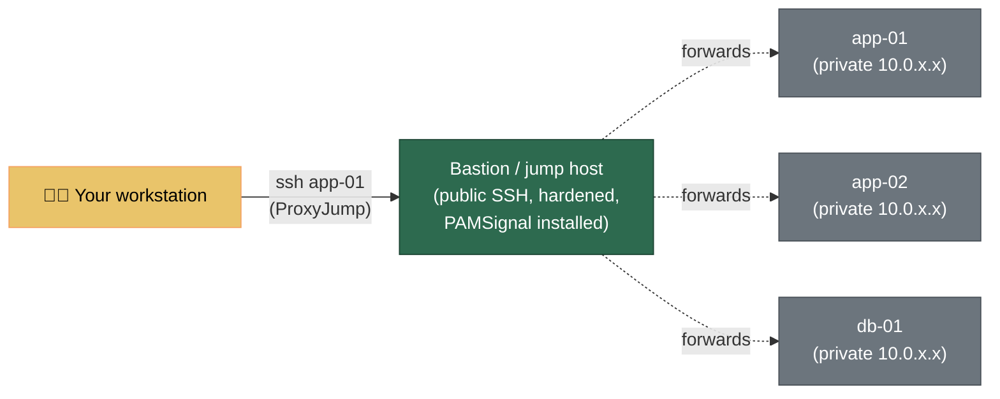

# Secure SSH & Manage a Fleet

> 🌐 **English** · [Tiếng Việt](vi/ssh-hardening.md)

SSH is the front door to your Linux server. PAMSignal tells you the instant someone knocks, rattles the handle, or gets in. This guide is about making the door itself hard to force — and about managing that door across one server or fifty without losing your mind.

If you have only ever logged in with a password, some of this will feel like a lot at once. That's fine. You do it **once per server** and then never think about it again — and PAMSignal is watching the whole time, so you get immediate feedback that each change worked.

> **New to all this?** Read [Quick Start](../README.md#-quick-start) first so PAMSignal is installed and you've seen at least one line in `journalctl -t pamsignal`. Then come back here.

---

## Where this fits

PAMSignal is **one layer** in a defence-in-depth stack. It does exactly one job — *detect and alert* — and does it well. The other layers are still your job, and this guide covers the most important one (Layer 1):

| Layer | Goal | Typical tools | Whose job |
|---|---|---|---|
| **1. Prevention** | Make the door hard to open | **SSH key-only auth, `sshd_config` hardening, firewall** | **You — this guide** |
| 2. Integrity | Detect tampering with the system itself | AIDE, `debsums`, `rpm -V` | You |
| **3. Detection / Alerting** | Tell you when something happens | **PAMSignal** | **PAMSignal** |
| 4. Forensics | Reconstruct what happened after the fact | `auditd`, journald retention | You |

PAMSignal **never touches `sshd`** — it doesn't change your SSH config, install a PAM module, or block anything. It reads PAM events from the systemd journal and tells you about them. So hardening SSH (this page) and detecting attacks on it (PAMSignal) are completely independent, complementary jobs. Hardening shrinks the attack surface; PAMSignal tells you when the remaining surface is being tested, and when something gets through.

The natural third partner is **automatic blocking** — see the [Fail2ban Integration Guide](../examples/fail2ban/README.md), which acts on PAMSignal's brute-force signal to drop attacker IPs at the firewall.

---

## Part 1 — Harden one server's SSH

Everything in this section runs **on the server**. Do it over an existing SSH session, and **keep that session open** until you've confirmed a new login works. That one habit saves you from every lock-out story you've ever heard.

### 1.1 Use SSH keys, not passwords

A password can be guessed, phished, or brute-forced. An SSH key cannot — it's a cryptographic secret that never leaves your machine. This is the single highest-impact change you can make.

**On your workstation** (laptop/desktop — *not* the server), generate a modern key if you don't have one:

```bash
ssh-keygen -t ed25519 -C "you@workstation"
# Press Enter for the default path (~/.ssh/id_ed25519).
# ALWAYS set a passphrase — it encrypts the key on disk.
```

`ed25519` is the current best-practice algorithm: short, fast, and strong. (If your organisation issues hardware security keys — YubiKey and friends — use `-t ed25519-sk` instead, which keeps the private key on the hardware.)

Copy the **public** key to the server:

```bash
ssh-copy-id you@your-server.example.com
# Or, if ssh-copy-id isn't available:
# ssh you@your-server.example.com 'mkdir -p ~/.ssh && cat >> ~/.ssh/authorized_keys' < ~/.ssh/id_ed25519.pub
```

**Now test it before changing anything else.** Open a *new* terminal and run:

```bash
ssh you@your-server.example.com
```

If it logs you in **without asking for your account password** (a key passphrase prompt is fine and expected), keys work. Only then continue.

### 1.2 Lock down `sshd_config` with a drop-in

Modern distros (Debian 12+, Ubuntu 22.04+, RHEL 9+) read extra config from `/etc/ssh/sshd_config.d/*.conf`. Dropping your hardening into its own file there is cleaner than editing the big `sshd_config` — it survives package upgrades untouched and is trivial to audit or remove.

Create `/etc/ssh/sshd_config.d/00-hardening.conf`:

```ini
# Authentication: keys only, no passwords, no root password login.
PubkeyAuthentication yes
PasswordAuthentication no
KbdInteractiveAuthentication no
PermitRootLogin prohibit-password
PermitEmptyPasswords no

# Slow down and bound each connection attempt.
MaxAuthTries 3
LoginGraceTime 20
MaxSessions 4

# Only these users (or groups) may log in at all. Adjust to your accounts.
AllowUsers deploy admin
# AllowGroups ssh-users

# Turn off things you almost certainly don't need.
X11Forwarding no
AllowAgentForwarding no
```

A few notes that matter:

- **`PermitRootLogin prohibit-password`** allows root login *only* with a key, never a password. If you have a normal user with `sudo` (recommended), use `PermitRootLogin no` and log in as that user instead.
- **The file name prefix matters.** `sshd` uses the **first** value it finds for each keyword, and `Include /etc/ssh/sshd_config.d/*.conf` is read in lexical order. Cloud images often ship a `50-cloud-init.conf` that *enables* password auth. A `00-` prefix sorts first, so your value wins. If your setting seems ignored, this is almost always why — check `sudo sshd -T | grep -i passwordauthentication` for the *effective* value.
- **`AllowUsers`** is a powerful allow-list: anyone not named simply cannot authenticate. Make sure your own account is in it before reloading.

### 1.3 Validate, then reload (without dropping your session)

**Always** check the syntax before applying — a typo here can lock everyone out:

```bash
sudo sshd -t          # prints nothing if the config is valid
sudo sshd -T | grep -iE 'passwordauthentication|permitrootlogin|allowusers'   # confirm effective values
```

Then reload. A *reload* re-reads the config without killing existing connections:

```bash
# Debian / Ubuntu — the unit is named "ssh"
sudo systemctl reload ssh

# RHEL / Fedora / AlmaLinux / Rocky — the unit is named "sshd"
sudo systemctl reload sshd
```

**The safety check:** with your current session still open, open a brand-new terminal and SSH in again. If it works, you're done. If it doesn't, you still have the old session to fix things. Never close that first session until the new one succeeds.

### 1.4 Watch PAMSignal confirm it

This is the satisfying part. Tail PAMSignal and watch your changes take effect in real time:

```bash
journalctl -t pamsignal -f
```

- Your key login shows up as `login_success ... auth=publickey`.
- A bot trying a password now fails *instantly* — you'll see `login_failure ... auth=password` with no chance of success.
- Once a single IP crosses your `fail_threshold`, you get a `brute_force_detected` line (and a chat alert if configured).

You've just closed the loop: prevention (Part 1) made the door strong, and detection (PAMSignal) proves it and watches it.

### 1.5 Optional extras

- **Change the port.** Moving SSH off `22` (e.g. `Port 2222`) won't stop a *targeted* attacker, but it dramatically cuts the background noise of internet-wide scanners — which means fewer junk alerts. If you do this, update your firewall and your `~/.ssh/config` (Part 2). Security by obscurity is a bonus, never the plan.
- **Firewall.** Restrict port 22/2222 to known IPs where you can (`ufw`, `firewalld`, or your cloud provider's security groups). A bastion (Part 2) lets you expose SSH on *one* host instead of all of them.
- **Two-factor.** For high-value hosts, add TOTP via `libpam-google-authenticator`. This is still Layer 1 (prevention) and lives in your PAM stack — PAMSignal will simply report the resulting successes and failures.

---

## Part 2 — Manage many servers without the pain

Once you have more than two or three servers, two problems show up: you can't remember every IP/port/user, and you don't want to expose SSH on every box to the whole internet. Both are solved on **your workstation** with `~/.ssh/config` — no server changes needed.

### 2.1 Give every server a name

Create or edit `~/.ssh/config` on your laptop:

```ini
# ~/.ssh/config  — on YOUR workstation, not the servers.

# Defaults applied to every host below.
Host *
    AddKeysToAgent yes
    ServerAliveInterval 60
    ServerAliveCountMax 3
    HashKnownHosts yes

Host web-01
    HostName 203.0.113.10
    User deploy
    Port 2222
    IdentityFile ~/.ssh/id_ed25519

Host web-02
    HostName 203.0.113.11
    User deploy

# One block can cover a whole naming scheme via wildcards.
Host db-*
    User postgres
    IdentityFile ~/.ssh/id_ed25519_db
```

Now instead of `ssh -p 2222 deploy@203.0.113.10`, you type:

```bash
ssh web-01
```

Tab-completion, `scp file web-02:/tmp/`, and `rsync` all understand these aliases. This is the single biggest quality-of-life upgrade for managing a fleet — and it makes the fleet rollout in Part 3 trivial, because every tool can refer to hosts by name.

### 2.2 Reach private servers through a bastion (jump host)

The best way to expose SSH for a fleet is to expose it on **exactly one** hardened, monitored host — the *bastion* (or *jump host*) — and keep every other server on a private network reachable only through it. `ProxyJump` makes this a one-liner from your side:

```ini
Host bastion
    HostName bastion.example.com
    User admin
    Port 2222

# Every host on the private 10.0.x.x range is reached via the bastion.
Host 10.0.*.*
    ProxyJump bastion
    User deploy

Host app-01
    HostName 10.0.1.21
    ProxyJump bastion
    User deploy
```

`ssh app-01` now transparently hops through the bastion. The connection to `app-01` is end-to-end encrypted — the bastion only forwards bytes, it never sees your session.



**Why this pairs so well with PAMSignal:** the bastion becomes the one internet-facing SSH surface, so it absorbs essentially all the brute-force traffic. Install PAMSignal there and your alerts concentrate where the attacks actually land. Install it on the private hosts too, and any login that *didn't* come through the bastion is an immediate red flag.

> **Prefer `ProxyJump` over agent forwarding.** Agent forwarding (`ForwardAgent yes`) exposes your keys to whatever host you land on. `ProxyJump` doesn't — your keys never touch the bastion. Only forward your agent to hosts you fully trust.

### 2.3 Key hygiene at fleet scale

- **One key per human, not one shared key.** If an admin leaves, you revoke *their* public key from `authorized_keys` everywhere — you don't have to rotate a secret everyone shared.
- **Distribute `authorized_keys` with config management** (Part 3), never by hand. A file you edit by hand on 30 servers will drift.
- **Use a passphrase + `ssh-agent`** so the key is encrypted at rest but you type the passphrase once per session.

---

## Part 3 — Roll PAMSignal out across the fleet

You hardened the doors; now put a sensor behind each one. The goal: every host runs PAMSignal, they share a sane config, and they all report into one place (chat for real-time pings, [Grafana](./grafana-getting-started.md) for the fleet-wide view).

### 3.1 The quick way: a loop over your SSH aliases

For a handful of hosts, the `~/.ssh/config` names from Part 2 make a one-liner enough. Install per the [Deployment guide](./deployment.md) on each:

```bash
for h in bastion web-01 web-02 db-01; do
  echo "== installing on $h =="
  ssh "$h" 'sudo apt-get update && sudo apt-get install -y pamsignal'   # assumes the repo is already configured
done
```

…and verify the whole fleet at once:

```bash
for h in bastion web-01 web-02 db-01; do
  echo "== $h =="
  ssh "$h" 'systemctl is-active pamsignal; journalctl -t pamsignal -n 2 --no-pager'
done
```

### 3.2 The repeatable way: Ansible

Past a handful of hosts, use config management so the install **and** the config are reproducible. Ansible reads your `~/.ssh/config` aliases natively. A minimal starting point:

```ini
# inventory.ini
[pamsignal_fleet]
bastion
web-01
web-02
db-01
```

```yaml
# install-pamsignal.yml
- hosts: pamsignal_fleet
  become: true
  tasks:
    - name: Install pamsignal (Debian/Ubuntu)
      ansible.builtin.apt:
        name: pamsignal
        state: present
        update_cache: true
      when: ansible_os_family == "Debian"

    - name: Install pamsignal (RHEL family)
      ansible.builtin.dnf:
        name: pamsignal
        state: present
      when: ansible_os_family == "RedHat"

    - name: Deploy the shared config
      ansible.builtin.template:
        src: pamsignal.conf.j2
        dest: /etc/pamsignal/pamsignal.conf
        owner: root
        group: pamsignal
        mode: "0640"
      notify: reload pamsignal

    - name: Enable and start
      ansible.builtin.systemd:
        name: pamsignal
        enabled: true
        state: started

  handlers:
    - name: reload pamsignal
      ansible.builtin.systemd:
        name: pamsignal
        state: reloaded
```

```bash
ansible-playbook -i inventory.ini install-pamsignal.yml
```

Because the config is a Jinja template (`pamsignal.conf.j2`), you can set **per-host context tags** from inventory variables — `provider` and `service_name` are appended to every alert so you always know which host (or which customer) an alert came from:

```ini
# pamsignal.conf.j2  (excerpt)
provider = {{ pamsignal_provider | default('selfhosted') }}
service_name = {{ inventory_hostname }}
```

That per-host tagging is the foundation of the multi-tenant patterns in [Use Cases → Small hosting provider](./use-cases.md#small-hosting-provider--msp).

### 3.3 One config, many hosts

Keep a single canonical `pamsignal.conf` in your config-management repo and push it everywhere. The keys most worth standardising across a fleet:

- `fail_threshold` / `fail_window_sec` — your fleet-wide definition of "brute force".
- `enable_notification_type` — narrow the chat noise (e.g. `login_success,brute_force`); the local journal still records everything. See [Configuration](./configuration.md#notification-type-filter).
- The alert-channel credentials — usually one shared channel for the fleet, or one per environment.

Reload everywhere after a config change without restarting:

```bash
for h in bastion web-01 web-02 db-01; do ssh "$h" 'sudo systemctl reload pamsignal'; done
# …or, with Ansible, just re-run the playbook — the handler reloads only changed hosts.
```

---

## Don't lock yourself out — the checklist

Hardening and automation are exactly where lock-outs happen. Before you walk away from any host:

- [ ] **A second session is still open** while you test the change.
- [ ] **A new SSH login succeeds** *before* you close the old session.
- [ ] **Your account is in `AllowUsers`** (if you set it).
- [ ] **You know your out-of-band path** — cloud serial console, hypervisor, or physical access — in case all SSH fails.
- [ ] If you also run [Fail2ban](../examples/fail2ban/README.md), **your own IP is in `ignoreip`** so a fat-fingered password can't ban you.

---

## How PAMSignal complements this — at a glance

| What you did | Layer | What it buys you | What PAMSignal adds |
|---|---|---|---|
| Key-only auth, `sshd_config` hardening | Prevention | Password attacks can't succeed | Tells you the instant they're attempted, and confirms each legit login |
| Bastion + private network | Prevention | One small attack surface instead of many | Concentrates alerts on the bastion; flags any login that bypassed it |
| Fail2ban on the brute-force signal | Response | Repeat offenders blocked at the firewall | Provides the validated `brute_force_detected` signal Fail2ban acts on |
| Fleet rollout + per-host tags | Operations | Reproducible, named, monitored fleet | One real-time + [one fleet-wide](./grafana-getting-started.md) view of all auth activity |

PAMSignal does not *replace* any of these — it makes them observable. A hardened server you can't see is a server you're trusting blindly; PAMSignal is how you stop trusting blindly.

---

## Further reading

- 🔒 **[Deployment](./deployment.md)** — install, systemd hardening directives, uninstall
- ⚙️ **[Configuration](./configuration.md)** — every config key, including the notification-type filter
- 🛡️ **[Fail2ban Integration](../examples/fail2ban/README.md)** — turn the brute-force signal into automatic IP bans
- 📊 **[Grafana from Zero](./grafana-getting-started.md)** — one dashboard for the whole fleet's auth activity
- 🎯 **[Threat Model — Observation scope](./threat-model.md#observation-scope)** — which access channels PAMSignal can and cannot see (read this before you assume SSH is your only door)
- 🧩 **[Use Cases](./use-cases.md)** — solo, small team, and hosting-provider playbooks
