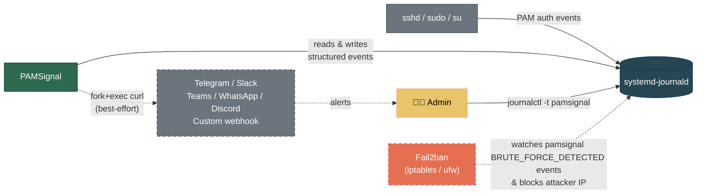

# PAMSignal 🚨

> 🌐 [English](../../README.md) · **Tiếng Việt**


PAMSignal là một login monitor nhẹ, zero-dependency cho Linux server. Nó theo dõi systemd journal để bắt các sự kiện PAM authentication và gửi cảnh báo real-time tới các nền tảng nhắn tin bạn yêu thích.

Nếu bạn quản lý vài server và muốn biết ngay lập tức khi có ai đó đăng nhập hoặc thử brute-force máy của bạn — mà không phải triển khai Wazuh, EDR, hay đọc 200 trang tài liệu — thì đây là thứ dành cho bạn.

## 🙏 Lời cảm ơn

Dự án này sẽ trông rất khác — hoặc không tồn tại — nếu thiếu hai người bạn:

<table>
<tr>
<td width="100" align="center" valign="top">
<a href="https://github.com/hongquan"></a><br/>
<sub><b><a href="https://github.com/hongquan">Nguyen Hong&nbsp;Quan</a></b></sub><br/>
<sub>@hongquan</sub>
</td>
<td valign="top">

Đã đưa ra những góp ý thẳng thắn, không nể nang về các chuẩn Linux và kỳ vọng của operator — những điều đã định hình lại roadmap và kiến trúc của PAMSignal. Quyết định thiết kế lớn nhất trong codebase này — subscribe <code>systemd-journald</code> để lấy sự kiện PAM thay vì tail <code>/var/log/auth.log</code> — đến trực tiếp từ sự phản biện của anh. Việc anh nhấn mạnh tuân thủ Linux <a href="https://refspecs.linuxfoundation.org/FHS_3.0/fhs/index.html">FHS</a> cũng xuyên suốt mọi lựa chọn đường dẫn file trong dự án: binary nằm dưới <code>/usr/bin</code>, config dưới <code>/etc/pamsignal/</code>, runtime state dưới <code>/run/pamsignal/</code>, systemd vendor unit dưới <code>/usr/lib/systemd/system/</code>, và apt repository keyring tại <code>/etc/apt/keyrings/pamsignal.gpg</code> (<a href="https://github.com/anhtuank7c/pamsignal/issues/14">#14</a>). Kết quả là một daemon hòa hợp với hệ sinh thái Linux hiện đại thay vì phải lách qua nó. 🙇

</td>
</tr>
<tr>
<td width="100" align="center" valign="top">
<a href="https://github.com/lehiep1994"></a><br/>
<sub><b><a href="https://github.com/lehiep1994">Samuel&nbsp;Le</a></b></sub><br/>
<sub>@lehiep1994</sub>
</td>
<td valign="top">

Đã giữ cho mình tiếp tục đọc và tiếp tục xây dựng. Anh gửi cho mình những cuốn sách về Linux internals đúng vào lúc mình cần nhất, và sự động viên bền bỉ để *không* bỏ dở dự án — qua mọi giai đoạn "liệu cái này có đáng ship không?" — là một phần thật sự khiến PAMSignal đi được tới một bản release. 🙇

</td>
</tr>
</table>

## ✨ Tại sao chọn PAMSignal?

- **Cảnh báo real-time**: Tích hợp sẵn cho Telegram, Slack, Teams, WhatsApp, Discord, và Custom Webhook.
- **Bảo vệ chống brute-force**: Tự động đếm số lần thất bại và tích hợp mượt mà với [Fail2ban](examples/fail2ban.md) để chặn kẻ tấn công.
- **Cực kỳ nhẹ**: Một C binary duy nhất với một file config duy nhất. Dependency duy nhất là `libsystemd`.
- **Chịu lỗi tốt**: Việc gửi cảnh báo được cô lập qua `fork+exec`. Network timeout hay API lỗi sẽ không bao giờ làm crash tiến trình monitoring lõi.

## 🏗️ Kiến trúc



## 🚀 Bắt đầu nhanh

### 1. Cài đặt

<details>
<summary><strong>Debian / Ubuntu</strong></summary>

```bash
sudo install -d -m 0755 /etc/apt/keyrings
curl -fsSL https://anhtuank7c.github.io/pamsignal/key.asc | sudo gpg --dearmor -o /etc/apt/keyrings/pamsignal.gpg
echo "deb [signed-by=/etc/apt/keyrings/pamsignal.gpg] https://anhtuank7c.github.io/pamsignal stable main" | sudo tee /etc/apt/sources.list.d/pamsignal.list
sudo apt update && sudo apt install pamsignal
```
</details>

<details>
<summary><strong>Fedora / CentOS / RHEL</strong></summary>

**Fedora / CentOS**
```bash
sudo dnf config-manager addrepo --from-repofile=https://anhtuank7c.github.io/pamsignal/rpm/fedora/pamsignal.repo
sudo dnf install pamsignal
```

**RHEL 9 / AlmaLinux 9 / Rocky Linux 9**
```bash
sudo dnf config-manager --add-repo https://anhtuank7c.github.io/pamsignal/rpm/el9/pamsignal.repo
sudo dnf install pamsignal
```
</details>

<details>
<summary><strong>Ubuntu 20.04 LTS (Focal, chỉ còn ESM)</strong></summary>

20.04 chỉ còn ESM từ tháng 4/2025 và không có apt pocket trên gh-pages cho nó — nhưng một bản `.deb` nhắm Focal được build và smoke-test trong CI ở mỗi release, rồi đính kèm làm GitHub release asset. Tải về và cài trực tiếp:

```bash
VERSION=0.5.0   # cập nhật theo từng release — xem https://github.com/anhtuank7c/pamsignal/releases
curl -fL -o pamsignal_focal.deb \
  "https://github.com/anhtuank7c/pamsignal/releases/download/v${VERSION}/pamsignal_${VERSION}-1_focal_amd64.deb"

# Tuỳ chọn: verify chữ ký detached (fingerprint của signing key ở bên dưới)
curl -fL -o pamsignal_focal.deb.asc \
  "https://github.com/anhtuank7c/pamsignal/releases/download/v${VERSION}/pamsignal_${VERSION}-1_focal_amd64.deb.asc"
gpg --verify pamsignal_focal.deb.asc pamsignal_focal.deb

# Cài đặt — apt sẽ tự resolve libsystemd0 và các transitive dep từ apt sources của host
sudo apt install ./pamsignal_focal.deb
```

Để nâng cấp sau này, chạy lại đúng công thức trên với `VERSION` mới. Với cả một fleet, hãy bọc nó trong một script Ansible / cron / shell nhỏ.

> 🕒 **Nhắc về vòng đời.** Focal kết thúc ESM vào tháng 4/2030. Hãy lên kế hoạch migrate sang 22.04 LTS (Standard Support tới tháng 4/2027) hoặc 24.04 LTS trong khoảng ~12 tháng tới. Xem [docs/distros.md](distros.md) để biết ma trận hỗ trợ đầy đủ.
</details>

*Fingerprint của signing key: `2D2C 828F A6F4 D019 E446  8FBB B106 2235 2862 2F69`*

### 2. Cấu hình cảnh báo

Sửa file cấu hình (`/etc/pamsignal/pamsignal.conf`) và điền credential nền tảng của bạn. Ví dụ, để bật Telegram:

```ini
telegram_bot_token = <your_bot_token>
telegram_chat_id = <your_chat_id>
```
*Xem [Hướng dẫn cài đặt cảnh báo](alerts.md) cho Slack, Teams, WhatsApp, và Discord.*

**Hai key tuning đáng biết ngay từ ngày đầu** — một cái điều khiển *tần suất* bạn bị ping, cái kia điều khiển *cái gì* khiến bạn bị ping:

```ini
# Số giây tối thiểu giữa các brute-force alert cho cùng một IP.
# Mặc định 60. Đặt 0 để bắn ở MỌI lần vượt ngưỡng —
# hữu ích cho host ít traffic, nơi bạn không muốn gộp bất kỳ tín hiệu nào.
alert_cooldown_sec = 60

# Loại sự kiện nào kích hoạt chat alert. Mặc định là "all" (mọi loại),
# khá ồn trong production. Hãy thu hẹp về đúng thứ bạn quan tâm —
# phần lớn operator chỉ muốn login thành công và brute-force ping.
enable_notification_type = login_success,brute_force
```
*Cả sáu token loại sự kiện (`login_success`, `login_failed`, `session_open`, `session_close`, `brute_force`, `all`) được tài liệu hoá tại [Configuration → Notification-type filter](configuration.md#bộ-lọc-loại-thông-báo). `journalctl -t pamsignal` vẫn giữ toàn bộ dấu vết forensic bất kể bạn lọc bỏ gì khỏi chat.*

### 3. Tích hợp Custom Webhook (Tuỳ chọn)

Cần gửi cảnh báo tới một provider mà chúng tôi không hỗ trợ sẵn? Hay muốn tự xây logic auto-ban của riêng bạn?
PAMSignal gửi structured ECS JSON tới bất kỳ custom webhook nào.

👉 **[Xem ví dụ Node.js Custom Webhook](examples/nodejs-webhook.md)** để thấy xây một receiver của riêng bạn dễ thế nào!

### 4. Reload & Theo dõi

Áp dụng cấu hình và xem sự kiện trực tiếp:

```bash
sudo systemctl reload pamsignal
journalctl -t pamsignal -f
```

## 🛡️ Tăng cường với Fail2ban (Bảo vệ nâng cao, tuỳ chọn)

PAMSignal tính sẵn ngưỡng brute-force cho bạn. Bạn có thể tiến thêm một bước bằng cách tự động chặn IP của kẻ tấn công bằng Fail2ban. Vì PAMSignal đã làm phần nặng nhọc, việc cấu hình Fail2ban cực kỳ đơn giản.

👉 **[Đọc hướng dẫn tích hợp Fail2ban](examples/fail2ban.md)**

## 📊 Góc nhìn toàn fleet trong Grafana

`journalctl` theo từng host và chat alert real-time chỉ bao quát một host. Để có fleet-wide auth visibility — một góc nhìn queryable trên mọi server — có sẵn một integration Loki/Alloy/Grafana đi kèm PAMSignal: sự kiện theo schema ECS chảy vào Loki qua Alloy, và một dashboard duy nhất trả lời "đang có gì xảy ra với auth trên cả fleet của tôi ngay lúc này?" chỉ trong một cái liếc.


Stack thử-tại-chỗ (không cần fleet Linux thật):

```bash
cd examples/grafana && docker compose up -d
# → http://localhost:3000 (anonymous Admin, dashboard có sẵn)
```

👉 **[Đọc hướng dẫn tích hợp Grafana](examples/grafana.md)** — deploy đầy đủ + cài Alloy + 4 alert rule

## 📚 Tài liệu

- 🏛️ **[Kiến trúc](architecture.md)** — Sơ đồ C4, mô hình cô lập, và các quyết định thiết kế
- ⚙️ **[Cấu hình](configuration.md)** — Tham chiếu config, CLI flag, và tuning
- 🔔 **[Cảnh báo](alerts.md)** — Webhook payload và cài đặt kênh
- 🔒 **[Triển khai](deployment.md)** — Hardening bảo mật và cấu hình systemd
- 🎯 **[Threat Model](threat-model.md)** — pamsignal phòng thủ trước cái gì, cố tình không làm gì, và lý do thiết kế đằng sau sự phân tách
- 📊 **[Tích hợp Grafana](grafana-integration.md)** — Thiết kế dashboard auth toàn fleet (schema, label cardinality, bố cục panel)
- 🐧 **[Distro được hỗ trợ](distros.md)** — Ma trận ba mức (CI-tested / kỳ vọng chạy được / không hỗ trợ) kèm lý do từng dòng
- 🛠️ **[Phát triển](development.md)** — Build từ source và testing
- 🔐 **[Chính sách bảo mật](SECURITY.md)** — Kênh báo lỗi có trách nhiệm và các phiên bản được hỗ trợ
- 📝 **[Changelog](../../CHANGELOG.md)** — Trạng thái, theo dõi công việc, và cập nhật

---

## 🤖 Xây dựng với sự cộng tác của AI

Dự án này được xây dựng với sự hỗ trợ của AI ([Claude Code](https://claude.ai/claude-code)). Mình công khai về quy trình này: AI bắt các edge case, dẫn dắt quyết định kiến trúc, và thậm chí đã thực hiện [đợt review bảo mật OWASP ASVS 5.0](../../.claude/skills/owasp-review/SKILL.md) giúp hardening dự án. Thư mục `.claude/` được commit vào repo này để bạn có thể kiểm tra chính xác cách AI được sử dụng. Con người test trên hệ thống thật và chịu trách nhiệm cho việc ship.
