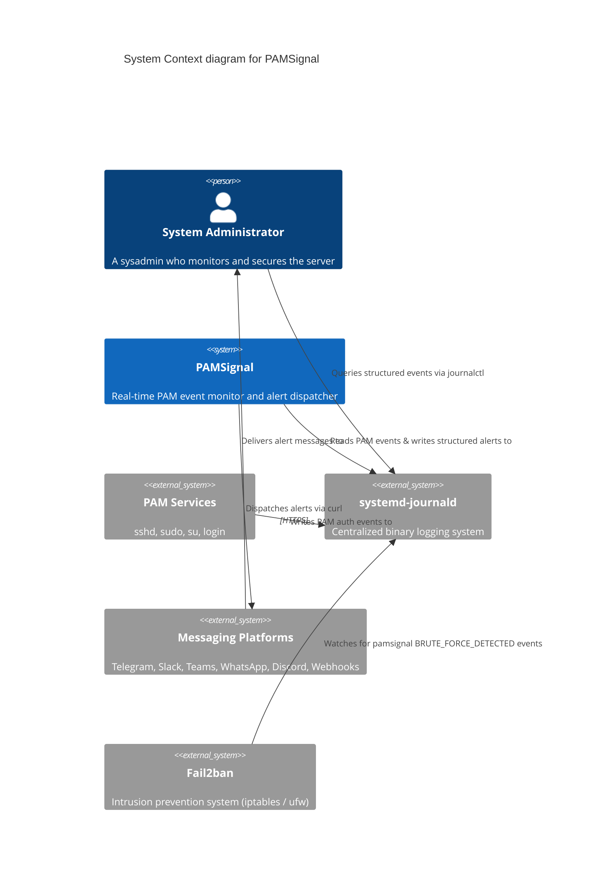
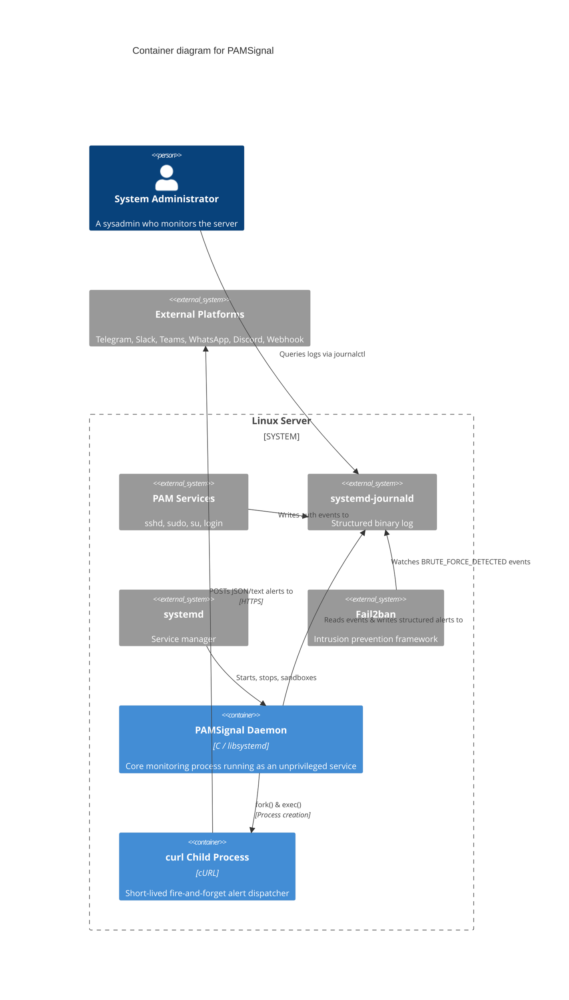
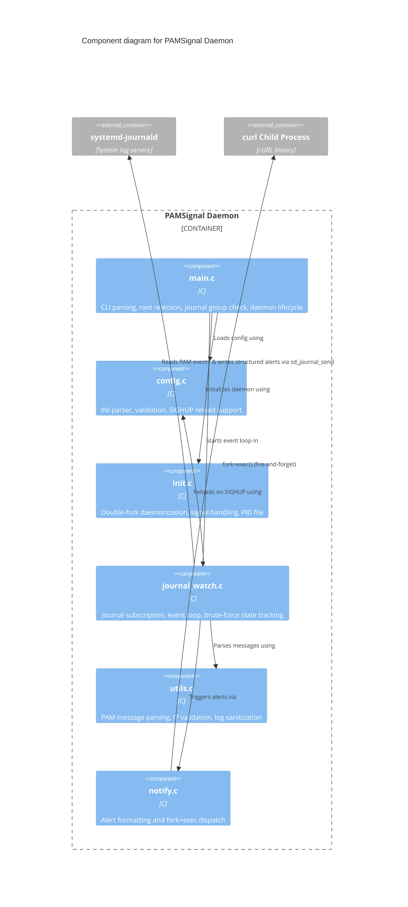
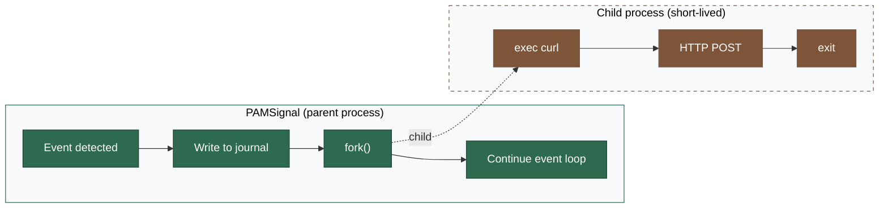

# Architecture

> 🌐 [English](../architecture.md) · **Tiếng Việt**

PAMSignal được thiết kế xung quanh một nguyên tắc cốt lõi: **làm tốt một việc với ít thành phần chuyển động nhất có thể.**

Nó đăng ký theo dõi systemd journal, lọc các thông báo liên quan đến PAM từ sshd, sudo, su và login, phân tích từng thông báo để trích xuất dữ liệu có cấu trúc (tên người dùng, địa chỉ IP nguồn, cổng, dịch vụ, phương thức xác thực), rồi ghi lại các sự kiện có cấu trúc trở lại journal với các trường tùy chỉnh. Nó theo dõi các lần đăng nhập thất bại theo IP và phát hiện các mẫu brute-force. Tuỳ chọn, nó gửi các cảnh báo best-effort đến các nền tảng nhắn tin mà không gây rủi ro cho việc giám sát cốt lõi.

Single binary. Single config file. Single dependency (`libsystemd`). Không database, không web server, không relay process riêng biệt.

## C4 Model

Theo quy ước [C4 model](https://c4model.com/), chúng ta ánh xạ kiến trúc từ tổng quan hệ thống cấp cao xuống các thành phần nội bộ.

### Level 1: System Context

Sơ đồ System Context cung cấp cái nhìn tổng quan cấp cao về cách người dùng tương tác với các hệ thống nội bộ và bên ngoài để nhận giá trị. Nó cho thấy PAMSignal trong môi trường máy chủ Linux rộng hơn.



### Level 2: Container

Sơ đồ Container phóng to vào ranh giới hệ thống để hiển thị các container có thể chạy/triển khai độc lập. PAMSignal là một daemon đơn tiến trình. Các cảnh báo được gửi bởi các tiến trình con (`curl`) có thời gian sống ngắn và không thể ảnh hưởng đến daemon giám sát cha.



### Level 3: Component

Sơ đồ Component phóng to vào container PAMSignal daemon để hiển thị các thành phần C nội bộ, ánh xạ đến các file source thực tế trong dự án.



## Data flow

```
SSH login attempt
    → sshd writes to journald
        → pamsignal reads via sd_journal_wait/next
            → utils.c parses message, extracts fields
                → journal_watch.c writes structured event via sd_journal_send
                    → journald stores event with custom fields
                        → admin reads with: journalctl -t pamsignal
                → notify.c fork() → child exec("curl", ...) → Telegram/Slack/etc.
                    → parent continues immediately (fire-and-forget)
                    → child exits on its own (success or failure)
```

## Mô hình cô lập cảnh báo

Các cảnh báo là **best-effort và không thể làm gián đoạn việc giám sát cốt lõi**. Đây là cách hoạt động:



**Tại sao thiết kế này an toàn:**

1. Tiến trình cha **luôn ghi vào journal trước** — bản ghi cốt lõi được lưu trữ trước khi có bất kỳ nỗ lực cảnh báo nào
2. `fork()` tạo ra một tiến trình con copy-on-write — nhẹ trên Linux, không có trạng thái chia sẻ
3. Tiến trình cha **không chờ** tiến trình con — nó tiếp tục vòng lặp sự kiện ngay lập tức
4. Nếu tiến trình con bị crash, segfault hoặc treo — tiến trình cha hoàn toàn không bị ảnh hưởng
5. Nếu Telegram/Slack/Discord bị sập — tiến trình con timeout và thoát, pamsignal tiếp tục giám sát
6. `SIGCHLD` bị bỏ qua (`SA_NOCLDWAIT`) nên các zombie process được tự động thu dọn
7. Tiến trình con `exec` `curl` — không có HTTP library nào được link vào tiến trình cha

### Cách gọi curl (config dùng memfd)

Mỗi sender theo kênh — Telegram, Slack/Teams/Discord, WhatsApp, custom webhook — đều đi qua một điểm vào nội bộ duy nhất (`post_alert` trong `src/notify.c`) — điểm này ghi cấu hình per-request vào một file được tạo bởi `memfd_create()` trong bộ nhớ và truyền cho curl dưới dạng `-K /dev/fd/9`. Memfd có bit CLOEXEC được xóa bằng `dup2`; mọi file descriptor kế thừa khác đều được đóng trong tiến trình con trước khi `execv`.

Nội dung trong memfd config:

- `url = "<endpoint>"` — luôn có mặt.
- `header = "<full Name: value>"` — có khi kênh cần auth header. WhatsApp dùng nội bộ cho Meta Cloud API Bearer; kênh custom-webhook dùng cho `webhook_auth_header`.
- `cert = "<path>"`, `key = "<path>"`, `cacert = "<path>"` — có khi kênh custom-webhook được cấu hình mTLS. Bản thân các đường dẫn không phải bí mật (nội dung file mới là bí mật, và nằm trên đĩa trong ranh giới tin cậy của daemon), nhưng việc định tuyến chúng qua cùng memfd config giúp `argv` của tiến trình con curl tối giản và nhất quán bất kể có bao nhiêu tùy chọn xác thực được cấu hình.

Hiệu ứng trên `/proc/<pid>/cmdline` của tiến trình con curl: mỗi lần gửi cảnh báo đều tạo ra một `argv` là `curl -s -S --max-time 10 --proto =https --proto-redir =https -H "Content-Type: application/json" -K /dev/fd/9 -d <body>`, byte-identical dù là kênh nào hay chế độ xác thực nào đang được dùng. Một người dùng không có đặc quyền đọc `/proc/*/cmdline` không thể biết từ command line liệu có token, client cert, hay cả hai được cấu hình, chứ chưa nói đến việc thu thập các giá trị đó.

Các flag `--proto =https` / `--proto-redir =https` vẫn ở trên `argv` (không nằm trong file config) để có thể kiểm tra từ bên ngoài như một đảm bảo hardening — bất kỳ ai xem xét tiến trình đang chạy đều có thể xác nhận rằng các scheme cleartext / non-HTTPS bị từ chối ngay cả trước cổng validator.

## Các trường journal có cấu trúc

PAMSignal ghi sự kiện bằng `sd_journal_send()` với tên trường được căn chỉnh theo [Elastic Common Schema (ECS)] để các công cụ SIEM hiện có có thể ingest journal trực tiếp qua tên trường ECS chuẩn thay vì một từ điển riêng của nhà cung cấp. (Từ series v0.2.x, PAMSignal cũng phát ra song song bộ trường `PAMSIGNAL_*`; các trường legacy đó đã bị loại bỏ trong v0.3.0 — hãy cập nhật mọi query `journalctl PAMSIGNAL_EVENT=…` sang các dạng ECS bên dưới.)

Cho các sự kiện login / session:

| Trường | Ví dụ | Mô tả |
|-------|---------|-------------|
| `EVENT_ACTION` | `login_failure` | Một trong: `session_opened`, `session_closed`, `login_success`, `login_failure`, `brute_force_detected` |
| `EVENT_CATEGORY` | `authentication` | Danh sách phân cách bằng dấu phẩy; session thêm `session`, brute-force thêm `intrusion_detection` |
| `EVENT_KIND` | `event` | `event` cho quan sát, `alert` cho brute-force |
| `EVENT_OUTCOME` | `failure` | `success`, `failure`, hoặc `unknown` |
| `EVENT_SEVERITY` | `5` | 3=info, 4=notice, 5=warning, 8=alert |
| `EVENT_MODULE` | `pamsignal` | Luôn là `pamsignal` |
| `USER_NAME` | `root` | Với sshd là tài khoản bị tấn công; với sudo/su là actor cục bộ (`ruser`) |
| `SOURCE_IP` | `203.0.113.45` | IP từ xa (đã được xác thực). Trống / vắng mặt với brute-force sudo/su thuần cục bộ |
| `SOURCE_PORT` | `22` | Cổng từ xa (chỉ với sự kiện login) |
| `SERVICE_NAME` | `sshd` | PAM service: `sshd`, `sudo`, `su`, `login`, `other` |
| `HOST_HOSTNAME` | `web-01` | Hostname của máy chủ |
| `PROCESS_PID` | `12345` | PID của sshd / sudo / su liên quan đến sự kiện |

Với các sự kiện brute-force, bộ `EVENT_*` tương tự được áp dụng, thêm vào đó — chỉ với biến thể local-actor — là `USER_TARGET_NAME` (ví dụ: `root`) — người dùng mà actor đang cố leo thang đặc quyền đến.

Ví dụ query:

```bash
# All pamsignal events
journalctl -t pamsignal

# Only failed logins
journalctl -t pamsignal EVENT_ACTION=login_failure

# Only brute-force alerts (both IP-keyed and local-actor-keyed)
journalctl -t pamsignal EVENT_ACTION=brute_force_detected

# Events from a specific IP
journalctl -t pamsignal SOURCE_IP=203.0.113.45

# JSON output (for scripting)
journalctl -t pamsignal -o json
```

[Elastic Common Schema (ECS)]: https://www.elastic.co/guide/en/ecs/current/index.html

## Quyết định thiết kế

**Tại sao dùng systemd journal làm đầu ra chính?**
Journal đã có sẵn ở đó. Nó cung cấp các trường có cấu trúc, kiểm soát truy cập, persistence và rotation. Quản trị viên có thể query bằng filter `journalctl`. Script có thể tiêu thụ đầu ra JSON. Không có định dạng log tùy chỉnh nào cần duy trì.

**Tại sao dùng fork+exec curl cho cảnh báo (không dùng libcurl, không dùng relay riêng)?**
Ba mối quan tâm được cân bằng:
- **Khả năng sử dụng:** Một binary, một config file. Không Python, không pip, không service thứ hai để quản lý.
- **Cô lập:** Crash của tiến trình con không ảnh hưởng đến tiến trình cha. Không có HTTP library nào trong không gian địa chỉ của tiến trình cha.
- **Đơn giản:** `curl` được cài sẵn trên mọi máy chủ Linux. Không có dependency mới nào để biên dịch hay link.

Một relay riêng (journal subscriber bằng Python) là cách tiếp cận kiến trúc thuần khiết nhất nhưng làm đôi độ phức tạp vận hành. Fork+exec đạt được sự cô lập lỗi tương tự với zero độ phức tạp phía người dùng.

**Tại sao không chạy bằng root?**
Daemon chỉ cần đọc journal. Chạy bằng root sẽ mở rộng bề mặt tấn công mà không mang lại lợi ích gì. Group `systemd-journal` cấp quyền đọc.

**Tại sao dùng bảng fail tĩnh (không phải hash map)?**
Bảng bị giới hạn ở `max_tracked_ips` mục (mặc định 256). Một mảng phẳng với linear scan đơn giản hơn, không có overhead từ allocator, và đủ nhanh cho quy mô này. Nếu bạn theo dõi 100.000 IP, bạn cần một công cụ khác.

**Tại sao dùng INI config (không phải YAML/JSON)?**
Không cần dependency. Config có khoảng 10 key — thư viện phân tích YAML/JSON thêm độ phức tạp mà không mang lại lợi ích gì. Quản trị viên có thể chỉnh sửa nó bằng `vi` trong 10 giây.

**Tại sao không có network code trong tiến trình cha?**
Mọi dependency mạng (libcurl, socket, TLS) đều là bề mặt tấn công. Một công cụ giám sát bảo mật nên tối thiểu hóa bề mặt tấn công của chính nó. Tiến trình cha đọc từ journal, ghi vào journal, và fork các tiến trình con cho cảnh báo. Các tiến trình con exec `curl` và thoát. Tiến trình cha không bao giờ thực hiện cuộc gọi mạng.
