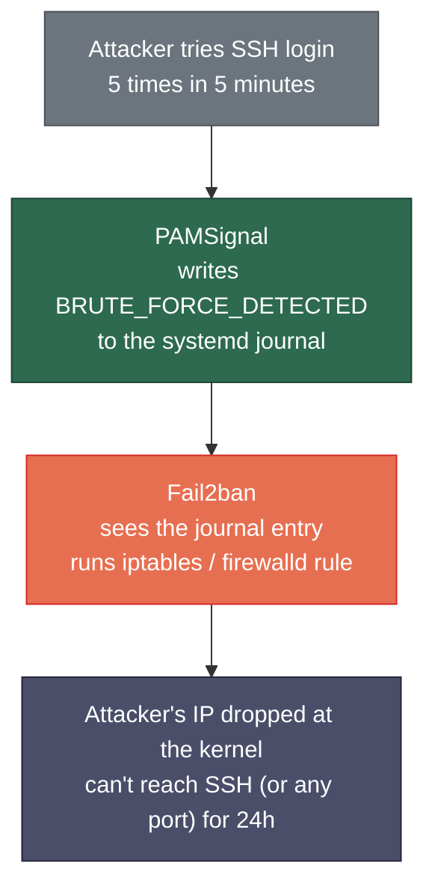
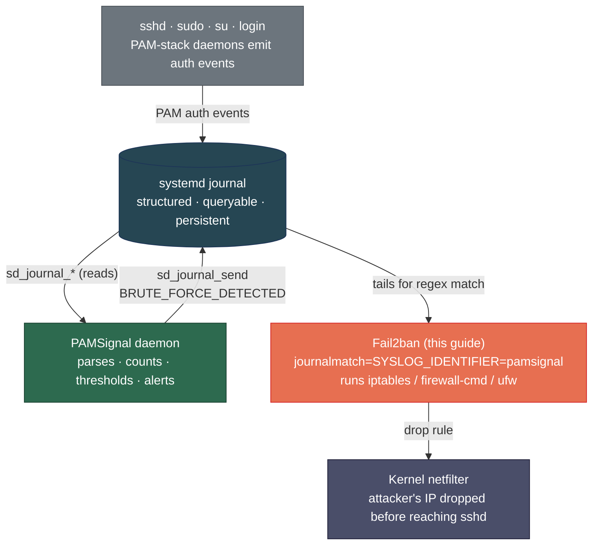

# Hướng dẫn tích hợp Fail2ban

> 🌐 [English](../../../examples/fail2ban/README.md) · **Tiếng Việt**

Hướng dẫn này trình bày từng bước cách cấu hình [Fail2ban](https://github.com/fail2ban/fail2ban) để khi PAMSignal phát hiện một cuộc tấn công brute-force, địa chỉ IP của kẻ tấn công sẽ tự động bị chặn ở tầng firewall. Ví dụ bao gồm **Ubuntu 22.04+ / Debian 12+** và **CentOS Stream 9 / AlmaLinux 9 / Rocky Linux 9** (các lệnh tương tự cũng áp dụng cho Fedora 40+).

Nếu bạn chưa từng dùng Fail2ban — không sao cả. Hướng dẫn này giải thích từng khái niệm ngay khi đề cập đến nó.

> **Thời gian cần thiết:** ~10 phút.
> **Điều kiện tiên quyết:** PAMSignal đã được cài đặt và bạn đã thấy ít nhất một dòng `pamsignal:` trong `journalctl -t pamsignal` (tức là daemon đang chạy). Nếu chưa, hãy hoàn tất phần [Quickstart](../README.md#-bắt-đầu-nhanh) trước.

---

## Kết quả đạt được sau khi hoàn tất



Không cần duy trì regex phân tích log phức tạp, không cần đồng bộ ngưỡng giữa hai công cụ. PAMSignal đã xử lý hết phần tính toán; Fail2ban chỉ việc hành động theo tín hiệu đó.

---

## Fail2ban là gì?

Fail2ban là một daemon Python nhỏ gọn, theo dõi các file log (hoặc systemd journal) để tìm các pattern biểu hiện cuộc tấn công, rồi thực thi một lệnh — thường là một quy tắc firewall — để chặn nguồn tấn công. Công cụ này đã là giải pháp phòng chống xâm nhập Linux thực tế trong hơn một thập kỷ.

Các thuật ngữ chính bạn sẽ gặp trong hướng dẫn này:

| Thuật ngữ | Ý nghĩa |
|---|---|
| **Filter** | Một regex nhận diện dòng log tấn công (`/etc/fail2ban/filter.d/*.conf`) |
| **Jail** | Cấu hình liên kết một filter với một firewall action (`/etc/fail2ban/jail.d/*.conf`) |
| **Backend** | Cách Fail2ban đọc log — ở đây là `systemd` journal |
| **Action** | Việc Fail2ban làm khi bị kích hoạt — ở đây là "chặn IP này ở firewall" |
| **`bantime`** | Thời gian lệnh cấm kéo dài (mặc định: 10 phút; ta đặt 24 giờ) |
| **`findtime`** | Khoảng thời gian tính số lần khớp `maxretry` |
| **`maxretry`** | Số lần khớp trong `findtime` để kích hoạt lệnh cấm — ta đặt là **1** vì PAMSignal đã tự đếm |
| **`ignoreip`** | Danh sách IP an toàn — các IP không bao giờ bị cấm (hãy đặt IP nhà/văn phòng của bạn vào đây!) |

Để tham khảo đầy đủ, xem [MANUAL của Fail2ban trên wiki chính thức](https://github.com/fail2ban/fail2ban/wiki/MANUAL).

---

## Tại sao kết hợp với PAMSignal?

PAMSignal và Fail2ban bổ trợ cho nhau, không thay thế nhau:

- **PAMSignal quan sát.** Nó phân tích mọi sự kiện PAM từ journal, theo dõi số lần đăng nhập thất bại theo IP, tính toán ngưỡng brute-force và gửi thông báo qua chat (Telegram, Slack, v.v.). Nó **không** can thiệp vào firewall.
- **Fail2ban hành động.** Khi PAMSignal phát ra sự kiện `BRUTE_FORCE_DETECTED`, Fail2ban nhận thấy và lắp quy tắc firewall chặn IP đó.

Điểm giao tiếp là một dòng log có cấu trúc duy nhất. Bạn không cần duy trì một `failregex` phức tạp cho output của `sshd` — PAMSignal đã hiểu sẵn các định dạng `sshd`, `sshd-session`, `sudo`, `su` và `login` trên nhiều distro khác nhau.

---

## Bước 1 — Cài đặt Fail2ban

### Ubuntu / Debian

```bash
sudo apt update
sudo apt install fail2ban
```

Gói này đã tích hợp sẵn backend systemd-journal, dùng được ngay.

### CentOS Stream 9 / AlmaLinux 9 / Rocky Linux 9 / Fedora 40+

Fail2ban nằm trong kho EPEL trên các distro thuộc họ RHEL:

```bash
sudo dnf install epel-release
sudo dnf install fail2ban fail2ban-firewalld
```

Gói con `fail2ban-firewalld` cấu hình Fail2ban sử dụng `firewalld` (firewall mặc định của RHEL) thay vì iptables thuần túy. Nếu không cài nó, Fail2ban sẽ fallback về iptables và có thể xung đột với các quy tắc của `firewalld`.

### Kiểm tra sau khi cài (cả hai distro)

```bash
fail2ban-client --version
sudo systemctl status fail2ban
```

Service đã được cài nhưng chưa được kích hoạt — ta sẽ khởi động sau khi cấu hình xong.

---

## Bước 2 — Cài đặt filter và jail của PAMSignal

Hai file cấu hình trong thư mục này cho Fail2ban biết *cần theo dõi gì* và *phản ứng như thế nào*. Sao chép chúng vào đúng vị trí hệ thống:

```bash
# Từ thư mục này (examples/fail2ban/):
sudo cp filter.d/pamsignal.conf /etc/fail2ban/filter.d/pamsignal.conf
sudo cp jail.d/pamsignal.conf   /etc/fail2ban/jail.d/pamsignal.conf
```

### Chức năng của từng file

**`/etc/fail2ban/filter.d/pamsignal.conf`** — regex nhận diện sự kiện brute-force của PAMSignal:

```ini
[Definition]
failregex = pamsignal: BRUTE_FORCE_DETECTED ip=<HOST> attempts=\d+ window=\d+s user=.*
ignoreregex =
```

Token `<HOST>` là đặc biệt — Fail2ban thay thế nó bằng một regex khớp với địa chỉ IPv4, IPv6 hoặc DNS, sau đó trích xuất địa chỉ khớp được làm "kẻ vi phạm" cần cấm. Xem [trang wiki Filter Files](https://github.com/fail2ban/fail2ban/wiki/Developing-Fail2Ban-Filters) để tìm hiểu DSL filter đầy đủ.

**`/etc/fail2ban/jail.d/pamsignal.conf`** — jail kết nối filter với firewall action:

```ini
[pamsignal]
enabled = true
filter = pamsignal
backend = systemd
journalmatch = SYSLOG_IDENTIFIER=pamsignal
banaction = iptables-allports
maxretry = 1
bantime = 24h
```

- `backend = systemd` — đọc từ journal thay vì file log.
- `journalmatch = SYSLOG_IDENTIFIER=pamsignal` — chỉ nhìn vào các dòng do daemon PAMSignal phát ra. Hiệu quả hơn là đọc toàn bộ journal.
- `maxretry = 1` — cấm ngay lập tức khi có một lần khớp. PAMSignal đã đếm đến ngưỡng rồi; một dòng `BRUTE_FORCE_DETECTED` **chính là** cảnh báo.
- `bantime = 24h` — chặn IP trong 24 giờ. Thay bằng `1h`, `7d` hoặc `-1` (vĩnh viễn) tùy ý.

---

## Bước 3 — Chọn đúng firewall backend

Dòng `banaction` trong jail quyết định *cách* IP bị chặn. Lựa chọn đúng phụ thuộc vào firewall mà distro của bạn đang dùng. Sửa `/etc/fail2ban/jail.d/pamsignal.conf` và đặt `banaction` tương ứng:

### Ubuntu / Debian

| Tình huống | `banaction` cần dùng |
|---|---|
| Bạn không dùng `ufw` (mặc định trên Ubuntu Server mới cài) | `iptables-allports` ← giá trị mặc định trong file jail của ta |
| Bạn dùng `ufw` để quản lý firewall | `ufw` |
| Bạn dùng `nftables` trực tiếp | `nftables-allports` |

Nếu bạn đang dùng Ubuntu 22.04+ và đã từng chạy `sudo ufw enable`, hãy dùng action `ufw` — nếu không Fail2ban và `ufw` sẽ xung đột với nhau khi quản lý rule set.

### CentOS / AlmaLinux / Rocky / Fedora

| Tình huống | `banaction` cần dùng |
|---|---|
| Bạn dùng `firewalld` (mặc định họ RHEL) và đã cài `fail2ban-firewalld` | `firewallcmd-allports` |
| Bạn dùng `iptables` thuần túy (cài cũ) | `iptables-allports` |
| Bạn dùng `nftables` trực tiếp | `nftables-allports` |

Hầu hết các bản cài RHEL-9 derivative đều chạy `firewalld` — hãy dùng `firewallcmd-allports`.

Danh sách đầy đủ các action đi kèm nằm trong `/etc/fail2ban/action.d/`; xem [trang wiki Actions](https://github.com/fail2ban/fail2ban/wiki/Actions) để biết mô tả từng action.

---

## Bước 4 — Whitelist IP của bạn (làm việc này trước khi khởi động!)

**Đây là bước quan trọng nhất.** Nếu bạn không whitelist bản thân và lỡ tay nhập sai mật khẩu từ máy quản trị, Fail2ban sẽ khóa bạn ra ngoài trong 24 giờ. Nói thẳng: bạn sẽ không thể SSH lại để gỡ lệnh cấm.

Sửa `/etc/fail2ban/jail.d/pamsignal.conf` và thêm dòng `ignoreip`:

```ini
[pamsignal]
enabled = true
filter = pamsignal
backend = systemd
journalmatch = SYSLOG_IDENTIFIER=pamsignal
banaction = iptables-allports
maxretry = 1
bantime = 24h

# Never ban these — your home/office IP and any LAN ranges you trust.
# Add one or more IPs / CIDRs separated by spaces.
ignoreip = 127.0.0.1/8 ::1 203.0.113.42 10.0.0.0/8
```

Thay `203.0.113.42` bằng IP công khai thực của bạn (tìm bằng `curl ifconfig.me` từ máy bạn sẽ SSH đến). Chỉ thêm `10.0.0.0/8`, `192.168.0.0/16` hoặc `172.16.0.0/12` nếu bạn tin tưởng mọi thiết bị trong các dải LAN đó.

Bạn cũng có thể đặt một whitelist *toàn cục* trong `/etc/fail2ban/jail.local` áp dụng cho mọi jail — đây là cách an toàn hơn nếu bạn định tạo thêm jail sau này. Xem [tài liệu `ignoreip`](https://github.com/fail2ban/fail2ban/wiki/MANUAL_0_8#jails) để biết cú pháp đầy đủ (chấp nhận CIDR, DNS, và shell-glob pattern).

---

## Bước 5 — Khởi động Fail2ban

```bash
sudo systemctl enable --now fail2ban
sudo systemctl status fail2ban
```

`status` phải hiển thị `active (running)`. Nếu hiển thị `failed`, chuyển đến phần [Xử lý sự cố](#xử-lý-sự-cố).

---

## Bước 6 — Kiểm tra tích hợp

### 6a. Xác nhận jail đã được nạp

```bash
sudo fail2ban-client status
```

Kết quả mong đợi:

```
Status
|- Number of jail:	1
`- Jail list:		pamsignal
```

Nếu `pamsignal` có trong danh sách jail, Fail2ban đã nạp cấu hình của bạn thành công.

### 6b. Kiểm tra trạng thái hiện tại của jail

```bash
sudo fail2ban-client status pamsignal
```

Kết quả mong đợi (bản cài mới, chưa có lệnh cấm nào):

```
Status for the jail: pamsignal
|- Filter
|  |- Currently failed:	0
|  |- Total failed:	0
|  `- Journal matches:	SYSLOG_IDENTIFIER=pamsignal
`- Actions
   |- Currently banned:	0
   |- Total banned:	0
   `- Banned IP list:
```

### 6c. Chạy thử filter trên journal hiện có

Đây là cách kiểm tra nhanh nhất — quét lịch sử PAMSignal thực tế của bạn và báo cáo bao nhiêu dòng filter sẽ khớp:

```bash
sudo fail2ban-regex systemd-journal /etc/fail2ban/filter.d/pamsignal.conf
```

Nếu bạn đã từng có sự kiện brute-force trong journal, bạn sẽ thấy kết quả tương tự:

```
Lines: 5 lines, 0 ignored, 3 matched, 2 missed
```

Nếu matched bằng 0 mà bạn biết chắc đã có sự kiện brute-force, xem phần [Xử lý sự cố](#xử-lý-sự-cố).

### 6d. Kích hoạt lệnh cấm thực sự (từ máy khác)

Từ một máy khác bạn có thể thử nghiệm (hoặc laptop kết nối mạng di động để có thể tắt dữ liệu nếu thử nghiệm bị hỏng), thực hiện nhiều lần SSH thất bại vào máy chủ:

```bash
# Từ máy thử nghiệm — thay your.server.example.com bằng máy chủ đang chạy PAMSignal
for i in {1..6}; do
  ssh -o PasswordAuthentication=yes -o PreferredAuthentications=password \
      -o PubkeyAuthentication=no -o StrictHostKeyChecking=no \
      nosuchuser@your.server.example.com
done
```

Vài giây sau, trên máy chủ PAMSignal:

```bash
sudo fail2ban-client status pamsignal
sudo iptables -L f2b-pamsignal -n     # hoặc: sudo firewall-cmd --list-rich-rules
```

"Banned IP list" lúc này phải chứa IP của máy thử nghiệm, và firewall phải hiển thị quy tắc DROP tương ứng.

Để **gỡ cấm** IP thử nghiệm ngay lập tức:

```bash
sudo fail2ban-client set pamsignal unbanip 203.0.113.99
```

---

## Tinh chỉnh

Sau khi tích hợp hoạt động, bạn có thể muốn điều chỉnh hành vi. Sửa `/etc/fail2ban/jail.d/pamsignal.conf` và chạy `sudo systemctl reload fail2ban` sau mỗi thay đổi.

| Cài đặt | Giá trị mặc định | Các lựa chọn thay thế phổ biến | Khi nào nên thay đổi |
|---|---|---|---|
| `bantime` | `24h` | `1h`, `7d`, `-1` (mãi mãi) | Giảm cho các IP hay thay đổi (residential dynamic); tăng cho máy chủ công khai muốn xử lý nghiêm |
| `maxretry` | `1` | Giữ ở `1` | Đừng tăng — PAMSignal đã đếm rồi. Tăng lên 2+ đòi hỏi N×ngưỡng-PAMSignal lần thất bại mới cấm |
| `findtime` | `10m` (mặc định Fail2ban) | Đặt khớp với `fail_window_sec` trong `pamsignal.conf` | Chỉ quan trọng khi `maxretry > 1`, điều mà bạn không nên làm — xem ở trên |
| `banaction` | `iptables-allports` | `ufw`, `firewallcmd-allports`, `nftables-allports` | Khớp với firewall của distro (Bước 3) |

### Tăng dần thời gian cấm cho kẻ tái phạm

Tính năng [`bantime.increment`](https://github.com/fail2ban/fail2ban/wiki/MANUAL_0_8#actions) làm cho các lệnh cấm lặp lại kéo dài theo cấp số nhân. Thêm vào jail của bạn:

```ini
bantime.increment = true
bantime.factor    = 2
bantime.maxtime   = 30d
```

Lần cấm đầu là `bantime` (24h); lần hai là 48h; lần ba là 96h; giới hạn ở `maxtime` (30 ngày). Đây là cài đặt tuyệt vời cho các máy chủ tiếp xúc trực tiếp với internet công khai.

---

## Xử lý sự cố

### "0 matched" từ `fail2ban-regex` nhưng tôi biết đã có sự kiện brute-force

Kiểm tra xem PAMSignal có thực sự phát ra sự kiện không:

```bash
journalctl -t pamsignal --since "1 hour ago" | grep BRUTE_FORCE_DETECTED
```

Nếu không có kết quả: PAMSignal chưa phát hiện ngưỡng bị vượt qua. Tạm thời giảm `fail_threshold` trong `/etc/pamsignal/pamsignal.conf`, chạy `sudo systemctl reload pamsignal`, và kích hoạt thêm SSH thất bại.

Nếu có kết quả nhưng regex không khớp: dán dòng đó vào [regex101.com](https://regex101.com) và kiểm tra với `failregex` từ `/etc/fail2ban/filter.d/pamsignal.conf`.

### `fail2ban` không khởi động được với lỗi "no module named systemd"

Trên các distro họ RHEL, backend systemd journal cần `python3-systemd`:

```bash
sudo dnf install python3-systemd
sudo systemctl restart fail2ban
```

Trên Ubuntu dependency này thường được kéo vào tự động; nếu không:

```bash
sudo apt install python3-systemd
```

### "Tôi bị khóa ra ngoài" — khôi phục khẩn cấp

Nếu bạn có quyền truy cập console (serial console của cloud provider, hypervisor, bàn phím vật lý):

```bash
sudo fail2ban-client unban --all                    # gỡ mọi lệnh cấm trong tất cả jail
sudo systemctl stop fail2ban                        # ngăn bị cấm lại trong khi sửa ignoreip
# … sửa /etc/fail2ban/jail.d/pamsignal.conf và thêm IP của bạn vào ignoreip …
sudo systemctl start fail2ban
```

Nếu không có quyền truy cập console — hãy chờ hết `bantime` (mặc định 24h) hoặc liên hệ cloud provider để reset ngoài băng tần.

### `firewalld` và `iptables-allports` xung đột nhau

Bạn thấy Fail2ban áp dụng quy tắc nhưng không có hiệu lực, hoặc các quy tắc `firewalld` cứ ghi đè lên. Trên họ RHEL, chuyển jail sang `banaction = firewallcmd-allports` (Bước 3). Trên Ubuntu với `ufw`, chuyển sang `banaction = ufw`. Đừng chạy hai firewall manager xung đột nhau.

### Thời gian cấm quá ngắn / quá dài

Sửa `bantime` trong `/etc/fail2ban/jail.d/pamsignal.conf` và reload:

```bash
sudo systemctl reload fail2ban
```

Reload giữ nguyên các lệnh cấm hiện có; `restart` đầy đủ sẽ xóa chúng.

---

## Cơ chế hoạt động bên dưới



Hai daemon hoàn toàn độc lập với nhau: PAMSignal không biết Fail2ban tồn tại, và Fail2ban không biết PAMSignal tồn tại. Chúng giao tiếp qua structured journal — bền bỉ, an toàn cho nhiều reader đồng thời, và là event log chuẩn tắc trên Linux có systemd. Nếu bạn gỡ cài đặt Fail2ban vào ngày mai, PAMSignal vẫn hoạt động bình thường.

### Tại sao ta không cấm sự kiện brute-force từ actor nội bộ

PAMSignal phát ra sự kiện brute-force cho cả tấn công từ xa (theo IP) lẫn tấn công từ actor nội bộ (theo username, khi ai đó liên tục dùng `sudo` từ phiên local). Fail2ban chỉ có thể chặn IP — nó không thể vô hiệu hóa tài khoản UNIX nội bộ — vì vậy filter của ta chỉ cố tình khớp với sự kiện có khóa là IP. Các sự kiện actor nội bộ vẫn xuất hiện trong journal và chat alert của bạn, nhưng không kích hoạt Fail2ban.

Nếu bạn cần khóa actor nội bộ, đó là việc của `pam_tally2` / `pam_faillock` trong PAM stack của bạn, không phải Fail2ban.

---

## Đọc thêm

- [README dự án Fail2ban](https://github.com/fail2ban/fail2ban) — ma trận cài đặt, distro hỗ trợ, mã nguồn
- [MANUAL Fail2ban (wiki chính thức)](https://github.com/fail2ban/fail2ban/wiki/MANUAL) — toàn bộ directive, backend và action được giải thích
- [Tham khảo Filter Files](https://github.com/fail2ban/fail2ban/wiki/Developing-Fail2Ban-Filters) — DSL regex và bảng token (`<HOST>`, `<ADDR>`, `<F-USER>`, v.v.)
- [Tham khảo Actions](https://github.com/fail2ban/fail2ban/wiki/Actions) — mọi `banaction` tích hợp sẵn và cách tự viết
- [Mô hình threat của PAMSignal — Hướng dẫn Operator §7](../threat-model.md#hướng-dẫn-cho-operator) — lý do ta khuyến nghị kết hợp quan sát với hành động
