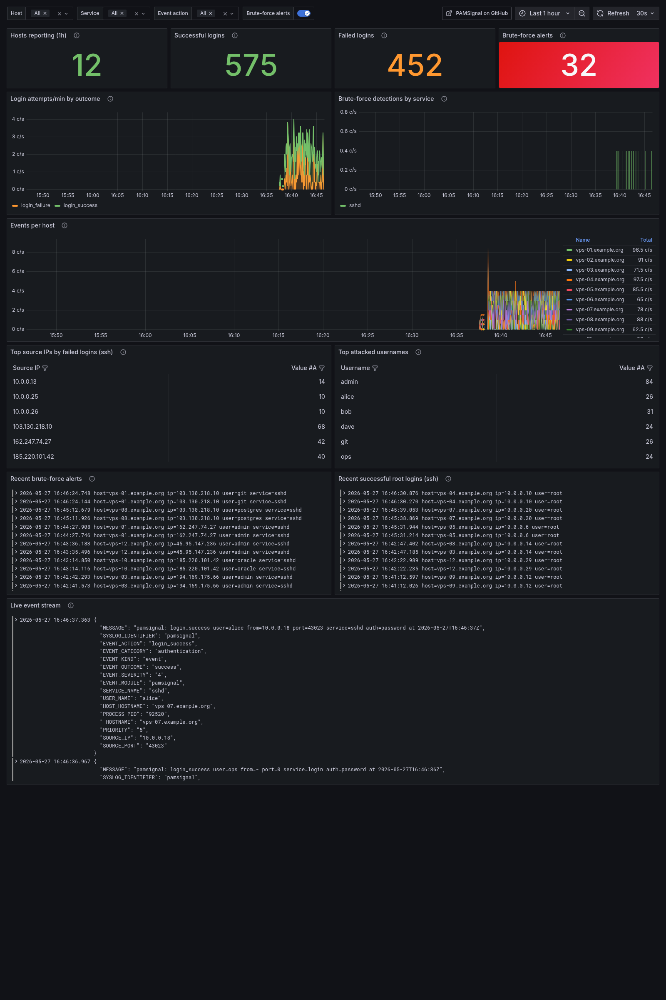

# PAMSignal — Tích hợp Grafana

> 🌐 [English](../../../examples/grafana/README.md) · **Tiếng Việt**

Giám sát SSH/sudo/su/login toàn bộ fleet với PAMSignal, hiển thị trên Grafana.



Thư mục này cung cấp mọi thứ operator cần để đưa các sự kiện PAMSignal từ fleet Linux vào một Grafana dashboard duy nhất:

- `alloy.river` — cấu hình [Grafana Alloy](https://grafana.com/docs/alloy/latest/) cho môi trường production. Cài một instance trên mỗi host. Scrape `SYSLOG_IDENTIFIER=pamsignal` từ systemd journald và đẩy lên Loki.
- `dashboards/pamsignal-v1.json` — dashboard, sẵn sàng provisioning (datasource UID hardcode là `loki`, khớp với file provisioning đi kèm).
- `dashboards/pamsignal-v1.grafana-com.json` — cùng dashboard, định dạng "shared externally" với placeholder `${DS_LOKI}` + các block `__inputs`/`__requires`. Upload **file này** lên grafana.com hoặc dùng tính năng UI Import của Grafana (sẽ hỏi bạn chọn datasource Loki của mình).
- `alerts.yaml` — bốn alert rule Grafana-native.
- `docker-compose.yml` — stack local một lệnh để bạn xem trước dashboard trước khi quyết định deploy thực sự.
- `verify.sh` — kiểm tra sức khỏe pipeline một lần.

Toàn bộ thiết kế — schema, kế hoạch label-cardinality, lý do panel — nằm trong
[`docs/grafana-integration.md`](../grafana-integration.md).

---

## Dùng thử trong 60 giây (không cần fleet Linux)

Bạn chỉ cần Docker. Vậy thôi.

```bash
cd examples/grafana
docker compose up -d
```

Mở **http://localhost:3000** — anonymous Admin, không cần đăng nhập. Dashboard nằm trong thư mục **PAMSignal**. Các sự kiện tổng hợp được stream vào với tốc độ ~2/giây; các đợt brute-force bùng phát trung bình mỗi ~25 giây.

Để dừng và xóa (bao gồm cả volume):

```bash
docker compose down -v
```

### Thành phần trong stack local

| Service | Vai trò |
| --- | --- |
| `loki` | Loki single-binary, lưu trữ filesystem, giữ log 7 ngày |
| `alloy` | Đọc sự kiện JSONL từ shared volume; phản ánh đúng hình dạng pipeline production |
| `grafana` | Anonymous Admin, được provisioning với Loki + dashboard |
| `renderer` | Image renderer cho URL `/render` (dùng bởi `assets/grafana-dashboard.png`) |
| `synthetic` | Container Python tạo sự kiện pamsignal thực tế |

Producer tổng hợp đẩy sự kiện vào Loki qua hai đường đồng thời:

1. **Direct push** vào `loki/api/v1/push` — mô phỏng những gì một HTTP-based agent sẽ làm.
2. **Append vào shared file** mà `alloy` đang tail — chứng minh pipeline Alloy theo kiểu production cũng hoạt động ở local.

Cả hai đường đều landing vào cùng một Loki instance với cùng label set, nên dashboard hoạt động như nhau với cả hai nguồn.

---

## Deploy thực sự

### 1. Dựng Loki + Grafana

Nếu bạn chưa có, cách đơn giản nhất là
[Grafana Cloud](https://grafana.com/products/cloud/) (gói miễn phí đã có Loki).
Tự host bằng [docker-compose](https://grafana.com/docs/loki/latest/setup/install/docker/)
hoặc [Helm](https://grafana.com/docs/loki/latest/setup/install/helm/).

### 2. Cài Alloy trên mỗi host PAMSignal

```bash
# Debian/Ubuntu — từ APT repo của grafana.com
curl -fsSL https://apt.grafana.com/gpg.key | sudo gpg --dearmor -o /etc/apt/keyrings/grafana.gpg
echo "deb [signed-by=/etc/apt/keyrings/grafana.gpg] https://apt.grafana.com stable main" \
  | sudo tee /etc/apt/sources.list.d/grafana.list
sudo apt-get update && sudo apt-get install alloy

# RHEL/Fedora/Alma/Rocky — từ RPM repo của grafana.com
# https://grafana.com/docs/alloy/latest/set-up/install/linux/
```

Gói Alloy đi kèm một unit systemd `alloy`; user mà nó chạy dưới
(`alloy:alloy`) phải thuộc group `systemd-journal` để đọc journald:

```bash
sudo usermod -aG systemd-journal alloy
```

### 3. Đặt `alloy.river` vào đúng chỗ

```bash
sudo cp alloy.river /etc/alloy/config.alloy
# Sửa URL endpoint loki.write cho Loki instance của bạn
sudo $EDITOR /etc/alloy/config.alloy
sudo systemctl restart alloy
```

Kiểm tra Alloy hoạt động ổn:

```bash
sudo journalctl -u alloy -f
# Hoặc truy cập http://<host>:12345 để xem Alloy UI
```

### 4. Import dashboard

**Tùy chọn A — provision** (khuyến nghị cho Grafana tự host):

```bash
sudo cp dashboards/pamsignal-v1.json /var/lib/grafana/dashboards/
sudo cp ../grafana/provisioning/dashboards/pamsignal.yml \
        /etc/grafana/provisioning/dashboards/
sudo systemctl restart grafana-server
```

**Tùy chọn B — import qua UI**: Grafana → Dashboards → New → Import → upload
`dashboards/pamsignal-v1.grafana-com.json` (phiên bản có placeholder `${DS_LOKI}`).
Chọn datasource Loki của bạn khi được hỏi.

### 5. Cấu hình alert

Sửa `alerts.yaml` để trỏ `folder:` đến Grafana folder bạn muốn, sau đó
provision qua `/etc/grafana/provisioning/alerting/` hoặc import qua
Grafana UI (Alerting → Alert rules → Import).

Sau khi import, gắn từng rule vào một contact point (Slack, Telegram,
PagerDuty, email). Bốn rule:

| Rule | Severity | Kích hoạt khi |
| --- | --- | --- |
| Brute-force detected | critical | Có bất kỳ `event_action="brute_force_detected"` nào trong 5 phút |
| Root login over SSH | high | Có bất kỳ lần đăng nhập SSH thành công bằng root trong 10 phút |
| ≥10 failed logins from one IP | high | Số lần thất bại từ một IP tăng đột biến trong 5 phút |
| Host stopped reporting | medium | Đã hoạt động trong 1h gần đây nhưng im lặng 10 phút |

### 6. Kiểm tra

Từ bất kỳ máy nào có thể kết nối đến Loki và Grafana:

```bash
LOKI_URL=https://loki.yourdomain GRAFANA_URL=https://grafana.yourdomain ./verify.sh
```

Kết quả mong đợi kết thúc bằng `✅ Pipeline healthy`. Nếu không, script sẽ cho biết bước nào bị hỏng.

---

## Kiến trúc

```mermaid
graph LR
    pamsignal["PAMSignal<br/>(per host)"]
    journald[("systemd-journald<br/>(per host)")]
    alloy["Grafana Alloy<br/>(per host)"]
    loki[("Loki")]
    grafana["Grafana"]
    operator["🧑‍💻 Operator"]

    pamsignal -- "sd_journal_send<br/>(ECS fields)" --> journald
    journald -- "SYSLOG_IDENTIFIER=pamsignal" --> alloy
    alloy -- "Loki push API<br/>(4 labels)" --> loki
    loki -- "LogQL queries" --> grafana
    grafana -- "fleet dashboard<br/>+ alerts" --> operator

    style pamsignal fill:#2d6a4f,stroke:#1b4332,color:#fff
    style journald fill:#264653,stroke:#1d3557,color:#fff
    style alloy fill:#457b9d,stroke:#1d3557,color:#fff
    style loki fill:#e9c46a,stroke:#f4a261,color:#000
    style grafana fill:#e76f51,stroke:#d62828,color:#fff
    style operator fill:#6c757d,stroke:#495057,color:#fff
```



**Lý do thiết kế theo hình dạng này:**

- PAMSignal đã ghi các structured field theo chuẩn ECS vào journald
  (`EVENT_ACTION`, `SOURCE_IP`, `USER_NAME`, ...). Không cần thay đổi gì ở daemon.
- Alloy đọc journald với `format_as_json=true`, chuyển mỗi field thành chữ thường dạng `__journal_<field>`, và một relabel pass chỉ đẩy đúng bốn trường lên thành Loki label (`app`, `host`, `service`, `event_action`). Mọi thứ còn lại ở trong phần thân JSON và được parse lúc query. Xem
  [kế hoạch label cardinality](../grafana-integration.md#kế-hoạch-label-cardinality).
- Loki index bốn label đó — `5 service × 6 action × fleet_size`
  stream. Hoạt động tốt đến hàng nghìn host.

---

## Xử lý sự cố

### Label Loki không hiển thị

Chạy `verify.sh --loki-only` trước để cô lập Alloy. Nếu sự kiện probe đến được Loki với đúng label, vấn đề nằm ở relabel pass của Alloy.

Kiểm tra tên các field `__journal_*`. Journald chuyển tên field tùy chỉnh thành chữ thường từ `SERVICE_NAME` sang `__journal_service_name`. Nếu tên label bị sai, relabel rule trong `alloy.river` sẽ không khớp.

### Các panel dashboard trống

Kiểm tra time picker. Mặc định là "last 6h" — nếu stack vừa khởi động, hãy thu ngắn xuống "last 5m".

Mở **Explore** của Grafana với datasource Loki và chạy `{app="pamsignal"}`.
Nếu không có kết quả, dữ liệu chưa đến được Loki. Kiểm tra log của `alloy` và `loki`.

### Alloy không đọc được journald

```
err="open /run/log/journal: permission denied"
```

User `alloy` phải thuộc group `systemd-journal`, HOẶC unit phải chạy với
`Group=systemd-journal`. Gói được đóng gói sẵn đã xử lý trường hợp đầu miễn là
bạn đã chạy `usermod -aG systemd-journal alloy`.

### Label `service_name` xuất hiện bên cạnh `service`

Loki 3.x tự động suy ra `service_name` để theo dõi log-volume. Vô hại — dashboard query trực tiếp `service=`. Nếu muốn bỏ đi, đặt `discover_log_levels: false` và `discover_service_name: false` trong block `loki.write` của bạn.

### Panel brute-force hiển thị 0 nhưng tôi biết đã có sự kiện brute-force

PAMSignal chỉ ghi `EVENT_ACTION=brute_force_detected` khi đạt `fail_threshold` nội bộ. Nếu bạn đặt ngưỡng cao (ví dụ: 50), các host riêng lẻ sẽ không kích hoạt và panel vẫn ở 0. Rule #3 trong `alerts.yaml` là lưới an toàn cho trường hợp này — nó kích hoạt trên các đợt tăng đột biến login thất bại ngay cả khi PAMSignal chưa leo thang.

---

## Ghi chú tinh chỉnh

- **Retention.** Mặc định trong `config/loki-config.yml` là 7 ngày. Tăng lên để phục vụ audit/compliance — xem [tài liệu retention của Loki](https://grafana.com/docs/loki/latest/operations/storage/retention/).
- **Cardinality.** Đừng đưa `source_ip` hay `user_name` lên làm Loki label. Cả hai không giới hạn và sẽ làm bùng nổ index. Dashboard parse chúng lúc query time bằng `| json` — hãy giữ nguyên như vậy.
- **Nhiễu session_closed.** Việc dùng sudo/su nhiều sẽ tạo ra nhiều sự kiện `session_closed`. Có một `stage.drop` đang bị comment trong `alloy.river` nếu bạn muốn bỏ chúng ở tầng Alloy.
- **Alert ngoài giờ hành chính.** Không được ship sẵn — policy khác nhau tùy tổ chức. Thêm rule với bộ lọc kiểu CRON qua điều kiện thời gian trong ngày của Grafana nếu bạn cần.

---

## Đóng góp thay đổi

PRs luôn được chào đón:

- Panel mới — thêm vào `dashboards/pamsignal-v1.json`, kèm screenshot thay đổi.
- Alert rule mới — thêm vào `alerts.yaml` với một hàng trong bảng ở trên.
- Ghi chú cài đặt Alloy cho distro cụ thể — thêm vào phần "Deploy thực sự".

CI (`.github/workflows/grafana-integration.yml`) dựng stack docker-compose
trên mỗi PR chạm vào thư mục này và chạy `verify.sh`.

---

## Liên kết liên quan

- [Grafana Alloy](https://grafana.com/docs/alloy/latest/)
- [Loki LogQL](https://grafana.com/docs/loki/latest/logql/)
- [README chính của PAMSignal](../README.md)
- [Tài liệu thiết kế](../grafana-integration.md)
