# Grafana từ con số 0 — Xem toàn bộ Fleet trên một màn hình

> 🌐 [English](../grafana-getting-started.md) · **Tiếng Việt**

Chat alert cho bạn biết *ngay lúc này*. `journalctl -t pamsignal` cho biết *chuyện gì đã xảy ra trên một host*. **Grafana** là góc nhìn thứ ba: hoạt động đăng nhập của mọi server gom về một màn hình, kèm xu hướng theo thời gian và một lịch sử tra cứu được, giữ lại hàng tháng trời.

Hướng dẫn này giả định **bạn chưa từng đụng tới Grafana, Loki hay Alloy**. Nó giải thích từng mảnh là gì, dẫn bạn từ con số 0 tới một dashboard chạy được theo hai cách (cloud có người quản lý, và tự host), và — quan trọng nhất — chỉ bạn cách *đọc* dashboard sau khi đã có nó.

> Đây là lối vào nhẹ nhàng. Bản tham chiếu ngắn gọn, thiên về production nằm ở [`examples/grafana.md`](examples/grafana.md), còn toàn bộ lý do thiết kế (schema, label cardinality, cách chọn panel) ở [`docs/grafana-integration.md`](grafana-integration.md). Trang này sẽ dẫn tới cả hai vào đúng lúc.

---

## Bạn có thực sự cần nó không?

Hãy thành thật với chính mình trước đã:

- **1–2 server, chat alert thấy là đủ?** Bạn có lẽ chưa cần Grafana. Telegram/Slack + `journalctl` lo được rồi. Lưu trang này lại cho lúc lớn hơn.
- **Từ 3 server trở lên, hoặc muốn xem xu hướng, hoặc cần một lịch sử để lưu lại?** Đây đúng là việc Grafana sinh ra để làm. Nhảy qua nhảy lại giữa các phiên `journalctl` trên mười host thì không scale nổi; một dashboard thì có.
- **Bạn chạy server cho người khác (hosting provider / MSP)?** Grafana là cách biến PAMSignal thành một dịch vụ giá trị gia tăng cho từng khách hàng — xem [Use Cases](use-cases.md#hosting-provider-nhỏ--msp).

PAMSignal **không cần đổi gì** để cấp dữ liệu cho Grafana. Nó vốn đã ghi các trường có cấu trúc theo chuẩn ECS vào journal; cả pipeline này chỉ làm một việc là chuyển chúng tới một nơi bạn truy vấn được.

---

## Ba công cụ mới, giải thích nhanh

Ba chương trình nữa nhập cuộc cùng PAMSignal. Một cách ví von cho dễ hình dung:

| Thành phần | Là gì | Ví von |
|---|---|---|
| **PAMSignal** | Đã chạy sẵn trên mỗi host; ghi các sự kiện auth có cấu trúc vào journal | **Nhà máy** làm ra hàng |
| **Grafana Alloy** | Một agent nhỏ trên mỗi host, đọc journal rồi đẩy sự kiện của PAMSignal đi | **Người giao hàng** gom hàng ở từng nhà máy |
| **Loki** | Một database chuyên cho log; lưu mọi thứ và trả lời truy vấn | **Kho trung tâm** |
| **Grafana** | Web UI có dashboard và alert, query vào Loki | **Mặt tiền cửa hàng** — nơi bạn thực sự nhìn vào |

```mermaid
graph LR
    pamsignal["PAMSignal<br/>(per host)"]
    journald[("systemd-journald<br/>(per host)")]
    alloy["Grafana Alloy<br/>(per host)"]
    loki[("Loki")]
    grafana["Grafana"]
    operator["🧑‍💻 You"]

    pamsignal -- "sd_journal_send<br/>(ECS fields)" --> journald
    journald -- "SYSLOG_IDENTIFIER=pamsignal" --> alloy
    alloy -- "Loki push API<br/>(4 labels)" --> loki
    loki -- "LogQL queries" --> grafana
    grafana -- "fleet dashboard<br/>+ alerts" --> operator

    style pamsignal fill:#2d6a4f,stroke:#1b4332,color:#fff
    style journald fill:#264653,stroke:#1d3557,color:#fff
    style alloy fill:#457b9d,stroke:#1d3557,color:#fff
    style loki fill:#e9c46a,stroke:#f4a261,color:#000
    style grafana fill:#e76f51,stroke:#d62828,color:#fff
    style operator fill:#6c757d,stroke:#495057,color:#fff
```



Bạn chỉ phải cài **Alloy** trên các server của mình. Loki và Grafana chạy ở *một nơi tập trung* — hoặc trên cloud của Grafana (Phương án A), hoặc trên một máy do bạn sở hữu (Phương án B).

---

## Thử trong 60 giây trước đã (không cần fleet, không cam kết gì)

Trước khi dựng thật, hãy *xem dashboard* với dữ liệu giả cho biết mặt mũi. Bạn chỉ cần Docker:

```bash
cd examples/grafana
docker compose up -d
```

Mở **http://localhost:3000** — không cần đăng nhập, dashboard nằm trong folder **PAMSignal**, và sự kiện giả lập chảy vào ngay (kể cả các đợt brute-force định kỳ). Cứ nghịch thoải mái, đọc mục [Đọc dashboard của bạn](#đọc-dashboard-của-bạn) đối chiếu với dữ liệu trông như thật, rồi dọn đi:

```bash
docker compose down -v
```

Đây chính là dashboard bạn sẽ deploy thật — chỉ khác là nó có một bộ sinh sự kiện giả lập thay cho fleet thật của bạn. Chi tiết: [`examples/grafana.md`](examples/grafana.md).

---

## Phương án A — Grafana Cloud (managed, zero-ops)

Cách nhanh nhất để có một dashboard fleet thật. Grafana lo phần Loki và Grafana giúp bạn; bạn chỉ cài Alloy trên các host. **Gói free đã có sẵn Loki** và quá đủ cho một fleet nhỏ.

### A1. Tạo một stack miễn phí

1. Đăng ký tại [grafana.com](https://grafana.com/auth/sign-up/create-user) và tạo một stack (bạn sẽ có một URL kiểu `https://yourname.grafana.net`).
2. Trong Cloud portal, mở phần chi tiết **Loki** của bạn. Ghi lại ba thứ:
   - **push URL** (trông như `https://logs-prod-xxx.grafana.net/loki/api/v1/push`),
   - **user / instance ID** của bạn (một con số),
   - một **token** bạn tạo ở mục *Access Policies* (cấp scope `logs:write`).

Để ba thứ đó sẵn bên cạnh — Alloy cần chúng.

### A2. Cài Alloy trên mỗi host

```bash
# Debian / Ubuntu
curl -fsSL https://apt.grafana.com/gpg.key | sudo gpg --dearmor -o /etc/apt/keyrings/grafana.gpg
echo "deb [signed-by=/etc/apt/keyrings/grafana.gpg] https://apt.grafana.com stable main" \
  | sudo tee /etc/apt/sources.list.d/grafana.list
sudo apt-get update && sudo apt-get install -y alloy

# RHEL / Fedora / AlmaLinux / Rocky — xem
# https://grafana.com/docs/alloy/latest/set-up/install/linux/
```

Alloy cần được phép đọc journal:

```bash
sudo usermod -aG systemd-journal alloy
```

### A3. Trỏ Alloy vào Cloud Loki

Bắt đầu từ file [`examples/grafana/alloy.river`](../../examples/grafana/alloy.river) đi kèm (nó đã scrape sẵn `SYSLOG_IDENTIFIER=pamsignal` và promote đúng bốn label cần thiết). Copy nó vào rồi sửa block `loki.write` để dùng endpoint Cloud của bạn kèm basic auth:

```bash
sudo cp examples/grafana/alloy.river /etc/alloy/config.alloy
sudo $EDITOR /etc/alloy/config.alloy
```

```river
loki.write "default" {
  endpoint {
    url = "https://logs-prod-xxx.grafana.net/loki/api/v1/push"
    basic_auth {
      username = "123456"                 // Cloud user / instance ID của bạn
      password = "glc_eyJ..."             // token bạn vừa tạo
    }
  }
}
```

> Lên production thì đừng dán thẳng token vào file — dùng biến môi trường hoặc một file rồi tham chiếu nó (`sys.env("LOKI_TOKEN")`). Xem tài liệu config của Alloy.

```bash
sudo systemctl restart alloy
sudo journalctl -u alloy -f          # theo dõi xem có push thành công không
```

### A4. Import dashboard

Trong Cloud Grafana của bạn: **Dashboards → New → Import**, upload file [`examples/grafana/dashboards/pamsignal-v1.grafana-com.json`](../../examples/grafana/dashboards/) (bản có placeholder `${DS_LOKI}`), rồi chọn Loki datasource của bạn khi được hỏi. Nhảy tới [Đọc dashboard của bạn](#đọc-dashboard-của-bạn).

---

## Phương án B — Tự host (bạn chạy Loki + Grafana)

Chọn cách này nếu bạn muốn giữ toàn bộ dữ liệu trên hạ tầng do mình kiểm soát. Bạn sẽ chạy Loki và Grafana trên một máy trung tâm, còn Alloy trên mọi host PAMSignal đẩy dữ liệu về đó.

### B1. Dựng Loki + Grafana tập trung

Trên máy trung tâm/giám sát, một `docker-compose.yml` tối giản nhưng dùng thật được:

```yaml
services:
  loki:
    image: grafana/loki:3.2.0          # kiểm tra tag stable mới nhất
    command: -config.file=/etc/loki/local-config.yaml
    ports: ["3100:3100"]
    volumes:
      - loki-data:/loki
    restart: unless-stopped

  grafana:
    image: grafana/grafana:11.3.0
    ports: ["3000:3000"]
    environment:
      - GF_SECURITY_ADMIN_PASSWORD=change-me-now   # đặt một password thật vào
    volumes:
      - grafana-data:/var/lib/grafana
    restart: unless-stopped

volumes:
  loki-data:
  grafana-data:
```

```bash
docker compose up -d
```

Image Loki đã kèm sẵn một config mặc định chạy được, nên cụm này lên ngay. Muốn retention thật (mặc định giữ rất ít), hãy chỉnh lại từ file [`examples/grafana/config/loki-config.yml`](../../examples/grafana/) đi kèm — nó đặt retention 7 ngày mà bạn có thể nâng lên cho mục đích audit/compliance. Mount nó vào rồi đổi `command:` để trỏ tới nó.

> **Bảo mật, bắt buộc khi tự host:** đừng bao giờ phơi Grafana ra internet với anonymous access hay password mặc định. Hãy đặt nó sau VPN/bastion, hoặc sau một reverse proxy có TLS và đăng nhập đàng hoàng. Stack thử-tại-chỗ đi kèm dùng anonymous admin *chỉ vì* nó chạy local và dùng xong là bỏ.

### B2. Thêm Loki làm datasource

Trong Grafana (**http://your-host:3000**, đăng nhập bằng `admin`): **Connections → Data sources → Add data source → Loki**, URL `http://loki:3100` (cùng mạng compose) hoặc `http://your-host:3100`. Bấm Save & test.

### B3. Cài Alloy trên mỗi host PAMSignal

Y như ở [A2](#a2-cài-alloy-trên-mỗi-host) (phần cài đặt + group `systemd-journal` giống hệt), rồi đặt `alloy.river` vào và trỏ endpoint `loki.write` về Loki **của bạn** — không cần basic-auth nếu nó nằm trong mạng private:

```bash
sudo cp examples/grafana/alloy.river /etc/alloy/config.alloy
sudo $EDITOR /etc/alloy/config.alloy   # đặt url = "http://your-loki-host:3100/loki/api/v1/push"
sudo systemctl restart alloy
```

### B4. Import dashboard + provision (tùy chọn)

Import qua UI y như ở [A4](#a4-import-dashboard), **hoặc** provision từ file (nên dùng khi tự host để nó sống sót qua các lần restart) — [`examples/grafana.md`](examples/grafana.md#4-import-dashboard) đi kèm có sẵn công thức copy-JSON-và-provisioning cùng một health check `verify.sh` chỉ một lệnh.

---

## Kết nối PAMSignal — kiểm chứng dữ liệu đã chảy về

Dù bạn chọn cách nào, mắt xích giữa PAMSignal và pipeline là **Alloy đọc journal**. Ba điều phải đúng:

1. PAMSignal đang phát sự kiện — `journalctl -t pamsignal -n 5` ra vài dòng.
2. User `alloy` nằm trong group `systemd-journal` (bước `usermod` ở trên).
3. Alloy đang push — `journalctl -u alloy -f` không có lỗi auth/kết nối.

Rồi kiểm chứng từ đầu tới cuối trong Grafana: mở **Explore**, chọn Loki datasource, và chạy:

```logql
{app="pamsignal"}
```

Có dòng hiện ra là pipeline đã thông. Nếu không, bảng xử lý sự cố trong [`examples/grafana.md`](examples/grafana.md#xử-lý-sự-cố) đi qua từng kiểu lỗi (hay gặp nhất: thiếu group `systemd-journal`, hoặc lệch tên label).

Bên dưới, Alloy promote đúng **bốn** trường low-cardinality lên thành label của Loki — `app`, `host`, `service`, `event_action` — và để mọi thứ còn lại (source IP, username, port, PID…) nằm trong phần body JSON, parse lúc query. Nhờ vậy Loki vẫn nhanh kể cả với hàng nghìn host; *vì sao* thì xem [kế hoạch label cardinality](grafana-integration.md#kế-hoạch-label-cardinality).

---

## Đọc dashboard của bạn

Đây mới là phần thực sự quan trọng. Một dashboard mà bạn không hiểu thì chỉ là mấy cái đèn nhấp nháy. Dashboard đi kèm có ba hàng, từ trên xuống: một cái **nhìn lướt** (có gì đang cháy không?), **trends** (có đang tệ đi không?), và **drill-down** (cụ thể là ai?).

Với mỗi panel dưới đây: **hiển thị gì · bình thường là gì · đáng lo là gì · cần làm gì.**


### Row 1 — Fleet pulse (nhìn trong 5 giây)

Năm con số lớn, tô màu theo trạng thái. Hàng này trả lời câu hỏi "tôi có cần nhìn kỹ hơn không?"

**① Hosts reporting (1h qua)**
- *Hiển thị:* có bao nhiêu host khác nhau đã gửi sự kiện trong 1 giờ qua — nhịp tim của fleet.
- *Bình thường:* bằng đúng số host trong fleet.
- *Đáng lo:* **thấp hơn số host của bạn.** Một host biến mất nghĩa là PAMSignal đã dừng, Alloy đã dừng, hoặc máy đã sập.
- *Cần làm:* trên host im tiếng đó, chạy `systemctl status pamsignal alloy`. Alert rule #4 tự bắt việc này.

**② Successful logins (trong khoảng thời gian)**
- *Hiển thị:* tổng số lần đăng nhập thành công trên cả fleet trong khoảng đã chọn.
- *Bình thường:* một mức ổn định, quen mắt — đội của bạn cộng với automation.
- *Đáng lo:* tăng vọt ngoài giờ làm, hoặc một cú nhảy đột ngột mà bạn không giải thích được.
- *Cần làm:* lọc các [bảng drill-down](#row-3--drill-down-chính-xác-là-ai) theo thời gian để xem *ai* và *ở đâu*.

**③ Failed logins (trong khoảng thời gian)**
- *Hiển thị:* tổng số lần đăng nhập thất bại.
- *Bình thường:* **khác 0 là chuyện đương nhiên** với bất kỳ host nào hướng ra internet — scanner dò liên tục. Một mức nền thấp, đều đều là khỏe mạnh.
- *Đáng lo:* một cú leo dốc, hoặc thất bại trên những host lẽ ra không phơi ra ngoài.
- *Cần làm:* xem bảng **top source IP** và **top username bị nhắm** bên dưới.

**④ Brute-force alerts (trong khoảng thời gian)** — đỏ khi > 0
- *Hiển thị:* ngưỡng brute-force của PAMSignal đã bị vượt bao nhiêu lần.
- *Bình thường:* **0.** PAMSignal chỉ phát cái này sau khi đã đếm vượt `fail_threshold` của bạn, nên nó không phải tín hiệu rác.
- *Đáng lo:* **bất cứ con số nào trên 0.** Đây là con số duy nhất trên bảng mà bạn coi là thật mỗi khi nó xuất hiện.
- *Cần làm:* xem **Recent brute-force alerts**; nếu bạn chạy [Fail2ban](examples/fail2ban.md), các IP vi phạm có lẽ đã bị ban rồi.

**⑤ Privilege escalations (sudo/su, trong khoảng thời gian)**
- *Hiển thị:* số phiên `sudo`/`su` mở thành công trên cả fleet.
- *Bình thường:* khớp với hoạt động admin và automation đã biết của bạn.
- *Đáng lo:* leo thang quyền bởi các tài khoản lẽ ra không leo thang, hoặc trên host mà lúc này không ai nên đụng vào.
- *Cần làm:* chuyển sang live log stream, lọc theo `service="sudo"`.

### Row 2 — Trends (có đang tệ đi không?)

Ba biểu đồ time-series. Một con số cho biết *hiện tại*; một xu hướng cho biết *chiều hướng*.

**⑥ Login attempts/min — xếp chồng theo outcome (success vs failure)**
- *Cách đọc:* tỉ lệ quan trọng hơn độ cao. Một mảng đỏ kín đặc (failure) với chút xanh (success) là một chiến dịch đang nã vào bạn mà không ăn thua — thường thì ổn, nhưng cứ để mắt. Đỏ chuyển sang xanh mới là bước ngoặt nguy hiểm: có người bắt đầu vào được.
- *Cần làm:* nếu màu xanh xuất hiện từ một IP lạ ngay giữa một đợt đỏ, hãy coi đó là khả năng bị xâm nhập — nhảy ngay tới bảng source-IP và live stream.

**⑦ Brute-force detections/min — xếp chồng theo service**
- *Cách đọc:* service nào đang chịu áp lực — `sshd` (từ xa) so với `sudo`/`su` (actor nội bộ). Đỉnh nhọn từ xa là internet; đỉnh nhọn nội bộ nghĩa là có người *đã ở sẵn trên một host* và đang liên tục thử leo thang quyền.
- *Cần làm:* brute-force từ actor nội bộ là tín hiệu nghiêm trọng hơn — hãy điều tra các phiên đang hoạt động trên host đó.

**⑧ Events/min per host — stacked area, top 10 host**
- *Cách đọc:* tìm con số lệch hẳn ra. Một host bỗng nhiên áp đảo cả biểu đồ thì hoặc đang bị tấn công, hoặc bị cấu hình sai (một service ồn ào làm ngập sự kiện).
- *Cần làm:* dùng biến `$host` để tách riêng nó ra.

### Row 3 — Drill-down (chính xác là ai?)

Các bảng và một luồng log trực tiếp. Đây là nơi bạn đi từ "có gì đó không ổn" tới "đúng IP này, user này, host này".

**⑨ Top 10 source IP theo số lần đăng nhập thất bại**
- *Dùng để:* lên danh sách rút gọn các IP cần chặn. Kẻ vi phạm dai dẳng ở đây là ứng viên tốt cho `ignoreip`/ban; còn một IP *tin cậy* mà lại nhiều thất bại thường là do một script hỏng hay credential hết hạn, chứ không phải tấn công.

**⑩ Top 10 username bị nhắm**
- *Dùng để:* kiểm tra trực giác. `root`, `admin`, `test`, `oracle`, `ubuntu` áp đảo là hành vi bot kinh điển — bình thường. Một username *thật, hợp lệ* mà bạn đang dùng lại xuất hiện ở đây thì nghĩa là có người biết tài khoản của bạn; đó là kiểu tấn công có nhắm.

**⑪ Recent brute-force alerts**
- *Dùng để:* bảng sự cố — thời gian, IP-hoặc-actor, attempts, window, service, host. Đây là điểm dừng đầu tiên khi panel ④ sáng đèn.

**⑫ Recent successful root logins qua SSH**
- *Dùng để:* panel có tín hiệu mạnh nhất trên bảng. Nếu bạn đã làm theo [hardening SSH](ssh-hardening.md) và đặt `PermitRootLogin no`, **bảng này phải trống.** Có dòng nào ở đây nghĩa là một lần đăng nhập root trực tiếp qua SSH mà hardening của bạn lẽ ra phải chặn — điều tra ngay.

**⑬ Live log stream**
- *Dùng để:* luồng PAMSignal thô, lọc theo những gì các biến của dashboard đang đặt. Là "tail -f cho cả fleet" của bạn.

### Lọc: các biến của dashboard

Trên đầu dashboard, ba dropdown (mặc định "All") scope mọi panel cùng lúc:

- **`$host`** — một server, hoặc một nhóm con (rất hợp cho góc nhìn theo từng khách hàng — xem [Use Cases](use-cases.md#hosting-provider-nhỏ--msp)).
- **`$service`** — `sshd`, `sudo`, `su`, `login`, `other`.
- **`$action`** — `login_success`, `login_failure`, `brute_force_detected`, …

Khoảng thời gian mặc định là **6h gần nhất**; chọn nhanh 1h / 6h / 24h / 7d / 30d. Vừa dựng stack lên? Rút xuống **5m gần nhất** kẻo các panel trông trống trơn.

### Hai ví dụ đọc bảng

**Một chiều thứ Sáu yên ả, nhìn lướt qua:** *Hosts reporting* = đúng số host (xanh). *Successful logins* khớp với đội của bạn. *Failed logins* chỉ rì rầm mức nền như mọi khi. *Brute-force alerts* = **0**. *Privilege escalations* khớp với công việc admin đã biết. Các trend phẳng lì. Chẳng có gì để làm — đóng tab.

**Một host đang bị tấn công:** *Failed logins* leo nhanh, *brute-force alerts* > 0 (đỏ), panel ⑦ nhọn lên ở `sshd`. Bạn mở **Recent brute-force alerts**, thấy một IP với hơn 40 attempts, xác nhận nó đã nằm trong danh sách ban của Fail2ban, rồi liếc qua **⑫** để chắc không có lần đăng nhập root nào lọt qua. Ba panel, một phút, đủ cả bức tranh.

---

## Alerts — nhận cảnh báo từ Grafana

Phần tích hợp đi kèm bốn alert rule kiểu Grafana-native ([`examples/grafana/alerts.yaml`](../../examples/grafana/)):

| # | Bắn khi | Mức độ | Vì sao đáng tin |
|---|---|---|---|
| 1 | Bất kỳ `brute_force_detected` nào | critical | PAMSignal đã kiểm chứng ngưỡng |
| 2 | Đăng nhập **root** thành công qua SSH | high | Đúng kiểu sự kiện "bạn nên quan tâm" |
| 3 | ≥10 lần đăng nhập thất bại từ một IP trong 5 phút | high | Lưới an toàn nếu bạn để `fail_threshold` rất cao |
| 4 | Một host ngừng báo cáo quá 10 phút | medium | Nhịp tim — daemon chết hoặc host offline |

Sau khi import, gắn mỗi rule vào một **contact point** (Slack, Telegram, PagerDuty, email…). Từng bước: [`examples/grafana.md`](examples/grafana.md#5-cấu-hình-alert).

**Khác gì với chat alert của chính PAMSignal?** Alert của PAMSignal là *theo từng host, tức thì* — cú ping nhanh nhất có thể. Alert của Grafana là *tổng hợp toàn fleet và có trạng thái* — chúng nói được những điều mà không host đơn lẻ nào tự biết, ví dụ "10 thất bại từ một IP trên khắp fleet" hay "host X đã im tiếng". Hãy chạy cả hai: PAMSignal cho sự tức thì, Grafana cho các trường hợp đa-host và nhịp tim.

---

## Bạn được gì

- **Một màn hình cho N server.** Thôi cảnh SSH vào mười máy chỉ để chạy `journalctl`.
- **Xu hướng, không chỉ là ảnh chụp.** "Thất bại tuần này tăng gấp đôi" thì vô hình trong chat nhưng hiện rõ mồn một trên biểu đồ.
- **Một audit trail đúng nghĩa.** Retention của Loki (ngày → tháng → năm) cho bạn lịch sử tra cứu được phục vụ điều tra sự cố và compliance — xa hơn nhiều so với những gì journal của một host giữ lại.
- **Tương quan đa host.** Cùng một IP tấn công năm server là *một* dòng hiển nhiên trong Grafana, thay vì năm cú ping rời rạc trong chat.
- **Một nhịp tim.** Bạn biết một host đã im tiếng nhờ panel ① / rule #4, chứ không phải nghe từ khách hàng.

---

## Chi phí & lưu ý

- **Cardinality.** Đừng bao giờ promote `source_ip` hay `user_name` lên thành label của Loki — chúng vô giới hạn và sẽ làm phình index lẫn hóa đơn của bạn. Dashboard parse chúng lúc query bằng `| json`; cứ để vậy. ([Vì sao.](grafana-integration.md#kế-hoạch-label-cardinality))
- **Retention = dung lượng.** Retention dài hơn thì tốn đĩa (tự host) hoặc tốn tiền (Cloud). Chọn một khoảng khớp với nhu cầu audit, đừng để mặc định "giữ mãi mãi".
- **Giới hạn gói free của Cloud.** Hào phóng với một fleet nhỏ; để mắt tới lượng ingest/retention khi fleet lớn lên. Tự host khi bài toán chi phí đảo chiều.
- **Tiếng ồn `session_closed`.** Dùng `sudo`/`su` nhiều sẽ sinh ra rất nhiều sự kiện close; có một stage drop được comment sẵn trong `alloy.river` nếu bạn muốn loại chúng ngay tại agent.

---

## Đọc thêm

- 🛠️ **[`examples/grafana.md`](examples/grafana.md)** — deploy production, `alloy.river`, `verify.sh`, xử lý sự cố đầy đủ
- 📐 **[Grafana Integration — Design](grafana-integration.md)** — schema, kế hoạch label-cardinality, mẫu LogQL, lý do chọn từng panel
- 🔐 **[Bảo mật SSH & Quản lý Fleet](ssh-hardening.md)** — hardening các cánh cửa mà dashboard này canh chừng (và vì sao panel ⑫ nên luôn trống)
- 🧩 **[Use Cases](use-cases.md)** — Grafana multi-tenant cho hosting provider, và cắm PAMSignal vào một SIEM có sẵn
- 🔔 **[Alerts](alerts.md)** — các định dạng chat/webhook (ECS) của chính PAMSignal chảy vào pipeline này
