# Grafana Integration — Design

> 🌐 [English](../grafana-integration.md) · **Tiếng Việt**

Tài liệu này là thiết kế đã được chốt cho integration PAMSignal Grafana, được theo dõi trong [issue #25](https://github.com/anhtuank7c/pamsignal/issues/25). Các artifact triển khai nằm dưới `examples/grafana/`.

Mục tiêu: một operator có 5+ host Linux và không có kinh nghiệm Loki nào có thể đi từ `apt install pamsignal` đến một dashboard toàn fleet hoạt động được trong vòng dưới 30 phút.

## Kiến trúc

```mermaid
graph LR
    pamsignal["PAMSignal<br/>(per host)"]
    journald[("systemd-journald<br/>(per host)")]
    alloy["Grafana Alloy<br/>(per host)"]
    loki[("Loki")]
    grafana["Grafana"]
    operator["🧑‍💻 Operator"]

    pamsignal -- "sd_journal_send<br/>(ECS fields)" --> journald
    journald -- "SYSLOG_IDENTIFIER=pamsignal" --> alloy
    alloy -- "Loki push API<br/>(4 labels)" --> loki
    loki -- "LogQL queries" --> grafana
    grafana -- "fleet dashboard<br/>+ alerts" --> operator

    style pamsignal fill:#2d6a4f,stroke:#1b4332,color:#fff
    style journald fill:#264653,stroke:#1d3557,color:#fff
    style alloy fill:#457b9d,stroke:#1d3557,color:#fff
    style loki fill:#e9c46a,stroke:#f4a261,color:#000
    style grafana fill:#e76f51,stroke:#d62828,color:#fff
    style operator fill:#6c757d,stroke:#495057,color:#fff
```



PAMSignal đã phát ra các trường có cấu trúc căn chỉnh theo ECS qua `sd_journal_send()`. Alloy scrape journald cho `SYSLOG_IDENTIFIER=pamsignal`, promote một tập nhỏ các trường low-cardinality lên thành Loki label, và forward phần còn lại dưới dạng log line được encode JSON. Grafana query Loki qua LogQL.

Không cần thay đổi PAMSignal daemon.

## Schema (những gì PAMSignal đã phát ra)

Mỗi mục được ghi vào journal bởi PAMSignal mang các trường có cấu trúc sau:

| Trường | Giá trị | Cardinality | Dùng làm |
|---|---|---|---|
| `SYSLOG_IDENTIFIER` | `pamsignal` | 1 | Alloy filter selector |
| `EVENT_ACTION` | `session_opened`, `session_closed`, `login_success`, `login_failure`, `brute_force_detected`, `unknown` | 6 | **Loki label** |
| `EVENT_CATEGORY` | `authentication`, `authentication,session`, `authentication,intrusion_detection` | 3 | log body |
| `EVENT_KIND` | `event`, `alert` | 2 | log body |
| `EVENT_OUTCOME` | `success`, `failure`, `unknown` | 3 | log body |
| `EVENT_SEVERITY` | 3, 4, 5, 8 (numeric) | 4 | log body |
| `EVENT_MODULE` | `pamsignal` | 1 | log body |
| `SERVICE_NAME` | `sshd`, `sudo`, `su`, `login`, `other` | 5 | **Loki label** |
| `USER_NAME` | username | cao | log body |
| `USER_TARGET_NAME` | sudo/su target | cao | log body |
| `SOURCE_IP` | địa chỉ từ xa | cao | log body |
| `SOURCE_PORT` | cổng từ xa | cao | log body |
| `PROCESS_PID` | PID của auth process | cao | log body |
| `HOST_HOSTNAME` | hostname (cũng là `_HOSTNAME` native của journald) | trung bình | (dư thừa) |

Nguồn sự thật: `src/journal_watch.c` (`emit_brute_force_alert`, `ps_log_event`) và `src/utils.c` (`ps_event_action_str`, `ps_service_str`, `ps_event_outcome_str`).

## Kế hoạch label cardinality

Loki index label — label high-cardinality làm index bùng nổ. Kế hoạch giữ cardinality bounded.

**Được promote lên Loki label (dùng trong mọi selector):**

- `app="pamsignal"` — tĩnh, được đặt bởi Alloy
- `host` ← `__journal__hostname` — một per host (bounded bởi kích thước fleet)
- `service` ← `__journal_service_name` — 5 giá trị
- `event_action` ← `__journal_event_action` — 6 giá trị

Tổng stream: `~5 × 6 × fleet_size ≈ 30 × N`. An toàn cho đến hàng nghìn host.

**Ở lại trong log body (được parse lúc query qua `| json`):**

- `SOURCE_IP`, `USER_NAME`, `USER_TARGET_NAME`, `SOURCE_PORT`, `PROCESS_PID`, `EVENT_SEVERITY`, `EVENT_OUTCOME`, `EVENT_KIND`

`event_outcome` và `event_kind` có thể suy ra từ `event_action` — không có lý do gì để index chúng. Source IP và username là high-cardinality; query chúng theo nhu cầu là đánh đổi đúng.

## Layout dashboard

Ba row, từ trên xuống dưới:

### Row 1 — Fleet pulse (5 stat panel)

Cái nhìn "chiều thứ Sáu." Mỗi panel là một con số, màu sắc theo mã.

1. **Hosts reporting (1h qua)** — liveness của fleet
2. **Đăng nhập thành công** (phạm vi)
3. **Đăng nhập thất bại** (phạm vi)
4. **Cảnh báo brute-force** (phạm vi) — đỏ nếu > 0
5. **Privilege escalation** (sudo/su `session_opened`, phạm vi)

### Row 2 — Trends (3 time-series)

6. **Số lần login/phút** — xếp chồng theo `event_outcome` (success vs failure)
7. **Phát hiện brute-force/phút** — xếp chồng theo `service`
8. **Events/phút mỗi host** — stacked area, top-10 host; phát hiện host ồn ào

### Row 3 — Drill-down (4 table + 1 logs panel)

9. **Top 10 source IP theo số lần login thất bại** (`SOURCE_IP` đã parse)
10. **Top 10 username bị tấn công** (`USER_NAME` đã parse)
11. **Cảnh báo brute-force gần đây** — thời gian, ip-or-actor, số lần thử, window, service, host
12. **Đăng nhập root thành công gần đây** — `event_action="login_success"` AND `USER_NAME="root"`
13. **Live log stream** — sự kiện pamsignal được lọc theo biến dashboard

### Variables (multi-select, mặc định "All")

- `$host` (từ label `host`)
- `$service` (từ label `service`)
- `$action` (từ label `event_action`)

### Phạm vi thời gian mặc định

6h qua. Tùy chọn nhanh: 1h / 6h / 24h / 7d / 30d.

## Mẫu LogQL query

Scheme bốn label giữ cho query dễ đọc:

```logql
# Failed-login rate
count_over_time({app="pamsignal", event_action="login_failure",
                 host=~"$host", service=~"$service"}[1m])

# Brute-force rate by service
sum by (service) (
  count_over_time({app="pamsignal", event_action="brute_force_detected"}[5m])
)

# Top source IPs (parsed from JSON body)
topk(10,
  sum by (source_ip) (
    count_over_time(
      {app="pamsignal", event_action="login_failure"}
      | json source_ip="SOURCE_IP"
      [$__range]
    )
  )
)

# Successful root logins
{app="pamsignal", event_action="login_success", service="sshd"}
  | json user_name="USER_NAME"
  | user_name="root"
```

## Alerts

Được ship trong `examples/grafana/alerts.yaml` dưới dạng Grafana-native rule:

| # | Rule | Severity | Lý do |
|---|---|---|---|
| 1 | Bất kỳ `event_action="brute_force_detected"` nào | critical | PAMSignal đã xác thực ngưỡng; alert đáng tin cậy |
| 2 | `event_action="login_success"` AND `USER_NAME="root"` trên `service="sshd"` | high | SSH root trực tiếp là sự kiện "bạn nên quan tâm" kinh điển |
| 3 | ≥10 `login_failure` từ một `SOURCE_IP` trong 5 phút | high | Safety net nếu operator đã điều chỉnh `fail_threshold` rất cao |
| 4 | Host ngừng báo cáo > 10 phút | medium | Heartbeat — daemon chết hoặc host offline |

Đăng nhập ngoài giờ là theo chính sách cụ thể. Ngoài phạm vi của v1.

## Đường dùng thử (docker-compose)

PAMSignal cần systemd + journald, điều này khó trong container. Stack thử nghiệm tránh điều này bằng cách bao gồm một **synthetic event producer** (container Python nhỏ) đẩy các log line có hình dạng pamsignal trực tiếp đến Loki qua HTTP push API. Điều này đủ để demo dashboard và chạy CI.

Đường "PAMSignal thực sự" được ghi lại trong `examples/grafana/README.md` và dùng Alloy được cài trên host.

## Layout deliverable

```
examples/grafana/
├── README.md              — integration guide (thân thiện với người mới dùng Loki)
├── alloy.river            — Alloy config: journald → Loki
├── dashboards/
│   └── pamsignal-v1.json  — dashboard
├── alerts.yaml            — Grafana alert rule
├── docker-compose.yml     — Loki + Alloy + Grafana try-it stack
├── synthetic/             — synthetic event producer (thử nghiệm & CI)
│   ├── Dockerfile
│   └── produce.py
└── verify.sh              — kiểm tra health integration một lệnh
```

## Tiêu chí thành công

Được sao chép từ issue để theo dõi thuận tiện:

1. Operator có 5+ Linux VPS và không có kinh nghiệm Loki nào đến được dashboard hoạt động trong vòng dưới 30 phút theo hướng dẫn.
2. Dashboard trả lời "điều gì đang xảy ra với auth trên fleet của tôi ngay bây giờ?" chỉ cần nhìn qua.
3. Listing grafana.com đạt 1k+ lượt tải xuống trong 3 tháng đầu.
4. Ít nhất một contributor bên ngoài mở PR cải thiện integration.
5. CI chứng minh integration vẫn hoạt động trên mỗi bản cập nhật Grafana / Loki / Alloy.
