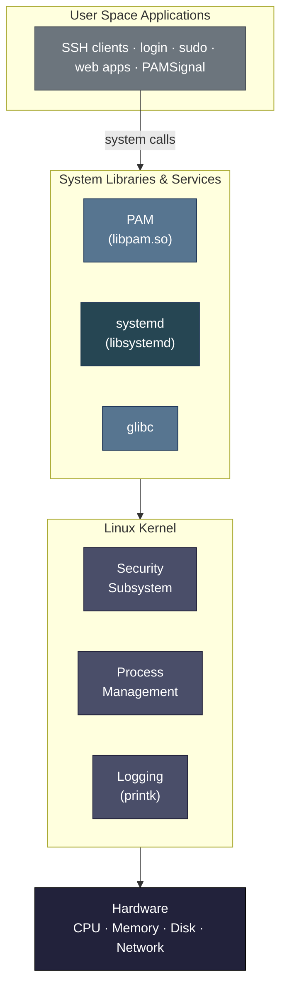
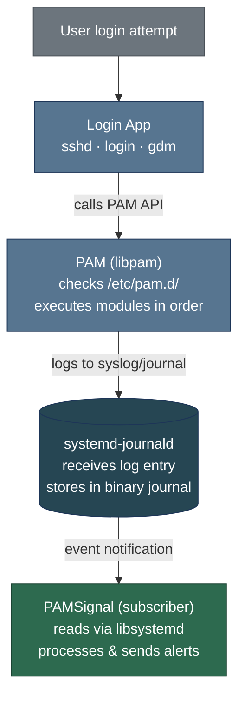
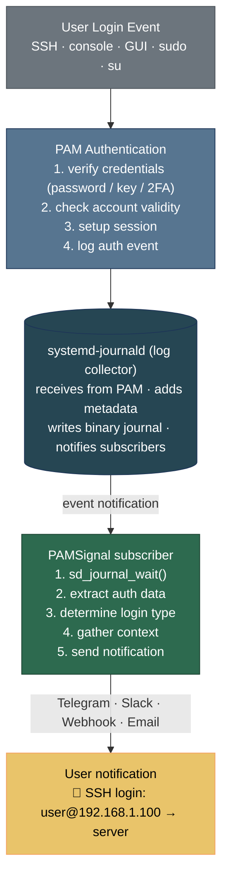
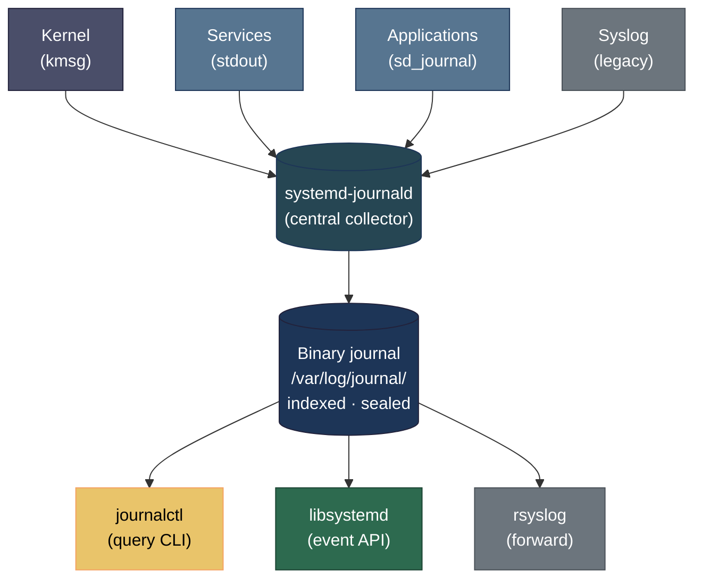

# Journal Subscriber

> 🌐 [English](../../notes/systemd-journal.md) · **Tiếng Việt**

- **Trạng thái**: Hoàn thành
- **Ngày bắt đầu**: 27/12/2025
- **Ngày hoàn thành**: 17/02/2026
- **Ngày cập nhật**: 20/02/2026

## 1. Mục Tiêu

- **Event-driven**: Thay thế cách quét file log truyền thống bằng cách đăng ký nhận sự kiện từ `libsystemd`, cho phép PAMSignal phản ứng ngay lập tức khi có log mới mà không lãng phí tài nguyên trong thời gian rảnh.
- **Thời gian thực**: Tận dụng hàm `sd_journal_wait()` để đạt độ trễ `~0s` từ khi hệ thống ghi nhận một phiên đăng nhập đến khi PAMSignal bắt đầu xử lý dữ liệu.
- **Dữ liệu có cấu trúc**: Khai thác định dạng nhị phân của Journal để truy xuất chính xác các trường metadata như `MESSAGE`, `_PID`, `_UID`.

## 2. Tổng Quan Kiến Trúc Linux

Để hiểu PAMSignal hoạt động như thế nào, chúng ta cần hiểu kiến trúc phân lớp của một hệ thống Linux:



**Các Lớp Chính:**

1. **Lớp Hardware**: Tài nguyên vật lý (CPU, RAM, lưu trữ, giao diện mạng)
2. **Kernel Space**: Kernel Linux quản lý phần cứng, tiến trình, bộ nhớ và bảo mật
3. **System Libraries**: Các thư viện dùng chung như PAM, systemd, glibc cung cấp API cho các ứng dụng
4. **User Space**: Các ứng dụng và dịch vụ mà người dùng tương tác

**Luồng Xác Thực trong Linux:**

Khi người dùng cố gắng đăng nhập (qua SSH, console, hoặc GUI), quá trình diễn ra như sau:



## 3. PAM (Pluggable Authentication Module) Là Gì?

**PAM** là một framework xác thực linh hoạt được hầu hết các distro Linux sử dụng để xử lý các tác vụ xác thực theo cách module hóa, có thể cấu hình.

### 3.1 Tại Sao PAM Tồn Tại

Trước khi có PAM, mỗi ứng dụng (login, ssh, sudo, v.v.) phải tự triển khai logic xác thực riêng. Điều này dẫn đến:
- Trùng lặp mã nguồn giữa các ứng dụng
- Chính sách bảo mật không nhất quán
- Khó cập nhật cơ chế xác thực trên toàn hệ thống

PAM giải quyết vấn đề này bằng cách cung cấp một **hệ thống xác thực tập trung, có thể cắm module**.

### 3.2 PAM Hoạt Động Như Thế Nào

**Các File Cấu Hình**: Nằm trong `/etc/pam.d/`, mỗi dịch vụ có cấu hình PAM riêng:

```bash
/etc/pam.d/
├── sshd          # Quy tắc xác thực SSH
├── login         # Quy tắc đăng nhập console
├── sudo          # Quy tắc xác thực sudo
├── common-auth   # Quy tắc xác thực dùng chung
└── ...
```

**Ví Dụ Cấu Hình PAM** (`/etc/pam.d/sshd`):

```
# PAM configuration for SSH daemon
auth       required     pam_unix.so        # Check password
auth       required     pam_env.so         # Set environment
account    required     pam_unix.so        # Check account validity
session    required     pam_systemd.so     # Register session with systemd
session    required     pam_unix.so        # Setup session
```

**Các Loại Module PAM:**

1. **auth**: Xác minh danh tính người dùng (mật khẩu, sinh trắc học, 2FA)
2. **account**: Kiểm tra tính hợp lệ của tài khoản (chưa hết hạn, chưa bị khóa)
3. **session**: Thiết lập/dọn dẹp phiên người dùng (mount home dir, ghi log phiên)
4. **password**: Cập nhật token xác thực (đổi mật khẩu)

**Các Control Flag:**

- `required`: Phải thành công, nhưng tiếp tục kiểm tra các module khác
- `requisite`: Phải thành công, dừng ngay nếu thất bại
- `sufficient`: Thành công là đủ, bỏ qua các module còn lại
- `optional`: Kết quả bị bỏ qua trừ khi đây là module duy nhất

### 3.3 PAM và Ghi Log Xác Thực

Khi PAM xác thực người dùng, nó tạo ra các thông điệp log được gửi đến system logger:

**Truyền thống (rsyslog):**
```
Feb 17 22:30:15 server sshd[12345]: Accepted password for user from 192.168.1.100 port 54321 ssh2
Feb 17 22:30:15 server sshd[12345]: pam_unix(sshd:session): session opened for user by (uid=0)
```

**Hiện đại (systemd-journald):**
```json
{
  "MESSAGE": "pam_unix(sshd:session): session opened for user by (uid=0)",
  "_PID": "12345",
  "_UID": "0",
  "_SYSTEMD_UNIT": "sshd.service",
  "_HOSTNAME": "server",
  "_SOURCE_REALTIME_TIMESTAMP": "1708186215000000",
  "SYSLOG_IDENTIFIER": "sshd"
}
```

**Đây chính là lúc PAMSignal phát huy tác dụng**: Nó theo dõi các sự kiện xác thực PAM này để phát hiện và cảnh báo về các phiên đăng nhập.

## 4. So Sánh Giải Pháp: Quét auth.log vs systemd-journald

### 4.1 Cách Tiếp Cận Cũ: Quét auth.log Định Kỳ

**Kiến trúc:**

```
┌──────────────────────────────────────────┐
│         PAMSignal (Old Version)          │
│                                          │
│  while (true) {                          │
│    sleep(500ms);  ← Polling interval     │
│    read("/var/log/auth.log");            │
│    parse_new_lines();                    │
│    if (login_detected) {                 │
│      send_alert();                       │
│    }                                     │
│  }                                       │
└──────────────────────────────────────────┘
                    │
                    ▼
         ┌──────────────────┐
         │ /var/log/auth.log│ (Plain text file)
         │ (rsyslog writes) │
         └──────────────────┘
```

**Các Vấn Đề:**

1. **Sử Dụng Tài Nguyên Kém Hiệu Quả**
   - Thức dậy mỗi 500ms kể cả khi không có đăng nhập nào
   - Trên một server thông thường: ~172.800 lần thức dậy không cần thiết mỗi ngày
   - Lãng phí chu kỳ CPU và pin (trên laptop)

2. **Phân Tích Cú Pháp Dễ Vỡ**
   - Định dạng log khác nhau giữa các distro:
     ```
     # Ubuntu/Debian
     Feb 17 22:30:15 server sshd[12345]: Accepted password for user from 192.168.1.100
     
     # CentOS/RHEL
     2026-02-17T22:30:15.123456+07:00 server sshd[12345]: Accepted password for user from 192.168.1.100
     
     # Arch Linux
     [2026-02-17 22:30:15] server sshd[12345]: Accepted password for user from 192.168.1.100
     ```
   - Yêu cầu các pattern regex phức tạp, dễ hỏng khi nâng cấp OS
   - Khó trích xuất metadata (PID, UID, hostname)

3. **Lỗ Hổng Bảo Mật**
   - **Race Condition**: Nếu kẻ tấn công xóa log trong vòng 500ms, PAMSignal sẽ bỏ sót sự kiện
   - **Giả mạo Log**: Các file plain text dễ bị chỉnh sửa/xóa
   - **Không Có Kiểm Tra Tính Toàn Vẹn**: Không thể phát hiện nếu log đã bị thay đổi

4. **Độ Trễ**
   - Độ trễ tối thiểu 500ms (trung bình 250ms)
   - Không chấp nhận được cho giám sát bảo mật thời gian thực

### 4.2 Cách Tiếp Cận Hiện Tại: Đăng Ký Sự Kiện systemd-journald

**Kiến trúc:**

```
┌──────────────────────────────────────────┐
│         PAMSignal (New Version)          │
│                                          │
│  sd_journal_open(&j);                    │
│  sd_journal_wait(j, -1);  ← Blocking     │
│                                          │
│  // Wakes ONLY when event occurs         │
│  while (sd_journal_next(j) > 0) {        │
│    get_data(j, "MESSAGE");               │
│    get_data(j, "_PID");                  │
│    send_alert();                         │
│  }                                       │
└──────────────────────────────────────────┘
                    ▲
                    │ Event notification
         ┌──────────┴──────────┐
         │  systemd-journald   │
         │  (Binary journal)   │
         │  /var/log/journal/  │
         └─────────────────────┘
```

**Ưu Điểm:**

1. **Hiệu Quả Theo Mô Hình Event-Driven**
   - Sử dụng CPU bằng 0 khi rảnh (blocking wait)
   - Thức dậy CHỈ khi có sự kiện xác thực xảy ra
   - Giảm ~99,9% số lần thức dậy so với polling

2. **Truy Cập Dữ Liệu Có Cấu Trúc**
   - Không cần phân tích cú pháp, truy cập trực tiếp theo trường:
     ```c
     sd_journal_get_data(j, "MESSAGE", &data, &length);
     sd_journal_get_data(j, "_PID", &data, &length);
     sd_journal_get_data(j, "_UID", &data, &length);
     ```
   - Định dạng nhất quán trên tất cả các distro
   - Metadata phong phú tự động có sẵn

3. **Hardening Bảo Mật**
   - **Thông Báo Tức Thì**: Độ trễ ~0ms, không có cửa sổ race condition
   - **Chống Giả Mạo**: Forward Secure Sealing (FSS) ngăn chặn việc chỉnh sửa log bằng mật mã
   - **Kiểm Tra Tính Toàn Vẹn**: Có thể phát hiện nếu log đã bị thay đổi
   - **Ghi Log Ở Cấp Kernel**: Khó bị kẻ tấn công vượt qua hơn

4. **Hiệu Năng Thời Gian Thực**
   - Độ trễ dưới mili giây từ sự kiện đến xử lý
   - Phù hợp cho giám sát bảo mật quan trọng

### 4.3 Bảng So Sánh Chi Tiết

| Khía cạnh | Quét auth.log | systemd-journald |
|--------|------------------|------------------|
| **CPU Usage (Idle)** | Liên tục (polling mỗi 500ms) | Bằng 0 (event-driven blocking) |
| **Độ trễ** | 0-500ms (trung bình 250ms) | <1ms (thông báo tức thì) |
| **Định dạng dữ liệu** | Văn bản không có cấu trúc | Nhị phân có cấu trúc (key-value) |
| **Độ phức tạp phân tích** | Cao (regex, khác nhau theo distro) | Không có (truy cập trực tiếp theo trường) |
| **Trích xuất Metadata** | Phân tích thủ công (dễ sai) | Tự động (PID, UID, timestamp, v.v.) |
| **Chống Giả Mạo** | Không có (plain text file) | Cao (niêm phong bằng mật mã) |
| **Nguy cơ Race Condition** | Có (cửa sổ 500ms) | Không (thông báo tức thì) |
| **Hỗ Trợ Đa Distro** | Dễ vỡ (khác biệt định dạng) | Vững chắc (API được chuẩn hóa) |
| **Hiệu quả tài nguyên** | ~172.800 lần thức dậy/ngày | ~10-100 lần thức dậy/ngày (thông thường) |
| **Độ phức tạp triển khai** | Cao (logic phân tích cú pháp) | Thấp (libsystemd API) |

**Kết luận**: Cách tiếp cận systemd-journald vượt trội hơn ở mọi khía cạnh có thể đo lường: hiệu năng, bảo mật, độ tin cậy và khả năng bảo trì.

## 5. PAMSignal Hoạt Động Như Thế Nào Bên Dưới

### 5.1 Kiến Trúc Tổng Quan



### 5.2 Quy Trình Nội Bộ của PAMSignal

**Bước 1: Khởi Tạo**

```c
// Open the systemd journal
sd_journal *journal;
sd_journal_open(&journal, SD_JOURNAL_LOCAL_ONLY);

// Seek to the end (only monitor new events)
sd_journal_seek_tail(journal);
sd_journal_previous(journal); // Move to last entry

// Add filters for authentication events
sd_journal_add_match(journal, "_SYSTEMD_UNIT=sshd.service", 0);
sd_journal_add_match(journal, "SYSLOG_IDENTIFIER=sshd", 0);
// ... add more filters for login, sudo, etc.
```

**Bước 2: Vòng Lặp Sự Kiện (Blocking Wait)**

```c
while (1) {
    // Block until new journal entries arrive
    // This is the KEY difference from polling
    int ret = sd_journal_wait(journal, (uint64_t) -1);
    
    if (ret < 0) {
        // Handle error
        continue;
    }
    
    // Process all new entries
    while (sd_journal_next(journal) > 0) {
        process_journal_entry(journal);
    }
}
```

**Bước 3: Trích Xuất Dữ Liệu Xác Thực**

```c
void process_journal_entry(sd_journal *j) {
    const void *data;
    size_t length;
    
    // Extract message
    sd_journal_get_data(j, "MESSAGE", &data, &length);
    char *message = extract_value(data, length);
    
    // Check if it's a successful login
    if (!is_successful_login(message)) {
        return;
    }
    
    // Extract metadata
    sd_journal_get_data(j, "_PID", &data, &length);
    int pid = parse_int(data, length);
    
    sd_journal_get_data(j, "_UID", &data, &length);
    int uid = parse_int(data, length);
    
    sd_journal_get_data(j, "_HOSTNAME", &data, &length);
    char *hostname = extract_value(data, length);
    
    uint64_t timestamp;
    sd_journal_get_realtime_usec(j, &timestamp);
    
    // Parse login details from message
    LoginEvent event = parse_login_message(message);
    event.pid = pid;
    event.uid = uid;
    event.hostname = hostname;
    event.timestamp = timestamp;
    
    // Send notification
    send_notification(&event);
}
```

**Bước 4: Gửi Thông Báo**

```c
void send_notification(LoginEvent *event) {
    // Format message
    char message[1024];
    snprintf(message, sizeof(message),
        "🔐 %s login\n"
        "👤 User: %s\n"
        "🌐 From: %s\n"
        "🖥️  Server: %s\n"
        "⏰ Time: %s",
        event->type,      // "SSH", "Console", "Sudo"
        event->username,
        event->source_ip,
        event->hostname,
        format_timestamp(event->timestamp)
    );
    
    // Send via configured channels
    if (config.telegram_enabled) {
        send_telegram(message);
    }
    if (config.email_enabled) {
        send_email(message);
    }
    if (config.webhook_enabled) {
        send_webhook(message);
    }
}
```

### 5.3 Các Quyết Định Thiết Kế Chính

**Tại Sao Event-Driven?**
- **Hiệu quả**: Không lãng phí chu kỳ CPU trong thời gian rảnh
- **Thời gian thực**: Phản ứng tức thì với các sự kiện bảo mật
- **Khả năng mở rộng**: Có thể xử lý các hệ thống xác thực lưu lượng cao

**Tại Sao libsystemd?**
- **Chuẩn hóa**: Hoạt động trên tất cả các distro dựa trên systemd (Ubuntu, Debian, Fedora, Arch, v.v.)
- **Độ tin cậy**: Được duy trì bởi dự án systemd, đã được thử nghiệm thực tế
- **Hiệu năng**: Thư viện C được tối ưu hóa với overhead tối thiểu

**Tại Sao Binary Journal?**
- **Dữ liệu có cấu trúc**: Không có lỗi phân tích cú pháp, truy cập trực tiếp theo trường
- **Bảo mật**: Chống giả mạo với niêm phong bằng mật mã
- **Hiệu quả**: Lưu trữ có index để truy vấn nhanh

**Khi PAMSignal Chạy:**
- Là một systemd service (được quản lý bởi chính systemd)
- Khởi động cùng hệ thống, chạy liên tục
- Tự động khởi động lại khi gặp lỗi
- Footprint tài nguyên tối thiểu (~1-2MB RAM, 0% CPU khi rảnh)

## 6. Hiểu Về systemd và journal

Trước đây, tôi có một ý tưởng cực kỳ đơn giản: quét file `/var/log/auth.log` rồi phân tích chuỗi để trích xuất thông tin phiên đăng nhập. Dù điều này có thể chứng minh khái niệm "cảnh báo đăng nhập" là khả thi, nhưng về mặt hiệu năng, ổn định và độ tin cậy, nó không đủ vững chắc.

**Cụ thể:**

- Xử lý từng dòng log gặp nhiều khó khăn vì định dạng thời gian và các pattern thông điệp khác nhau đáng kể giữa các phiên bản OS, dẫn đến việc trích xuất thông tin không đáng tin cậy.

- Polling định kỳ mỗi `500ms` lãng phí tài nguyên. Trong một ngày thông thường, không có nhiều phiên đăng nhập thành công vào hệ thống, vì vậy cách tiếp cận này kém hiệu quả.
- Nếu một hacker xâm nhập vào hệ thống và xóa dấu vết trong file auth.log trong vòng 500ms, hệ thống sẽ hoàn toàn không hay biết.

### 6.1 systemd Là Gì?

**systemd** là một system và service manager hiện đại cho hệ điều hành Linux, được phát hành vào năm 2010 bởi Lennart Poettering. Nó đã trở thành tiêu chuẩn de facto init system cho hầu hết các distro Linux lớn, thay thế SysV (System V - phiên bản lớn thứ năm của Unix do AT&T Bell Labs phát triển vào những năm 1980, phát hành năm 1983) init truyền thống.

**SysV init (Truyền thống):**

- Sử dụng shell scripts trong `/etc/init.d/` để khởi động/dừng dịch vụ
- Khởi động tuần tự (các dịch vụ khởi động lần lượt từng cái)
- Đơn giản nhưng thời gian boot chậm
- Quản lý dependency hạn chế
- Được sử dụng từ những năm 1980 đến những năm 2010

**systemd (Hiện đại):**

- Sử dụng unit file (các file `.service`) với cú pháp khai báo
- Khởi động song song (các dịch vụ khởi động đồng thời khi dependencies được đáp ứng)
- Thời gian boot nhanh
- Quản lý dependency nâng cao, socket activation và nhiều tính năng khác
- Trở thành tiêu chuẩn khoảng năm 2010-2015

**Các Thành Phần Cốt Lõi:**

- **systemd (PID 1)**: Tiến trình đầu tiên được kernel khởi động, chịu trách nhiệm khởi tạo hệ thống và quản lý tất cả các tiến trình khác
- **systemd-journald**: Daemon ghi log thu thập và lưu trữ dữ liệu log
- **systemctl**: Công cụ dòng lệnh để điều khiển các systemd service
- **journalctl**: Công cụ dòng lệnh để truy vấn và xem journal logs

**Tại Sao systemd Quan Trọng Với PAMSignal:**

systemd cung cấp một cách tiếp cận hiện đại, thống nhất trong quản lý hệ thống, giải quyết những hạn chế của cách ghi log truyền thống:

1. **Ghi Log Tập Trung**: Tất cả log hệ thống (kernel, dịch vụ, ứng dụng) được thu thập ở một nơi
2. **Định Dạng Nhị Phân**: Log được lưu trữ ở định dạng nhị phân có index, có cấu trúc thay vì plain text
3. **Metadata Phong Phú**: Mỗi log entry bao gồm metadata đầy đủ (PID, UID, tên dịch vụ, timestamp, v.v.)
4. **API Event-Driven**: Các ứng dụng có thể đăng ký nhận sự kiện log theo thời gian thực qua `libsystemd`

### 6.2 Kiến Trúc systemd-journald

**Cách hoạt động:**



**Các Tính Năng Chính:**

1. **Lưu Trữ Có Cấu Trúc**: Mỗi log entry là một bản ghi có cấu trúc với các cặp key-value
2. **Indexing**: Truy vấn nhanh sử dụng các trường metadata (unit, priority, time range)
3. **Chống Giả Mạo**: Forward Secure Sealing (FSS) tùy chọn ngăn chặn việc chỉnh sửa log
4. **Rotation Tự Động**: Rotation theo kích thước và thời gian với khả năng lưu trữ có thể cấu hình
5. **Hiệu Năng**: Được tối ưu hóa cho ghi log lưu lượng cao với overhead tối thiểu

### 6.3 Ưu Điểm So Với Các File Log Truyền Thống

| Tính năng | Truyền thống (`/var/log/auth.log`) | systemd-journald |
|---------|--------------------------------|------------------|
| **Định dạng** | Plain text, không có cấu trúc | Nhị phân, có cấu trúc với metadata |
| **Phân tích cú pháp** | Regex/string parsing (dễ vỡ) | Truy cập trực tiếp theo trường (đáng tin cậy) |
| **Hiệu năng** | Quét file tuần tự | Truy vấn có index |
| **Thời gian thực** | File polling (độ trễ 500ms+) | API event-driven (độ trễ ~0ms) |
| **Giả mạo** | Dễ chỉnh sửa/xóa | Niêm phong bằng cryptographic hashing |
| **Metadata** | Hạn chế (timestamp, message) | Phong phú (PID, UID, dịch vụ, hostname, v.v.) |
| **Rotation** | Cấu hình logrotate thủ công | Tự động với systemd |

### 6.4 API Event-Driven của libsystemd

Đối với PAMSignal, ưu điểm quan trọng nhất là **kiến trúc event-driven** được cung cấp bởi `libsystemd`:

**Cách Tiếp Cận Truyền Thống (Polling):**
```c
while (1) {
    read_log_file("/var/log/auth.log");
    parse_new_lines();
    sleep(500); // Waste CPU, miss events
}
```

**Cách Tiếp Cận systemd (Event-Driven):**
```c
sd_journal *j;
sd_journal_open(&j, SD_JOURNAL_LOCAL_ONLY);
sd_journal_seek_tail(j);

while (1) {
    // Wait for new journal entries (blocking, no CPU waste)
    sd_journal_wait(j, (uint64_t) -1);
    
    // Process new entries immediately
    while (sd_journal_next(j) > 0) {
        const void *data;
        size_t length;
        
        // Direct field access, no parsing needed
        sd_journal_get_data(j, "MESSAGE", &data, &length);
        sd_journal_get_data(j, "_PID", &data, &length);
        sd_journal_get_data(j, "_UID", &data, &length);
    }
}
```

**Các Hàm Chính:**

- `sd_journal_open()`: Mở journal để đọc
- `sd_journal_wait()`: Blocking cho đến khi có entry mới (event-driven)
- `sd_journal_next()`: Di chuyển đến entry tiếp theo
- `sd_journal_get_data()`: Lấy các trường cụ thể theo tên
- `sd_journal_add_match()`: Lọc các entry theo tiêu chí (ví dụ: chỉ các sự kiện auth)

**Lợi Ích cho PAMSignal:**

1. ✅ **Zero polling overhead**: CPU chỉ sử dụng khi có sự kiện
2. ✅ **Thông báo tức thì**: Độ trễ ~0ms từ sự kiện đến xử lý
3. ✅ **Phân tích cú pháp đáng tin cậy**: Không có regex, truy cập trực tiếp theo trường
4. ✅ **Phát hiện giả mạo**: Log được niêm phong ngăn kẻ tấn công xóa log
5. ✅ **Tương thích đa distro**: Hoạt động trên tất cả các distro dựa trên systemd

Kiến trúc này biến PAMSignal thành một giải pháp giám sát xác thực thực sự thời gian thực, hiệu quả và đáng tin cậy.
