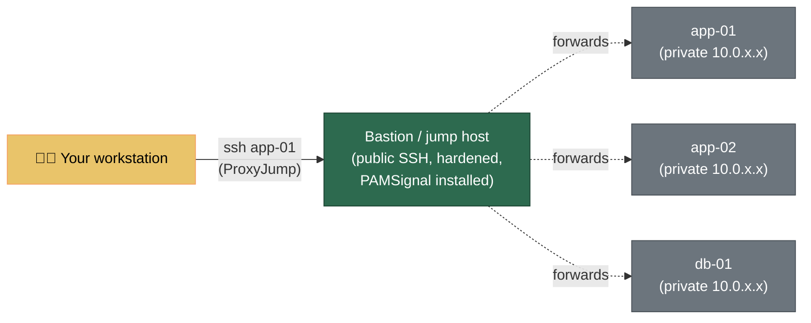

# Bảo mật SSH & Quản lý Fleet

> 🌐 [English](../ssh-hardening.md) · **Tiếng Việt**

SSH là cửa ngõ vào Linux server của bạn. PAMSignal báo cho bạn ngay khi có người gõ cửa, lay tay nắm, hay lọt được vào trong. Hướng dẫn này nói về việc làm cho chính cánh cửa đó vững chắc — và về cách quản lý cánh cửa ấy trên một server hay năm mươi server mà không bị rối.

Nếu trước giờ bạn chỉ đăng nhập bằng password, vài phần dưới đây có thể hơi nhiều thứ phải tiếp thu một lúc. Không sao — bạn chỉ làm **một lần cho mỗi server** rồi quên nó đi, và PAMSignal theo dõi suốt quá trình nên mỗi thay đổi đều có phản hồi tức thì cho biết nó đã có hiệu lực.

> **Chưa quen gì với mấy thứ này?** Hãy đọc [Bắt đầu nhanh](README.md#-bắt-đầu-nhanh) trước để cài PAMSignal và thấy ít nhất một dòng trong `journalctl -t pamsignal`. Rồi quay lại đây.

---

## PAMSignal nằm ở đâu

PAMSignal là **một tầng** trong mô hình phòng thủ nhiều lớp (defence-in-depth). Nó làm đúng một việc — *phát hiện và cảnh báo* — và làm tốt việc đó. Các tầng còn lại vẫn là phần việc của bạn, và hướng dẫn này lo tầng quan trọng nhất (Tầng 1):

| Tầng | Mục tiêu | Công cụ thường dùng | Ai lo |
|---|---|---|---|
| **1. Phòng ngừa (Prevention)** | Làm cánh cửa khó mở | **SSH key-only auth, hardening `sshd_config`, firewall** | **Bạn — hướng dẫn này** |
| 2. Toàn vẹn (Integrity) | Phát hiện hệ thống bị can thiệp | AIDE, `debsums`, `rpm -V` | Bạn |
| **3. Phát hiện / Cảnh báo (Detection / Alerting)** | Báo cho bạn khi có chuyện | **PAMSignal** | **PAMSignal** |
| 4. Điều tra (Forensics) | Dựng lại sự việc về sau | `auditd`, journald retention | Bạn |

PAMSignal **không bao giờ đụng vào `sshd`** — nó không sửa cấu hình SSH, không cài PAM module, cũng không chặn gì. Nó đọc sự kiện PAM từ systemd journal rồi báo cho bạn. Nhờ vậy, hardening SSH (trang này) và phát hiện tấn công nhắm vào nó (PAMSignal) là hai việc tách bạch, bổ trợ cho nhau: hardening thu hẹp bề mặt tấn công, còn PAMSignal cho bạn biết khi phần bề mặt còn lại bị thử — và khi có thứ gì lọt qua.

Mảnh ghép tự nhiên thứ ba là **chặn tự động**: xem [Hướng dẫn tích hợp Fail2ban](examples/fail2ban.md), nơi Fail2ban dựa vào tín hiệu brute-force của PAMSignal để chặn IP kẻ tấn công ngay tại firewall.

---

## Phần 1 — Hardening SSH cho một server

Mọi thứ trong phần này chạy **trên server**. Hãy làm qua một phiên SSH đang mở sẵn, và **giữ phiên đó mở** cho tới khi bạn xác nhận đăng nhập mới hoạt động. Chỉ một thói quen đó thôi đã đủ tránh mọi câu chuyện "tự khóa mình ra ngoài" mà bạn từng nghe.

### 1.1 Dùng SSH key, không dùng password

Password có thể bị đoán, bị lừa lấy (phishing), hoặc bị dò brute-force. SSH key thì không — nó là một bí mật mã hóa không bao giờ rời khỏi máy bạn. Đây là thay đổi mang lại hiệu quả lớn nhất.

**Trên máy của bạn** (laptop/desktop — *không phải* server), tạo một key hiện đại nếu chưa có:

```bash
ssh-keygen -t ed25519 -C "you@workstation"
# Nhấn Enter để dùng đường dẫn mặc định (~/.ssh/id_ed25519).
# LUÔN đặt passphrase — nó mã hóa key khi lưu trên đĩa.
```

`ed25519` là thuật toán được khuyến nghị hiện nay: ngắn, nhanh và mạnh. (Nếu công ty bạn phát hành hardware security key — kiểu YubiKey — hãy dùng `-t ed25519-sk` để private key nằm luôn trên thiết bị phần cứng.)

Copy **public** key lên server:

```bash
ssh-copy-id you@your-server.example.com
# Hoặc, nếu không có ssh-copy-id:
# ssh you@your-server.example.com 'mkdir -p ~/.ssh && cat >> ~/.ssh/authorized_keys' < ~/.ssh/id_ed25519.pub
```

**Giờ hãy thử nó trước khi đổi bất cứ thứ gì khác.** Mở một terminal *mới* và chạy:

```bash
ssh you@your-server.example.com
```

Nếu nó cho bạn vào **mà không hỏi password tài khoản** (việc hỏi passphrase của key là bình thường), nghĩa là key đã chạy. Lúc đó mới đi tiếp.

### 1.2 Siết `sshd_config` bằng drop-in

Các distro hiện đại (Debian 12+, Ubuntu 22.04+, RHEL 9+) đọc thêm cấu hình từ `/etc/ssh/sshd_config.d/*.conf`. Đặt phần hardening vào một file riêng ở đó gọn hơn nhiều so với sửa thẳng vào `sshd_config` lớn — nó không bị đụng tới khi nâng cấp package, và rất dễ rà soát hay gỡ bỏ.

Tạo file `/etc/ssh/sshd_config.d/00-hardening.conf`:

```ini
# Xác thực: chỉ dùng key, không password, không cho root đăng nhập bằng password.
PubkeyAuthentication yes
PasswordAuthentication no
KbdInteractiveAuthentication no
PermitRootLogin prohibit-password
PermitEmptyPasswords no

# Làm chậm lại và giới hạn mỗi lần thử kết nối.
MaxAuthTries 3
LoginGraceTime 20
MaxSessions 4

# Chỉ những user (hoặc group) này mới được đăng nhập. Sửa lại cho đúng tài khoản của bạn.
AllowUsers deploy admin
# AllowGroups ssh-users

# Tắt những thứ gần như chắc chắn bạn không cần.
X11Forwarding no
AllowAgentForwarding no
```

Vài điểm quan trọng:

- **`PermitRootLogin prohibit-password`** chỉ cho root đăng nhập *bằng key*, không bao giờ bằng password. Nếu bạn có một user thường có quyền `sudo` (nên có), hãy đặt `PermitRootLogin no` và đăng nhập bằng user đó.
- **Tiền tố tên file có ý nghĩa.** `sshd` dùng giá trị **đầu tiên** mà nó gặp cho mỗi keyword, và `Include /etc/ssh/sshd_config.d/*.conf` đọc các file theo thứ tự bảng chữ cái. Cloud image thường kèm sẵn một file `50-cloud-init.conf` *bật* password auth; tiền tố `00-` xếp trước nên giá trị của bạn thắng. Nếu thấy thiết lập của mình bị bỏ qua, gần như luôn là vì lý do này — kiểm tra giá trị *thực tế* bằng `sudo sshd -T | grep -i passwordauthentication`.
- **`AllowUsers`** là một danh sách cho phép rất mạnh: ai không có tên trong đó thì đơn giản là không xác thực được. Nhớ thêm tài khoản của chính bạn vào trước khi reload.

### 1.3 Validate rồi reload (không ngắt phiên đang dùng)

**Luôn** kiểm tra cú pháp trước khi áp dụng — một lỗi gõ nhầm ở đây có thể khóa tất cả mọi người ra ngoài:

```bash
sudo sshd -t          # không in ra gì nếu cấu hình hợp lệ
sudo sshd -T | grep -iE 'passwordauthentication|permitrootlogin|allowusers'   # xác nhận giá trị thực tế
```

Rồi reload. *Reload* đọc lại cấu hình mà không cắt các kết nối đang có:

```bash
# Debian / Ubuntu — unit tên là "ssh"
sudo systemctl reload ssh

# RHEL / Fedora / AlmaLinux / Rocky — unit tên là "sshd"
sudo systemctl reload sshd
```

**Bước kiểm tra an toàn:** vẫn để phiên hiện tại mở, mở thêm một terminal mới và SSH vào lại. Vào được là xong. Không vào được thì bạn vẫn còn phiên cũ để sửa. Đừng đóng phiên đầu tiên cho tới khi phiên mới thành công.

### 1.4 Xem PAMSignal xác nhận

Đây là phần thú vị nhất. Tail PAMSignal và xem thay đổi của bạn có hiệu lực ngay trước mắt:

```bash
journalctl -t pamsignal -f
```

- Đăng nhập bằng key của bạn hiện ra dưới dạng `login_success ... auth=publickey`.
- Một con bot thử password giờ thất bại *ngay lập tức* — bạn sẽ thấy `login_failure ... auth=password`, không còn cửa nào để thành công.
- Khi một IP vượt `fail_threshold`, bạn nhận được một dòng `brute_force_detected` (và một chat alert nếu đã cấu hình).

Vậy là vòng tròn đã khép lại: phòng ngừa (Phần 1) làm cánh cửa vững chắc, còn phát hiện (PAMSignal) chứng minh điều đó và canh chừng nó.

### 1.5 Tùy chọn nâng cao

- **Đổi port.** Chuyển SSH khỏi cổng `22` (ví dụ `Port 2222`) không ngăn được kẻ tấn công *có chủ đích*, nhưng cắt giảm đáng kể tiếng ồn từ các scanner quét khắp internet — tức là ít alert rác hơn. Nếu làm vậy, nhớ cập nhật firewall và `~/.ssh/config` (Phần 2). Security-by-obscurity chỉ là điểm cộng, đừng bao giờ coi nó là phương án chính.
- **Firewall.** Giới hạn cổng 22/2222 cho những IP đã biết ở nơi nào có thể (`ufw`, `firewalld`, hoặc security group của nhà cung cấp cloud). Một bastion (Phần 2) cho phép bạn chỉ phơi SSH ra trên *một* host thay vì tất cả.
- **2FA.** Với host quan trọng, thêm TOTP qua `libpam-google-authenticator`. Đây vẫn là Tầng 1 (phòng ngừa) và nằm trong PAM stack của bạn — PAMSignal chỉ việc báo lại các lần thành công và thất bại do nó sinh ra.

---

## Phần 2 — Quản lý nhiều server mà không đau đầu

Khi bạn có hơn hai ba server, hai vấn đề nảy sinh: bạn không nhớ nổi IP/port/user của từng máy, và bạn không muốn phơi SSH ra internet trên mọi máy. Cả hai đều giải quyết được **ngay trên máy của bạn** bằng `~/.ssh/config` — không phải đụng gì tới server.

### 2.1 Đặt tên cho mỗi server

Tạo hoặc sửa `~/.ssh/config` trên laptop của bạn:

```ini
# ~/.ssh/config  — trên MÁY của bạn, không phải trên server.

# Mặc định áp dụng cho mọi host bên dưới.
Host *
    AddKeysToAgent yes
    ServerAliveInterval 60
    ServerAliveCountMax 3
    HashKnownHosts yes

Host web-01
    HostName 203.0.113.10
    User deploy
    Port 2222
    IdentityFile ~/.ssh/id_ed25519

Host web-02
    HostName 203.0.113.11
    User deploy

# Một block có thể bao cả một quy ước đặt tên nhờ wildcard.
Host db-*
    User postgres
    IdentityFile ~/.ssh/id_ed25519_db
```

Giờ thay vì `ssh -p 2222 deploy@203.0.113.10`, bạn chỉ gõ:

```bash
ssh web-01
```

Tab-completion, `scp file web-02:/tmp/`, và `rsync` đều hiểu các alias này. Đây là nâng cấp tiện lợi đáng giá nhất khi quản lý fleet — và nó khiến phần triển khai ở Phần 3 trở nên đơn giản, vì mọi công cụ đều có thể gọi host bằng tên.

### 2.2 Truy cập server private qua bastion (jump host)

Cách tốt nhất để mở SSH cho cả fleet là chỉ mở trên **đúng một** host đã hardening và được giám sát — gọi là *bastion* (hay *jump host*) — rồi giữ mọi server khác trong mạng private, chỉ vào được thông qua nó. `ProxyJump` biến việc này thành một dòng từ phía bạn:

```ini
Host bastion
    HostName bastion.example.com
    User admin
    Port 2222

# Mọi host trong dải private 10.0.x.x đều vào qua bastion.
Host 10.0.*.*
    ProxyJump bastion
    User deploy

Host app-01
    HostName 10.0.1.21
    ProxyJump bastion
    User deploy
```

Giờ `ssh app-01` tự động đi vòng qua bastion một cách trong suốt. Kết nối tới `app-01` được mã hóa end-to-end — bastion chỉ chuyển tiếp gói tin, nó không bao giờ thấy nội dung phiên của bạn.



**Vì sao nó hợp với PAMSignal đến vậy:** bastion trở thành bề mặt SSH duy nhất hướng ra internet, nên nó hứng gần như toàn bộ lưu lượng brute-force. Cài PAMSignal ở đó thì alert tập trung đúng nơi tấn công đổ về. Cài luôn trên các host private nữa thì bất kỳ lần đăng nhập nào *không* đi qua bastion đều là dấu hiệu đáng nghi ngay lập tức.

> **Ưu tiên `ProxyJump` hơn agent forwarding.** Agent forwarding (`ForwardAgent yes`) phơi key của bạn ra host mà bạn vừa vào. `ProxyJump` thì không — key của bạn không bao giờ chạm tới bastion. Chỉ forward agent tới những host bạn hoàn toàn tin tưởng.

### 2.3 Quản lý key ở quy mô fleet

- **Mỗi người một key, đừng dùng chung một key.** Khi một admin nghỉ, bạn chỉ cần thu hồi public key *của họ* khỏi `authorized_keys` ở mọi nơi — không phải xoay (rotate) một bí mật mà cả nhóm dùng chung.
- **Phân phối `authorized_keys` bằng config management** (Phần 3), đừng làm tay. Một file bạn sửa thủ công trên 30 server thì sớm muộn cũng mỗi nơi một khác.
- **Dùng passphrase + `ssh-agent`** để key được mã hóa khi lưu nhưng bạn chỉ phải gõ passphrase một lần mỗi phiên.

---

## Phần 3 — Triển khai PAMSignal cho toàn fleet

Cửa đã chắc; giờ đặt một cảm biến sau mỗi cánh cửa. Mục tiêu: mọi host đều chạy PAMSignal, dùng chung một cấu hình hợp lý, và cùng báo về một chỗ (chat cho cảnh báo tức thì, [Grafana](grafana-getting-started.md) cho góc nhìn toàn fleet).

### 3.1 Cách nhanh: vòng lặp qua các SSH alias

Với một vài host, các tên trong `~/.ssh/config` ở Phần 2 là đủ cho một dòng lệnh. Cài đặt theo [hướng dẫn Triển khai](deployment.md) trên từng máy:

```bash
for h in bastion web-01 web-02 db-01; do
  echo "== installing on $h =="
  ssh "$h" 'sudo apt-get update && sudo apt-get install -y pamsignal'   # giả định repo đã được cấu hình
done
```

…rồi kiểm tra cả fleet một lượt:

```bash
for h in bastion web-01 web-02 db-01; do
  echo "== $h =="
  ssh "$h" 'systemctl is-active pamsignal; journalctl -t pamsignal -n 2 --no-pager'
done
```

### 3.2 Cách tái lập được: Ansible

Vượt quá một vài host thì nên dùng config management để cả việc cài đặt **lẫn** cấu hình đều tái lập được. Ansible đọc trực tiếp các alias trong `~/.ssh/config` của bạn. Một điểm khởi đầu tối giản:

```ini
# inventory.ini
[pamsignal_fleet]
bastion
web-01
web-02
db-01
```

```yaml
# install-pamsignal.yml
- hosts: pamsignal_fleet
  become: true
  tasks:
    - name: Install pamsignal (Debian/Ubuntu)
      ansible.builtin.apt:
        name: pamsignal
        state: present
        update_cache: true
      when: ansible_os_family == "Debian"

    - name: Install pamsignal (RHEL family)
      ansible.builtin.dnf:
        name: pamsignal
        state: present
      when: ansible_os_family == "RedHat"

    - name: Deploy the shared config
      ansible.builtin.template:
        src: pamsignal.conf.j2
        dest: /etc/pamsignal/pamsignal.conf
        owner: root
        group: pamsignal
        mode: "0640"
      notify: reload pamsignal

    - name: Enable and start
      ansible.builtin.systemd:
        name: pamsignal
        enabled: true
        state: started

  handlers:
    - name: reload pamsignal
      ansible.builtin.systemd:
        name: pamsignal
        state: reloaded
```

```bash
ansible-playbook -i inventory.ini install-pamsignal.yml
```

Vì cấu hình là một template Jinja (`pamsignal.conf.j2`), bạn có thể đặt **context tag riêng cho từng host** từ biến inventory — `provider` và `service_name` được gắn vào mọi alert, nên bạn luôn biết một cảnh báo đến từ host nào (hay khách hàng nào):

```ini
# pamsignal.conf.j2  (trích)
provider = {{ pamsignal_provider | default('selfhosted') }}
service_name = {{ inventory_hostname }}
```

Cách gắn tag theo host như vậy chính là nền tảng cho các mô hình multi-tenant trong [Use Cases → Hosting provider nhỏ](use-cases.md#hosting-provider-nhỏ--msp).

### 3.3 Một cấu hình, nhiều host

Giữ một file `pamsignal.conf` chuẩn duy nhất trong repo config-management rồi đẩy đi mọi nơi. Những key đáng chuẩn hóa trên cả fleet:

- `fail_threshold` / `fail_window_sec` — định nghĩa "brute force" chung cho cả fleet.
- `enable_notification_type` — lọc bớt tiếng ồn trên chat (ví dụ `login_success,brute_force`); journal cục bộ vẫn ghi đủ mọi thứ. Xem [Configuration](configuration.md#bộ-lọc-loại-thông-báo).
- Thông tin xác thực kênh cảnh báo — thường là một kênh chung cho cả fleet, hoặc một kênh cho mỗi môi trường.

Reload mọi nơi sau khi đổi cấu hình mà không cần restart:

```bash
for h in bastion web-01 web-02 db-01; do ssh "$h" 'sudo systemctl reload pamsignal'; done
# …hoặc, với Ansible, chỉ cần chạy lại playbook — handler chỉ reload các host có thay đổi.
```

---

## Đừng tự khóa mình ra ngoài — checklist

Hardening và tự động hóa chính là lúc dễ tự khóa mình ra ngoài nhất. Trước khi rời khỏi bất kỳ host nào:

- [ ] **Vẫn còn một phiên thứ hai đang mở** trong khi bạn thử thay đổi.
- [ ] **Một lần đăng nhập SSH mới đã thành công** *trước khi* bạn đóng phiên cũ.
- [ ] **Tài khoản của bạn nằm trong `AllowUsers`** (nếu bạn có đặt).
- [ ] **Bạn biết đường vào out-of-band** — serial console của cloud, hypervisor, hoặc truy cập vật lý — phòng khi mọi đường SSH đều hỏng.
- [ ] Nếu bạn cũng chạy [Fail2ban](examples/fail2ban.md), **IP của chính bạn nằm trong `ignoreip`** để một lần gõ nhầm password không tự ban mất bạn.

---

## PAMSignal bổ trợ thế nào — nhìn nhanh

| Bạn đã làm gì | Tầng | Được lợi gì | PAMSignal thêm vào gì |
|---|---|---|---|
| Key-only auth, hardening `sshd_config` | Phòng ngừa | Tấn công bằng password không thể thành công | Báo ngay khi có người thử, và xác nhận từng lần đăng nhập hợp lệ |
| Bastion + mạng private | Phòng ngừa | Một bề mặt tấn công nhỏ thay vì nhiều | Gom alert về bastion; gắn cờ mọi lần đăng nhập né được nó |
| Fail2ban dựa trên tín hiệu brute-force | Phản ứng | Kẻ tái phạm bị chặn tại firewall | Cung cấp tín hiệu `brute_force_detected` đã kiểm chứng để Fail2ban hành động |
| Triển khai fleet + tag theo host | Vận hành | Fleet tái lập được, có tên, được giám sát | Một góc nhìn tức thì + [một góc nhìn toàn fleet](grafana-getting-started.md) cho mọi hoạt động auth |

PAMSignal không *thay thế* bất cứ thứ nào ở trên — nó làm chúng quan sát được. Một server đã hardening mà bạn không nhìn thấy gì là một server bạn đang tin tưởng một cách mù quáng; PAMSignal là cách bạn thôi tin mù quáng.

---

## Đọc thêm

- 🔒 **[Triển khai](deployment.md)** — cài đặt, các chỉ thị hardening của systemd, gỡ cài đặt
- ⚙️ **[Configuration](configuration.md)** — mọi config key, gồm cả bộ lọc loại thông báo
- 🛡️ **[Tích hợp Fail2ban](examples/fail2ban.md)** — biến tín hiệu brute-force thành lệnh ban IP tự động
- 📊 **[Grafana từ con số 0](grafana-getting-started.md)** — một dashboard cho hoạt động auth của cả fleet
- 🎯 **[Threat Model — Phạm vi quan sát](threat-model.md#phạm-vi-quan-sát)** — những kênh PAMSignal thấy và không thấy (đọc phần này trước khi cho rằng SSH là cánh cửa duy nhất)
- 🧩 **[Use Cases](use-cases.md)** — playbook cho cá nhân, nhóm nhỏ, và hosting provider
