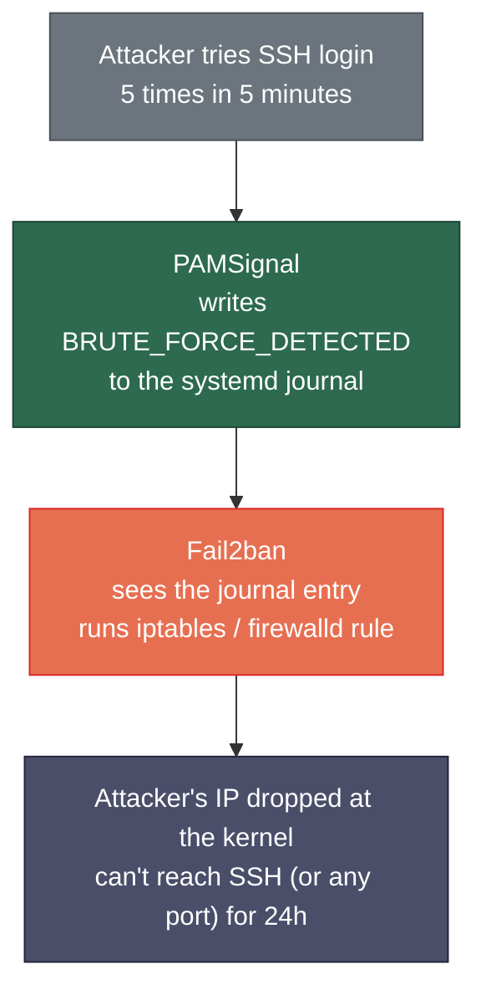
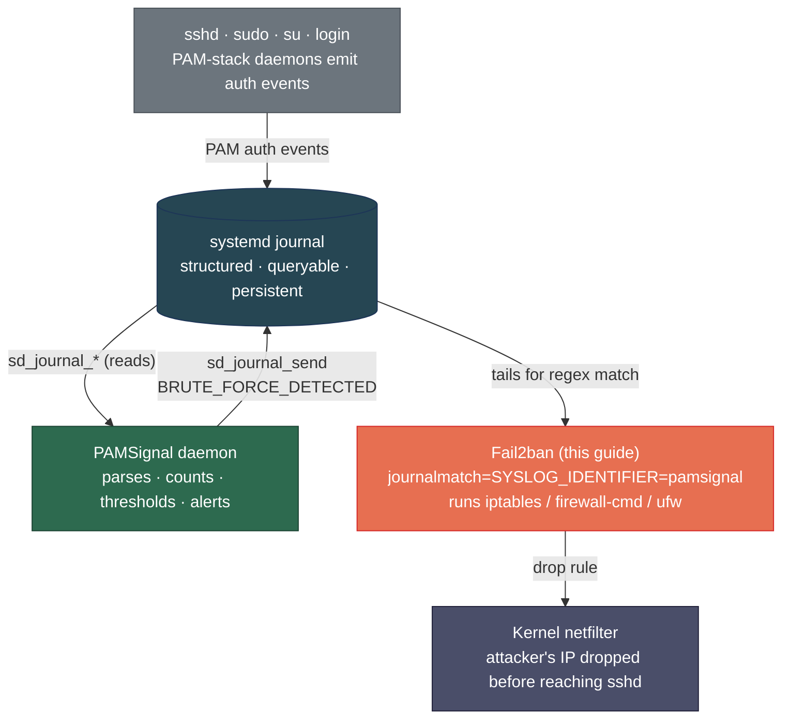

# Fail2ban Integration Guide

This guide walks you through setting up [Fail2ban](https://github.com/fail2ban/fail2ban) so that whenever PAMSignal detects a brute-force attack, the attacker's IP is automatically blocked at the firewall. Examples cover **Ubuntu 22.04+ / Debian 12+** and **CentOS Stream 9 / AlmaLinux 9 / Rocky Linux 9** (same commands work on Fedora 40+ too).

If you've never used Fail2ban before — that's fine. The guide explains every concept as it introduces it.

> **Time required:** ~10 minutes.
> **Prerequisite:** PAMSignal is already installed and you have seen at least one `pamsignal:` line in `journalctl -t pamsignal` (i.e., the daemon is alive). If not, finish the [Quickstart](../../README.md#-quick-start) first.

---

## What you'll have at the end



No log-parsing regex to maintain, no thresholds to keep in sync between two tools. PAMSignal already did the math; Fail2ban just acts on its signal.

---

## What is Fail2ban?

Fail2ban is a small Python daemon that watches log files (or the systemd journal) for patterns that indicate an attack, and then runs a command — typically a firewall rule — to block the source. It's been the de-facto Linux intrusion-prevention tool for over a decade.

Key terms you'll see in this guide:

| Term | Meaning |
|---|---|
| **Filter** | A regex that identifies an attack line in a log (`/etc/fail2ban/filter.d/*.conf`) |
| **Jail** | A configuration that ties a filter to a firewall action (`/etc/fail2ban/jail.d/*.conf`) |
| **Backend** | How Fail2ban reads logs — for us, the `systemd` journal |
| **Action** | What Fail2ban does when triggered — for us, "ban this IP at the firewall" |
| **`bantime`** | How long a ban lasts (default: 10 minutes; we set 24 hours) |
| **`findtime`** | The window over which `maxretry` matches must occur |
| **`maxretry`** | Matches in `findtime` that trigger a ban — we set this to **1** because PAMSignal has already done the counting |
| **`ignoreip`** | Your safety net — IPs that are never banned (set this to your home/office IP!) |

For a complete reference, see [Fail2ban's MANUAL on the official wiki](https://github.com/fail2ban/fail2ban/wiki/MANUAL).

---

## Why pair it with PAMSignal?

PAMSignal and Fail2ban are complementary, not redundant:

- **PAMSignal observes.** It parses every PAM event from the journal, tracks failed-login counts per IP, calculates brute-force thresholds, and notifies you over chat (Telegram, Slack, etc.). It does **not** touch the firewall.
- **Fail2ban acts.** When PAMSignal emits a `BRUTE_FORCE_DETECTED` event, Fail2ban sees it and installs a firewall rule blocking that IP.

The handoff is a single structured log line. You don't need to maintain a complex `failregex` against `sshd` output — PAMSignal already understands `sshd`, `sshd-session`, `sudo`, `su`, and `login` formats across distros.

---

## Step 1 — Install Fail2ban

### Ubuntu / Debian

```bash
sudo apt update
sudo apt install fail2ban
```

The package ships with the systemd-journal backend ready to go.

### CentOS Stream 9 / AlmaLinux 9 / Rocky Linux 9 / Fedora 40+

Fail2ban lives in the EPEL repository on RHEL-family distros:

```bash
sudo dnf install epel-release
sudo dnf install fail2ban fail2ban-firewalld
```

The `fail2ban-firewalld` sub-package configures Fail2ban to use `firewalld` (the default RHEL firewall) instead of raw iptables. If you don't install it, Fail2ban will fall back to iptables and may conflict with `firewalld` rules.

### Verify the install (both distros)

```bash
fail2ban-client --version
sudo systemctl status fail2ban
```

The service is installed but not enabled yet — we'll start it after configuration.

---

## Step 2 — Install the PAMSignal filter and jail

The two configuration files in this directory tell Fail2ban *what* to watch for and *how* to react. Copy them into the system locations:

```bash
# From this directory (examples/fail2ban/):
sudo cp filter.d/pamsignal.conf /etc/fail2ban/filter.d/pamsignal.conf
sudo cp jail.d/pamsignal.conf   /etc/fail2ban/jail.d/pamsignal.conf
```

### What each file does

**`/etc/fail2ban/filter.d/pamsignal.conf`** — the regex that recognizes a PAMSignal brute-force event:

```ini
[Definition]
failregex = pamsignal: BRUTE_FORCE_DETECTED ip=<HOST> attempts=\d+ window=\d+s user=.*
ignoreregex =
```

The `<HOST>` token is special — Fail2ban substitutes it with a regex that matches IPv4, IPv6, or DNS names, and then extracts the matched address as the "offender" to ban. See the [Filter Files wiki page](https://github.com/fail2ban/fail2ban/wiki/Developing-Fail2Ban-Filters) for the full filter DSL.

**`/etc/fail2ban/jail.d/pamsignal.conf`** — the jail that connects the filter to a firewall action:

```ini
[pamsignal]
enabled = true
filter = pamsignal
backend = systemd
journalmatch = SYSLOG_IDENTIFIER=pamsignal
banaction = iptables-allports
maxretry = 1
bantime = 24h
```

- `backend = systemd` — read from the journal instead of a log file.
- `journalmatch = SYSLOG_IDENTIFIER=pamsignal` — only look at lines emitted by the PAMSignal daemon. This is more efficient than tailing the whole journal.
- `maxretry = 1` — ban immediately on a single match. PAMSignal has already counted to the threshold; one `BRUTE_FORCE_DETECTED` line **is** the alert.
- `bantime = 24h` — block the IP for 24 hours. Change to `1h`, `7d`, or `-1` (permanent) to taste.

---

## Step 3 — Pick the right firewall backend

The `banaction` line in the jail decides *how* the IP gets blocked. The right choice depends on which firewall your distro uses. Edit `/etc/fail2ban/jail.d/pamsignal.conf` and set `banaction` accordingly:

### Ubuntu / Debian

| Your situation | `banaction` to use |
|---|---|
| You don't use `ufw` (default on a fresh Ubuntu Server) | `iptables-allports` ← the default in our jail file |
| You use `ufw` to manage your firewall | `ufw` |
| You use `nftables` directly | `nftables-allports` |

If you're on Ubuntu 22.04+ and have ever run `sudo ufw enable`, use the `ufw` action — otherwise Fail2ban and `ufw` will fight over the rule set.

### CentOS / AlmaLinux / Rocky / Fedora

| Your situation | `banaction` to use |
|---|---|
| You use `firewalld` (the RHEL-family default) and installed `fail2ban-firewalld` | `firewallcmd-allports` |
| You use plain `iptables` (older setups) | `iptables-allports` |
| You use `nftables` directly | `nftables-allports` |

Most RHEL-9-derivative installs run `firewalld` — use `firewallcmd-allports`.

The complete list of bundled actions lives in `/etc/fail2ban/action.d/`; see the [Actions wiki page](https://github.com/fail2ban/fail2ban/wiki/Actions) for the description of each.

---

## Step 4 — Whitelist your own IP (do this before starting!)

**This is the single most important step.** If you don't whitelist yourself and you ever mistype a password from your management workstation, Fail2ban will lock you out for 24 hours. To be clear: you will not be able to SSH back in to lift the ban.

Edit `/etc/fail2ban/jail.d/pamsignal.conf` and add an `ignoreip` line:

```ini
[pamsignal]
enabled = true
filter = pamsignal
backend = systemd
journalmatch = SYSLOG_IDENTIFIER=pamsignal
banaction = iptables-allports
maxretry = 1
bantime = 24h

# Never ban these — your home/office IP and any LAN ranges you trust.
# Add one or more IPs / CIDRs separated by spaces.
ignoreip = 127.0.0.1/8 ::1 203.0.113.42 10.0.0.0/8
```

Replace `203.0.113.42` with your actual public IP (find it via `curl ifconfig.me` from the machine you'll SSH from). Include `10.0.0.0/8`, `192.168.0.0/16`, or `172.16.0.0/12` only if you trust everything on those LAN ranges.

You can also set a *global* whitelist in `/etc/fail2ban/jail.local` that applies to every jail you ever create — that's the safer pattern if you'll add more jails later. See [the `ignoreip` documentation](https://github.com/fail2ban/fail2ban/wiki/MANUAL_0_8#jails) for the full syntax (it accepts CIDR, DNS names, and shell-glob patterns).

---

## Step 5 — Start Fail2ban

```bash
sudo systemctl enable --now fail2ban
sudo systemctl status fail2ban
```

`status` should show `active (running)`. If it shows `failed`, jump to the [Troubleshooting](#troubleshooting) section.

---

## Step 6 — Verify the integration

### 6a. Confirm the jail is loaded

```bash
sudo fail2ban-client status
```

Expected output:

```
Status
|- Number of jail:	1
`- Jail list:		pamsignal
```

If `pamsignal` is in the jail list, Fail2ban has loaded your configuration.

### 6b. Inspect the jail's current state

```bash
sudo fail2ban-client status pamsignal
```

Expected output (on a fresh install with no bans yet):

```
Status for the jail: pamsignal
|- Filter
|  |- Currently failed:	0
|  |- Total failed:	0
|  `- Journal matches:	SYSLOG_IDENTIFIER=pamsignal
`- Actions
   |- Currently banned:	0
   |- Total banned:	0
   `- Banned IP list:
```

### 6c. Dry-run the filter against your existing journal

This is the quickest sanity check — it scans your real PAMSignal history and reports how many lines the filter would have matched:

```bash
sudo fail2ban-regex systemd-journal /etc/fail2ban/filter.d/pamsignal.conf
```

If you've had any brute-force events in your journal, you'll see something like:

```
Lines: 5 lines, 0 ignored, 3 matched, 2 missed
```

If matched is 0 and you know you've had brute-force events, see [Troubleshooting](#troubleshooting).

### 6d. Trigger a real ban (from a second machine)

From a different machine you can throw away (or your laptop on cellular so you can switch off mobile data if the test misfires), make several failed SSH attempts to the host:

```bash
# From the test machine — replace your.server.example.com with the host running PAMSignal
for i in {1..6}; do
  ssh -o PasswordAuthentication=yes -o PreferredAuthentications=password \
      -o PubkeyAuthentication=no -o StrictHostKeyChecking=no \
      nosuchuser@your.server.example.com
done
```

After a few seconds, on the PAMSignal host:

```bash
sudo fail2ban-client status pamsignal
sudo iptables -L f2b-pamsignal -n     # or: sudo firewall-cmd --list-rich-rules
```

The "Banned IP list" should now contain the test machine's IP, and the firewall should show the corresponding DROP rule.

To **unban** the test IP immediately:

```bash
sudo fail2ban-client set pamsignal unbanip 203.0.113.99
```

---

## Tuning

Once the integration is working, you might want to tune behavior. Edit `/etc/fail2ban/jail.d/pamsignal.conf` and run `sudo systemctl reload fail2ban` after changes.

| Setting | Default we ship | Common alternatives | When to change |
|---|---|---|---|
| `bantime` | `24h` | `1h`, `7d`, `-1` (forever) | Lower for noisy IPs that are mostly residential dynamic; higher for hosts on the public internet that should be aggressive |
| `maxretry` | `1` | Keep at `1` | Don't raise this — PAMSignal already counted. Raising to 2+ requires N×PAMSignal-thresholds of failures before a ban |
| `findtime` | `10m` (Fail2ban default) | Match `fail_window_sec` from `pamsignal.conf` | Only matters if `maxretry > 1`, which you shouldn't do — see above |
| `banaction` | `iptables-allports` | `ufw`, `firewallcmd-allports`, `nftables-allports` | Match your distro's firewall (Step 3) |

### Escalating bans for repeat offenders

The [`bantime.increment` feature](https://github.com/fail2ban/fail2ban/wiki/MANUAL_0_8#actions) makes repeat bans exponentially longer. Add to your jail:

```ini
bantime.increment = true
bantime.factor    = 2
bantime.maxtime   = 30d
```

First ban is `bantime` (24h); second is 48h; third is 96h; capped at `maxtime` (30 days). This is a great default for public-internet-facing hosts.

---

## Troubleshooting

### "0 matched" from `fail2ban-regex` but I know I had brute-force events

Check whether PAMSignal is actually emitting the events:

```bash
journalctl -t pamsignal --since "1 hour ago" | grep BRUTE_FORCE_DETECTED
```

If no output: PAMSignal isn't seeing the threshold being crossed yet. Lower `fail_threshold` in `/etc/pamsignal/pamsignal.conf` temporarily, `sudo systemctl reload pamsignal`, and trigger more SSH failures.

If output exists but the regex doesn't match: paste the line into [regex101.com](https://regex101.com) and test against the `failregex` from `/etc/fail2ban/filter.d/pamsignal.conf`.

### `fail2ban` fails to start with "no module named systemd"

On RHEL-family distros, the systemd journal backend needs `python3-systemd`:

```bash
sudo dnf install python3-systemd
sudo systemctl restart fail2ban
```

On Ubuntu the dependency is usually pulled in automatically; if not:

```bash
sudo apt install python3-systemd
```

### "I locked myself out" — emergency recovery

If you have console access (cloud provider's serial console, hypervisor, physical keyboard):

```bash
sudo fail2ban-client unban --all                    # lift every ban in every jail
sudo systemctl stop fail2ban                        # prevent re-ban while you fix ignoreip
# … edit /etc/fail2ban/jail.d/pamsignal.conf and add your IP to ignoreip …
sudo systemctl start fail2ban
```

If you have no console access — wait out the `bantime` (24h by default) or contact your cloud provider for an out-of-band reset.

### `firewalld` and `iptables-allports` are fighting

You see Fail2ban applying rules but they don't take effect, or `firewalld` rules keep overwriting them. On RHEL-family, switch the jail to `banaction = firewallcmd-allports` (Step 3). On Ubuntu with `ufw`, switch to `banaction = ufw`. Don't run two firewall managers in conflict.

### Bans are too short / too long

Edit `bantime` in `/etc/fail2ban/jail.d/pamsignal.conf` and reload:

```bash
sudo systemctl reload fail2ban
```

A reload preserves existing bans; a full `restart` clears them.

---

## How it works under the hood



The two daemons are completely decoupled: PAMSignal doesn't know Fail2ban exists, and Fail2ban doesn't know PAMSignal exists. They communicate through the structured journal, which is durable, multi-reader-safe, and the canonical event log on systemd Linux. If you uninstall Fail2ban tomorrow, PAMSignal keeps working unchanged.

### Why we don't ban local-actor brute-force events

PAMSignal emits brute-force events for both remote attacks (keyed by IP) and local-actor attacks (keyed by username, when someone is hammering `sudo` from a local session). Fail2ban can only block IPs — it can't disable a local UNIX account — so our filter intentionally matches only the IP-keyed events. The local-actor events still appear in the journal and your chat alerts, but they don't trigger Fail2ban.

If you need to lock out local actors, that's a job for `pam_tally2` / `pam_faillock` in your PAM stack, not Fail2ban.

---

## Further reading

- [Fail2ban project README](https://github.com/fail2ban/fail2ban) — install matrix, supported distros, source
- [Fail2ban MANUAL (official wiki)](https://github.com/fail2ban/fail2ban/wiki/MANUAL) — every directive, every backend, every action explained
- [Filter Files reference](https://github.com/fail2ban/fail2ban/wiki/Developing-Fail2Ban-Filters) — the regex DSL and tag table (`<HOST>`, `<ADDR>`, `<F-USER>`, etc.)
- [Actions reference](https://github.com/fail2ban/fail2ban/wiki/Actions) — every bundled `banaction` and how to write your own
- [PAMSignal threat model — Operator guidance §7](../../docs/threat-model.md#operator-guidance) — why we recommend pairing observation with action
